# Inductive Biases for Semantic Representation Learning in Self-Supervised Learning

## Contents

- [0. Question and contribution](#0-question-and-contribution)
- Part I. Theory of joint-embedding SSL
  - [1. Setting and notation](#1-setting-and-notation)
    - [1.1. Notation](#11-notation)
    - [1.2. Levels of a training system](#12-levels-of-a-training-system)
  - [2. The gradient of every joint-embedding loss is attraction minus repulsion](#2-the-gradient-of-every-joint-embedding-loss-is-attraction-minus-repulsion)
    - [2.1. Attraction alone collapses](#21-attraction-alone-collapses)
    - [2.2. Contrastive repulsion is a kernel density estimate](#22-contrastive-repulsion-is-a-kernel-density-estimate)
    - [2.3. Regularizer repulsion is an MMD to a target distribution or a spectral penalty](#23-regularizer-repulsion-is-an-mmd-to-a-target-distribution-or-a-spectral-penalty)
    - [2.4. Siamese methods move the repulsion from the loss to the update rule](#24-siamese-methods-move-the-repulsion-from-the-loss-to-the-update-rule)
    - [2.5. Shared properties: repulsion ignores which input is which, shape is separate from content, the drift vanishes only at equal densities](#25-shared-properties-repulsion-ignores-which-input-is-which-shape-is-separate-from-content-the-drift-vanishes-only-at-equal-densities)
    - [2.6. The flow is a score difference](#26-the-flow-is-a-score-difference)
  - [3. Regularities of training seen across methods](#3-regularities-of-training-seen-across-methods)
    - [3.1. Collapse is a saddle when repulsion is in the loss](#31-collapse-is-a-saddle-when-repulsion-is-in-the-loss)
    - [3.2. The temperature decides where the push goes and when the pull stops](#32-the-temperature-decides-where-the-push-goes-and-when-the-pull-stops)
    - [3.3. Positive pairs contract to a floor; the spread between inputs decides collapse](#33-positive-pairs-contract-to-a-floor-the-spread-between-inputs-decides-collapse)
    - [3.4. Repulsion does not prevent dimensional collapse](#34-repulsion-does-not-prevent-dimensional-collapse)
    - [3.5. A feature available early in training suppresses the features learned later](#35-a-feature-available-early-in-training-suppresses-the-features-learned-later)
    - [3.6. The loss acts on the projector output and the probe reads the encoder output](#36-the-loss-acts-on-the-projector-output-and-the-probe-reads-the-encoder-output)
    - [3.7. An adaptive temperature closes a feedback loop, and the loss can rise during training](#37-an-adaptive-temperature-closes-a-feedback-loop-and-the-loss-can-rise-during-training)
    - [3.8. SSL needs more epochs than supervised learning](#38-ssl-needs-more-epochs-than-supervised-learning)
  - [4. Published theorems, their assumptions, and why they do not combine](#4-published-theorems-their-assumptions-and-why-they-do-not-combine)
    - [4.1. Levels of rigour, the network kernel, and why results do not stack](#41-levels-of-rigour-the-network-kernel-and-why-results-do-not-stack)
    - [4.2. Wang and Isola: the minimizer of the limit loss and what the limit misses](#42-wang-and-isola-the-minimizer-of-the-limit-loss-and-what-the-limit-misses)
    - [4.3. Downstream guarantees: latent classes, the augmentation graph, captured energy, identifiability](#43-downstream-guarantees-latent-classes-the-augmentation-graph-captured-energy-identifiability)
    - [4.4. Theorems about training dynamics exist only for linear or two-layer models](#44-theorems-about-training-dynamics-exist-only-for-linear-or-two-layer-models)
    - [4.5. PPS: the temperature set to the positive-pair distance](#45-pps-the-temperature-set-to-the-positive-pair-distance)
    - [4.6. Score matching and drifting generators: identities transfer, convergence needs a fixed target](#46-score-matching-and-drifting-generators-identities-transfer-convergence-needs-a-fixed-target)
    - [4.7. Table of results: what each concludes about and what it assumes](#47-table-of-results-what-each-concludes-about-and-what-it-assumes)
  - [5. Methods grouped by how they build the repulsion](#5-methods-grouped-by-how-they-build-the-repulsion)
    - [5.1. Waves of methods and their families](#51-waves-of-methods-and-their-families)
    - [5.2. Contrastive methods: fixes to InfoNCE and temperature rules](#52-contrastive-methods-fixes-to-infonce-and-temperature-rules)
    - [5.3. Regularizer methods: how much of the distribution to constrain](#53-regularizer-methods-how-much-of-the-distribution-to-constrain)
    - [5.4. Siamese and distillation methods: competing explanations of why they do not collapse](#54-siamese-and-distillation-methods-competing-explanations-of-why-they-do-not-collapse)
    - [5.5. Places in the pipeline where a method intervenes](#55-places-in-the-pipeline-where-a-method-intervenes)
  - [6. Semantics comes from the relation, the architecture or the task](#6-semantics-comes-from-the-relation-the-architecture-or-the-task)
    - [6.1. A representation is optimal only for a chosen task family](#61-a-representation-is-optimal-only-for-a-chosen-task-family)
    - [6.2. Augmentations are hidden supervision](#62-augmentations-are-hidden-supervision)
    - [6.3. A prediction loss learns the conditional mean of the target](#63-a-prediction-loss-learns-the-conditional-mean-of-the-target)
    - [6.4. A weighted graph gives invariance; equivariance needs an operator on each edge](#64-a-weighted-graph-gives-invariance-equivariance-needs-an-operator-on-each-edge)
    - [6.5. Quality is defined through the task](#65-quality-is-defined-through-the-task)
    - [6.6. Open questions of SSL theory](#66-open-questions-of-ssl-theory)
- Part II. Applications
  - [7. RandBit: a shortcut channel defeats contrastive and regularizer losses](#7-randbit-a-shortcut-channel-defeats-contrastive-and-regularizer-losses)
    - [7.1. Choosing the test: Trifeature and STL-digits fail, RandBit works](#71-choosing-the-test-trifeature-and-stl-digits-fail-randbit-works)
    - [7.2. All three losses lose the image: VICReg at 4 bits, SIGReg at 6, InfoNCE at 8](#72-all-three-losses-lose-the-image-vicreg-at-4-bits-sigreg-at-6-infonce-at-8)
    - [7.3. Labels help only when the shortcut cannot satisfy them](#73-labels-help-only-when-the-shortcut-cannot-satisfy-them)
    - [7.4. The same failure on natural data: static backgrounds and small moving objects](#74-the-same-failure-on-natural-data-static-backgrounds-and-small-moving-objects)
    - [7.5. RandBit and the hard conditions: few samples, structure between samples, an unclear goal](#75-randbit-and-the-hard-conditions-few-samples-structure-between-samples-an-unclear-goal)
  - [8. Downstream-guided SSL](#8-downstream-guided-ssl)
    - [8.1. Families of methods that use a task](#81-families-of-methods-that-use-a-task)
    - [8.2. Predictive information measures structure](#82-predictive-information-measures-structure)
    - [8.3. The task subspace from probe gradients](#83-the-task-subspace-from-probe-gradients)
    - [8.4. Gradient projection with a ridge probe](#84-gradient-projection-with-a-ridge-probe)
    - [8.5. Research directions and the quantities to measure](#85-research-directions-and-the-quantities-to-measure)
  - [9. Information inside and between small samples](#9-information-inside-and-between-small-samples)
    - [9.1. What a distortion does to an image](#91-what-a-distortion-does-to-an-image)
    - [9.2. What a network learns inside one image and across images](#92-what-a-network-learns-inside-one-image-and-across-images)
    - [9.3. Random noise and a specific transformation](#93-random-noise-and-a-specific-transformation)
    - [9.4. Thirty images](#94-thirty-images)
    - [9.5. Built-in priors replace what the sample cannot fix](#95-built-in-priors-replace-what-the-sample-cannot-fix)
    - [9.6. How much data suffices: information and sufficiency](#96-how-much-data-suffices-information-and-sufficiency)
- [10. Planned experiments and where their results go](#10-planned-experiments-and-where-their-results-go)
  - [10.1. Checks of the propositions of chapters 2-6](#101-checks-of-the-propositions-of-chapters-2-6)
  - [10.2. PPS in other regimes](#102-pps-in-other-regimes)
  - [10.3. The three families compared in one setting](#103-the-three-families-compared-in-one-setting)
  - [10.4. RandBit follow-ups](#104-randbit-follow-ups)
  - [10.5. Downstream-guided SSL](#105-downstream-guided-ssl)
  - [10.6. Small samples](#106-small-samples)
  - [10.7. Visualizations](#107-visualizations)
- [Appendix A. Proofs](#appendix-a-proofs)
  - [A.1. Proofs for chapter 2](#a1-proofs-for-chapter-2)
  - [A.2. Proofs for chapter 3](#a2-proofs-for-chapter-3)
  - [A.3. Proofs for chapter 4](#a3-proofs-for-chapter-4)
  - [A.4. Proofs for chapter 5](#a4-proofs-for-chapter-5)
  - [A.5. Proofs for chapter 6](#a5-proofs-for-chapter-6)
  - [A.6. Proofs for chapter 8](#a6-proofs-for-chapter-8)
- [References](#references)
  - [Contrastive learning and InfoNCE](#contrastive-learning-and-infonce)
  - [SSL theory](#ssl-theory)
  - [Regularizers, JEPA, prediction](#regularizers-jepa-prediction)
  - [Semi-supervised and downstream-guided SSL](#semi-supervised-and-downstream-guided-ssl)
  - [How much data: information, diversity, scale](#how-much-data-information-diversity-scale)
  - [Small samples and internal statistics](#small-samples-and-internal-statistics)
  - [Graphs, equivariance, hierarchy](#graphs-equivariance-hierarchy)
  - [Score matching and diffusion](#score-matching-and-diffusion)

## 0. Question and contribution

Self-supervised learning (SSL) trains an encoder without labels by declaring some inputs equivalent. In every joint-embedding method one relation says which inputs should land close together, such as two augmentations of an image, two neighbouring frames of a video, or a visible context and its masked target. Each method also has a mechanism that stops the encoder from satisfying that relation by sending every input to the same point, a failure called collapse. Contrastive methods build the mechanism from negatives, inputs that the loss pushes away from the current one. Regularizer methods build it from statistics of the batch. Siamese methods build it from an asymmetric architecture with a predictor and a stopped gradient, a branch through which no gradient flows. SSL theory takes the relation and the mechanism as given and describes what representation they optimize. Neither the data nor the loss says which differences between inputs to keep or which geometry a later task needs, so those answers come from outside the loss. They come from the augmentations, from the architecture, from the distribution that a regularizer pushes the embeddings toward (a standard Gaussian in LeJEPA, a recent joint-embedding method), and from an assumption about which tasks the representation will later serve.

The thesis asks which inductive biases, the assumptions built into a method that decide what it learns when the data allow several answers, turn unlabeled data into a semantically useful representation. The gradient of each family moves every embedding toward what the relation calls the same and away from the rest of the cloud, so training is a flow of points under attraction and repulsion. The three families differ only in how they build the repulsion (chapter 2). This flow obeys a few regularities seen across methods. Collapse is a saddle, the temperature decides where the push goes, the embeddings lose dimensions along directions where augmentation noise exceeds data variance, and a feature that the network can read after a small change of its weights, such as colour or a constant extra channel, is learned first and can suppress the rest (chapter 3). Published theorems each explain one link of the chain from loss to downstream accuracy under their own assumptions. Because they speak about different objects, they cannot be stacked into one result (chapter 4). Within each family the methods came in waves, each patching a failure of the previous one (chapter 5). In all of them the attraction is the only term through which the relation, and with it the semantics, enters the loss (chapter 6). The second part applies this picture to one failure that all three families share, to SSL guided by a downstream task, and to the information inside and between small samples (chapters 7-9). Chapter 10 lists the experiments that test the open claims and the chapter each result goes to.

The difficulty common to these chapters is that semantics does not follow from the loss. Every theory of SSL therefore adds assumptions of its own. The stronger its conclusion, the stronger these assumptions have to be. This work places these assumptions on one map of the levels of a training system (1.2, 4.7) and shows which results are consistent with which, in what form, and by what method a result can be carried to the setting of another. The aim is to make these relations explicit, to test in experiments which of them hold, and to propose methods that close several gaps at once. Most theoretical works neutralize one specific failure with a shortcut of their own, such as a stopped gradient against collapse or a hand-made augmentation against a feature that satisfies the loss and carries nothing useful. The methods proposed here attempt a more general remedy.

==Besides the published results, the text states hypotheses of this work, each with the experiment of chapter 10 that can refute it. The temperature schedules give the first group. At the end of training the kernel width reaches the scale at which the two views of an input are as far apart as the nearest other input (H1, 4.5). A kernel that starts heavy-tailed and narrows to a peaked one of this width trains faster than a Gaussian width schedule (H2, 4.5). The effective rank of the embeddings follows the current temperature more closely than the epoch (H3, 4.5). The relation that training starts from gives the second group. Without augmentations, neighbour positives cannot raise the purity of the neighbour graph of the initial encoder (H4, 6.2). Multistage contrastive learning removes a $b$-bit shortcut in about $b/\log_2k$ stages, as does its analogue with SIGReg (H5, 8.1). The corruption that defines a view gives the third group. Pixel noise as the only view stops at the kNN accuracy of the top principal components of the images (H6, 9.3). Masking and noise lie on one scale of block sizes (H7, 9.3), and corruptions of several sizes with one embedding each give one level of the representation per scale (H8, 9.3).==

## 1. Setting and notation

The question of chapter 0 involves an encoder, a relation that declares inputs equivalent, a mechanism against collapse and a task. The argument needs one name for each of them and a map of where each lives in a training system.

### 1.1. Notation

A network with parameters $\theta$ maps an input to an embedding, and most methods normalize it, $z=f_\theta(x)/\|f_\theta(x)\|\in S^{D-1}$. On the sphere $\|z-z'\|^2=2-2z^\top z'$, so dot products and distances carry the same information. Contrastive and siamese methods compute the loss on the output of a small projector placed after the encoder, while a downstream probe reads the encoder output before it. The encoder output is the representation $h$ and the projector output is the embedding $z$; "embedding" below always means $z$. A batch of $N$ embeddings forms the rows of $Z\in\mathbb R^{N\times D}$. Passing every input through the network gives a cloud of embeddings. The distribution of this cloud, the distribution of $z$ when $x\sim P_X$, is the embedding distribution $p_z$. A batch is a sample from $p_z$.

The loss compares embeddings through the relation that declares inputs equivalent. This relation is a weighted graph $G$ on observations. A positive pair $(x,x^+)\sim p^+$ is two augmentations of one input, two neighbouring frames, or a context and its target. The edge weight is $W_{xx'}=p^+(x,x')$ and the degree $d_x=p_X(x)$ is the data marginal, from which negatives are drawn when a method uses them. The normalized adjacency is $\bar A=\mathcal D^{-1/2}W\mathcal D^{-1/2}$ with $\mathcal D=\mathrm{diag}(d_x)$, and the Laplacian is $L=I-\bar A$. Read as an operator on functions of the input, the same relation is the two-view operator $(\mathcal Tf)(x)=\mathbb E[f(x^+)\mid x]$, that is $\mathcal T=\mathcal D^{-1}W$, which has the eigenvalues of $\bar A$ (4.3).

On a batch the relation appears as positive pairs. The mean squared distance between positives, $p=\mathbb E\|z_i-z_{i^+}\|^2$, and between different inputs, $q=\mathbb E_{i\ne j}\|z_i-z_j\|^2$, recur throughout, together with their gap $g=q-p$. At initialization the embeddings are nearly orthogonal and $p\approx q\approx2$. Complete collapse sends every input to one point, $p,q\to0$. Dimensional collapse keeps $q>0$ and confines the cloud to a subspace of dimension below $D$, which shows as zero singular values of the batch covariance $Z^\top Z$.

These statistics describe the embeddings, and whether the embeddings serve a task is a separate measurement. A linear probe on a frozen encoder measures whether information is linearly accessible, and information can be present while the probe misses it. Other measures used below are per-factor probe error, the effective rank of the embedding matrix $Z$ (the exponent of the entropy of its normalized singular values; Roy and Vetterli) and uniformity (the logarithm of the mean Gaussian kernel over pairs of embeddings, low when the cloud is spread; Wang and Isola). A task is a map $y:\mathcal X\to\mathcal Y$ with posterior $\eta(x)=\mathbb E[Y\mid X=x]$, and $\mathcal F$ is the set of tasks the representation will serve; chapter 6 argues that semantics is the choice of $\mathcal F$.

### 1.2. Levels of a training system

The objects of 1.1 belong to different parts of a training system. A statement about SSL is always about one of them, whether the distribution of the data, the weights, one batch of embeddings, the distribution of all embeddings, the loss, the trajectory or a task. ==Many disagreements between papers come from a statement about one object being tested on another==, so every claim below names its object. The table fixes the objects and groups them by the part of the system they belong to. Figure 1 draws the same groups with the arrows of one training step.

| Group     | Level                     | Object                                                                                                                                       | Where it appears                                                    |
| --------- | ------------------------- | -------------------------------------------------------------------------------------------------------------------------------------------- | ------------------------------------------------------------------- |
| Data      | data distribution $P_X$           | the distribution of inputs                                                                                                                   | latent classes (Proposition 4.5), uniform latents (Proposition 4.9) |
| Data      | relation $G$             | the graph $W$, $\bar A$, $L$ and the operator $\mathcal T$, indexed by inputs                                                         | Propositions 2.1, 2.7, 4.6, 4.7                                     |
| Network   | parameters $\theta$      | weights of the encoder and the projector                                                                                                     | linear dynamics (4.4), Proposition 4.1                              |
| Network   | representation $h$       | the encoder output, read by the probe                                                                                                        | projector gap (3.6), few-shot error bounds (4.3)                    |
| Network   | embedding $z$            | the projector output, read by the loss                                                                                                       | chapter 2                                                           |
| Sample    | batch $Z$                | $N$ rows; the Gram matrix $ZZ^\top$ ($N\times N$, between samples) and the covariance $Z^\top Z$ ($D\times D$, between dimensions) | Propositions 2.10, 3.3; effective rank                              |
| Sample    | embedding distribution $p_z$      | the distribution of $z$ under $P_X$, the limit of the batch as $N,K\to\infty$                                                                    | Wang-Isola (4.2), LeJEPA (5.3)                                      |
| Objective | order 0                   | values and minimizers of the loss                                                                                                            | Propositions 4.3, 4.8                                               |
| Objective | order 1                   | the drift $-\nabla_z\mathcal L$ that moves each point                                                                                       | Propositions 2.3-2.5, 4.16                                          |
| Objective | order 2                   | the Hessian in the embeddings                                                                                                                | Proposition 3.1                                                     |
| Time      | embedding flow            | an ODE for the points, a PDE for $p_z$                                                                                                      | 3.7, Proposition 4.17                                               |
| Time      | parameter flow            | SGD on $\theta$; the neural tangent kernel $\Theta=JJ^\top$, with $J$ the Jacobian of the batch embeddings in $\theta$, turns a parameter step into a motion of the embeddings                         | Proposition 4.1                                                     |
| Control   | temperature and targets   | $\tau$ computed from the batch; a stopped gradient and a moving-average target                                                             | Propositions 3.5, 4.12; 2.4                                         |
| Use       | task family $\mathcal F$ | tasks, the probe and the posterior $\eta$                                                                                                   | chapter 6                                                           |

The objective rows of the table are orders. The order of a statement is the order of the derivative of the loss it uses, taken with respect to the embeddings. A zero-order statement concerns values and minimizers, a first-order one the drift, and a second-order one the curvature that decides whether a stationary state is stable. The same derivatives taken with respect to the parameters are other objects, since the parameter gradient is $J^\top\nabla_Z\mathcal L$ with $J=\partial\,\mathrm{vec}Z/\partial\theta$ (Proposition 4.1). A statement moves from one to the other only through an assumption on $J$.

Levels are easiest to confuse in statements about eigenvalues and eigenvectors, such as spectral clustering of the augmentation graph (HaoChen et al.), dimensional collapse (Jing et al.) and effective rank (RankMe), because the matrices in the table belong to different levels, so every spectral statement below names its matrix. The graph matrices $\bar A$, $L$ and $\mathcal T$ are indexed by inputs and belong to the relation; HaoChen et al. and Luthra et al. decompose them over all inputs, Balestriero and LeCun over the inputs of one batch. The Gram matrix and the covariance of a batch are indexed by samples and by dimensions and share their nonzero eigenvalues, the squared singular values of $Z$; effective rank, RankMe and dimensional collapse are statements about these. Weight matrices and the kernel $\Theta$ belong to the parameters. The linear-network results of 4.4 read dimensional collapse off products of weight matrices. A spectral statement passes between these levels only through an assumption, such as a linear encoder, for which the covariance of $Z$ is the weight matrix applied to the data covariance.

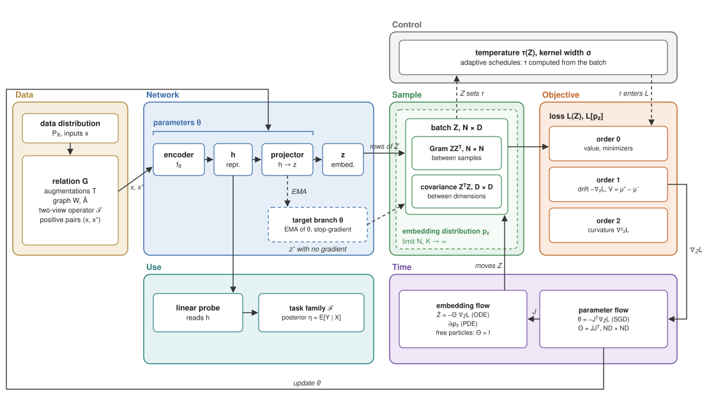

**Figure 1.** Levels of a joint-embedding training system. One step runs from the data through the network to the batch and the loss, and back through the parameter flow; the embedding flow is the same step seen from the embeddings. The control loop and the target branch feed the batch back into the loss by a path other than the gradient.

In Figure 1 the embedding distribution contains the batch, since a batch is a sample of it. The parameters contain the encoder and the projector, whose outputs $h$ and $z$ are functions of $\theta$. The two flows in the bottom row describe one process twice. The parameter flow is what SGD computes. The embedding flow is what this computation does to the points through the kernel $\Theta$. Most theorems of chapter 4 replace $\Theta$ with the identity and treat the points as free particles.

## 2. The gradient of every joint-embedding loss is attraction minus repulsion

With the objects fixed, the first question is what the three families of chapter 0 have in common. Their loss values cannot be compared, since InfoNCE is a cross-entropy, VICReg a weighted sum of squared errors and BYOL a prediction error. Their gradients can, because a gradient step moves every embedding by some displacement, and displacements of points in one space are the same kind of object for every method. This chapter writes each family as a velocity field on the embeddings and stays at the level of algebra on the loss. Assumptions about data, networks and limits enter in chapter 4. The text before each proposition gives the step that leads to it. The proofs are in Appendix A.1. Figure 2 shows the architecture the families share, two branches that embed two views and a criterion that compares the embeddings.

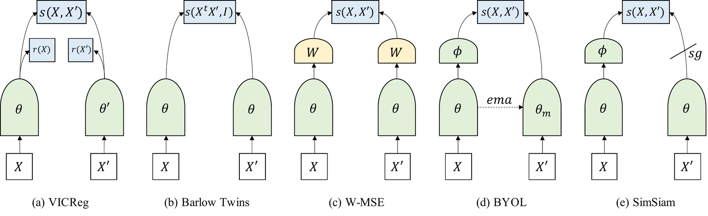

**Figure 2.** Joint-embedding architectures: VICReg, Barlow Twins, W-MSE, BYOL and SimSiam. $X$ and $X'$ are two views, $\theta$ the encoder weights, $s$ the criterion between the branches, $r$ a regularizer on one branch, $W$ a whitening, $\phi$ a predictor, ema a moving-average copy of the weights and sg a stopped gradient. From Bardes, Ponce and LeCun (2022).

### 2.1. Attraction alone collapses

Every family starts from the relation. The simplest loss that uses only the relation is alignment, $\mathbb E\|z-z^+\|^2$. What this term selects on its own decides whether anything else is needed. Alignment is zero only when every edge of $G$ joins two equal embeddings. Embeddings that are equal along every edge of a path are also equal at its two ends.

*Proposition 2.1 (this work).* If a loss reaches perfect alignment, $z$ is constant on every connected component of $G$.

A constant encoder therefore reaches the global minimum of alignment. The minimum is also stable: around a collapsed state $z_a=c+\varepsilon u_a$ alignment grows by $\varepsilon^2\sum_i\|u_i-u_{i^+}\|^2\ge0$ in every direction. Every working method adds a second force that makes collapse costly. The families differ in where that force comes from. Proposition 2.1 also bounds what the relation can teach. If $G$ is connected, perfect alignment gives a constant; if $G$ is nearly discrete, as it is for augmentations of different images, perfect alignment constrains nothing across inputs. Chapter 6 returns to this.

### 2.2. Contrastive repulsion is a kernel density estimate

The contrastive family builds the second force from negatives. For anchor $z$, positive $z^+$ and $K$ negatives $z_k^-$, InfoNCE (van den Oord et al.), a descendant of noise-contrastive estimation (Gutmann and Hyvärinen), is the cross-entropy of finding the positive among $K+1$ candidates,

$$
\mathcal L=-\frac{s^+}{\tau}+\log\Big(e^{s^+/\tau}+\sum_{k=1}^K e^{s_k/\tau}\Big),\qquad s^+=z^\top z^+,\ s_k=z^\top z_k^-.
$$

The temperature $\tau$ looks like a free scale. On the sphere it has a geometric meaning, derived in the author's paper on the Positive-Pair Schedule of the temperature (PPS, 4.5). That meaning ties contrastive learning to density estimation. For unit vectors the dot product and the squared distance carry the same information, $z^\top z'=1-\tfrac12\|z-z'\|^2$, so every exponential in InfoNCE can be rewritten as a function of distance.

*Proposition 2.2 (PPS).* On $S^{D-1}$, $e^{z^\top z'/\tau}=e^{1/\tau}e^{-\|z-z'\|^2/(2\tau)}$, so the softmax weights of InfoNCE are the weights of a Gaussian kernel of width $\sigma=\sqrt\tau$.

The temperature is thus the squared size of the neighbourhood the loss treats as close. The kernel $\propto e^{\kappa z^\top y}$ is the von Mises-Fisher (vMF) density, the analogue of a Gaussian bump on the sphere, with sharpness $\kappa=1/\tau$. The denominator of InfoNCE is therefore a kernel density estimate (KDE) of the embeddings, a smoothed density obtained by placing one such bump on every candidate, evaluated at the anchor. The next question is how the loss moves the anchor at this width. The loss is a log-sum-exp of similarities, whose derivative is a softmax, so each candidate enters the gradient with its softmax weight.

*Proposition 2.3 (after Wang and Liu).* Let $S=e^{s^+/\tau}+\sum_k e^{s_k/\tau}$, $w_k=e^{s_k/\tau}/S$ and $w^+=e^{s^+/\tau}/S$. Then $\partial\mathcal L/\partial z_k^-=\tfrac{w_k}{\tau}z$, $\partial\mathcal L/\partial z^+=-\tfrac{1-w^+}{\tau}z$, and $\partial\mathcal L/\partial z=-\tfrac1\tau\big((1-w^+)z^+-\sum_kw_kz_k^-\big)$.

A close negative carries a large $w_k$ and is pushed hardest. The pull toward the positive carries the factor $1-w^+$, which vanishes once the positive outweighs the negatives. Regrouping the anchor gradient gives the form used for every family below. Factoring out the sum of the negative weights, $1-w^+$, leaves a difference of two weighted means. A weighted mean under a Gaussian kernel is the quantity that mean shift uses to estimate a score, the gradient of a log-density (Fukunaga-Hostetler), so the difference of means is a difference of scores.

*Proposition 2.4 (drift identity, PPS).* With $\sigma^2=\tau$, $\nabla_z\mathcal L=-\frac{1-w^+}{\sigma^2}V$, where $V=\mu^+-\mu^-$, $\mu^+=z^+$ (the centroid of positives when there are several views) and $\mu^-=\sum_kw_kz_k^-/(1-w^+)$ is the softmax-weighted centroid of the negatives. Equivalently, $V/\sigma^2=\nabla_z\log\big(\hat p^+(z)/\hat p^-(z)\big)$, where $\hat p^\pm$ are Gaussian KDEs of width $\sigma$ over the positives and the negatives.

The gradient is taken in ambient coordinates, before the projection onto the tangent space of the sphere. The realized update of $z$ also collects the terms in which $z$ is the positive or a negative of another anchor. $V$ is the anchor-term drift. Proposition 4.16 computes the other terms for the uniformity part of the loss. Each anchor moves toward its positive and away from a softmax-weighted mean of its near negatives. The step is a difference of two scores, gradients of log-densities at scale $\sigma$. The other two families are now written in the same form.

### 2.3. Regularizer repulsion is an MMD to a target distribution or a spectral penalty

The second family, the regularizer methods VICReg, Barlow Twins and SIGReg, has no negatives. They penalize statistics of the whole batch, which raises the question whether their gradients still split into attraction and repulsion. For regularizers that compare the batch with a target distribution the split is exact. The comparison is a maximum mean discrepancy (MMD), a distance between two distributions computed from kernel similarities between their samples. The squared MMD sums kernel values within the batch and between the batch and the target sample. The gradient of a Gaussian kernel points from one point toward the other, so the first sum pushes each embedding away from the batch and the second pulls it toward the target sample.

*Proposition 2.5 (MMD gradient as drift, this work).* Let $z_1,\dots,z_N$ be embeddings, $y_1,\dots,y_M$ a sample from the target distribution, $k(z,y)=e^{-\|z-y\|^2/(2\sigma^2)}$, and let $\hat p^+=\frac1M\sum_jk(\cdot,y_j)$ and $\hat p^-=\frac1N\sum_lk(\cdot,z_l)$ be unnormalized KDEs of the target sample and of the batch. Then

$$
-\nabla_{z_i}\widehat{\mathrm{MMD}}^2=\tfrac2N\big(\nabla\hat p^+(z_i)-\nabla\hat p^-(z_i)\big).
$$

The gradient attracts each embedding to the target sample and repels it from its own batch, the same attraction minus repulsion as $V$. The two differ in the weighting. InfoNCE and a KL over a KDE use normalized weights and give $\nabla\log\hat p$, whereas MMD uses unnormalized ones and gives $\nabla\hat p$. The two gradients are related by $\nabla\hat p=\hat p\,\nabla\log\hat p$. SIGReg, the regularizer of LeJEPA, pushes the embedding distribution to $\mathcal N(0,I)$ through random one-dimensional projections, which determine the distribution by the Cramer-Wold theorem, and scores each projection with the Epps-Pulley statistic, a weighted distance between the empirical and the Gaussian characteristic functions. That statistic is an MMD. Expanding the squared distance between characteristic functions gives averages of $e^{it(x-x')}$ over pairs of points. By Bochner's theorem, which writes a shift-invariant kernel as the Fourier transform of a positive weight, integrating these averages against a Gaussian weight gives a Gaussian kernel.

*Proposition 2.6 (Epps-Pulley is MMD on a slice, this work).* For one-dimensional samples, $\int|\hat\varphi_N(t)-\varphi_0(t)|^2w(t)\,dt$ with a Gaussian weight $w$ equals $\mathrm{MMD}^2$ with a Gaussian kernel between the empirical and the target distributions; the Epps-Pulley statistic differs by the factor $N$.

SIGReg is therefore a sum of MMDs over random slices. SPHERE-JEPA, which replaces the Gaussian target with the uniform distribution on the sphere, is the same with another target. Both fall under Proposition 2.5, with the kernel width set by the weight $w$. ==Expanding SPHERE-JEPA averages over all slices analytically and should give MMD on the sphere with an induced kernel; this is unchecked.==

The MMD reading needs a target sample, which VICReg and Barlow Twins do not have. Their variance and covariance terms act on the eigenvalues of the covariance of the batch embeddings, so the spectral picture is the one that shows what they compute. HaoChen et al. start from a loss whose two terms are the linear and the quadratic parts of a squared matrix distance, so completing the square turns the loss into a low-rank fit of the normalized adjacency matrix $\bar A$ of $G$.

*Proposition 2.7 (HaoChen et al.).* The spectral contrastive loss $\mathcal L_{\rm spec}(F)=-2\mathbb E_{x,x^+}F(x)^\top F(x^+)+\mathbb E_{x,x'}(F(x)^\top F(x'))^2$ equals $\|FF^\top-\bar A\|_F^2$ up to a constant, after rescaling the rows of $F$ by $\sqrt{d_x}$.

The same eigenvectors appear when the Laplacian quadratic form is minimized over orthonormal columns, since a sum of Rayleigh quotients over orthonormal vectors is smallest on the bottom eigenvectors.

*Proposition 2.8 (Ky Fan).* Under $Z^\top Z=I$, $\min\mathrm{tr}(Z^\top LZ)$ is attained by the bottom eigenvectors of $L$.

By Eckart-Young-Mirsky the best rank-$k$ fit of $\bar A$ is its top eigenvectors, the bottom ones of $L$, so both propositions end in a spectral embedding of $G$. Both are statements about a function on inputs, a matrix $F$ or $Z$ with one row per input of the whole dataset. The eigenvectors belong to the graph matrices of the relation. Applied to a batch, they describe the subgraph of $G$ on the inputs of that batch. VICReg is a soft version of Proposition 2.8, with the constraint $Z^\top Z=I$ replaced by variance and covariance penalties. Balestriero and LeCun place the SSL losses among three classical spectral methods of dimension reduction. Laplacian Eigenmaps embed a graph by the bottom eigenvectors of its Laplacian, so neighbours in the graph stay close. Kernel ISOMAP embeds data by the top eigenvectors of a kernel built from distances measured along the data manifold. Canonical correlation analysis (CCA) finds linear projections of two views with maximal correlation. Under their conditions each SSL loss reduces to one of these spectral problems, solved by Ky Fan's theorem for a Laplacian or by Eckart-Young for a kernel matrix.

*Proposition 2.9 (Balestriero-LeCun).* Under conditions on linearity, batch size and augmentations, VICReg recovers Laplacian Eigenmaps on the positive graph, SimCLR recovers Kernel ISOMAP, and Barlow Twins is close to CCA.

The spectral picture still separates "contrastive" from "non-contrastive" by what the penalty touches. The second term of $\mathcal L_{\rm spec}$ penalizes similarities between samples, while VICReg penalizes correlations between dimensions. One identity shows the separation is thin. The Gram matrix $ZZ^\top$ of the samples and the uncentered covariance $Z^\top Z$ of the dimensions have the same Frobenius norm, since both squared norms equal $\mathrm{tr}(Z^\top ZZ^\top Z)$, so their off-diagonal parts differ only through the diagonals.

*Proposition 2.10 (after Garrido et al.).* Let $\mathcal L_{\rm sam}=\|ZZ^\top-\mathrm{diag}(ZZ^\top)\|_F^2$ penalize similarity between samples, the off-diagonal of the Gram matrix of the batch, and $\mathcal L_{\rm dim}=\|Z^\top Z-\mathrm{diag}(Z^\top Z)\|_F^2$ penalize correlation between dimensions, the off-diagonal of its uncentered covariance. Then $\mathcal L_{\rm sam}-\mathcal L_{\rm dim}=\sum_d\|Z_{:,d}\|^4-\sum_n\|z_n\|^4$.

With unit-norm samples and standardized dimensions, both norm sums in Proposition 2.10 are constant, so the two penalties coincide. Repulsion between samples and decorrelation of dimensions are one quantity in this case. So the boundary between the contrastive and the regularizer families is only a choice of which axis to normalize.

Whether this boundary matters in practice is the question of Garrido et al., who prove the identity of Proposition 2.10 for every embedding matrix (their Thm 3.3). With unit-norm samples alone, the dimension sum lies between $N^2/D$, for equal energy in every dimension, and $N^2$, for all energy in one dimension. The two penalties therefore only bound each other, $\mathcal L_{\rm dim}-N+N^2/D\le\mathcal L_{\rm sam}\le\mathcal L_{\rm dim}-N+N^2$ (their Cor. 3.4.1). The variance term of VICReg spreads the energy over the dimensions and moves this pair toward the lower bound. After Garrido et al. tune the optimizer and widen the projector, the ImageNet gap between SimCLR and VICReg shrinks from about 10 points to about 3. Most of the gap that papers attribute to the family thus comes from these settings. ==What plays the role of $\mu^-$ on the dimension side has no derivation in drift form (2.5).==

### 2.4. Siamese methods move the repulsion from the loss to the update rule

The third family, the siamese methods, has neither negatives nor a regularizer. BYOL and SimSiam train an online branch with a small predictor network against a target branch under a stopped gradient, with loss $\|\mathrm{pred}(z)-\mathrm{sg}(z')\|^2$ on normalized vectors; in BYOL the target is a moving average of the online network (Figure 3). A constant encoder with the identity as predictor has zero loss, so by Proposition 2.1 the loss alone admits collapse. Whatever prevents collapse is therefore a property of the training dynamics.

This claim has a proof in the one case where the dynamics has a solution, a linear encoder $z=Wx$ with a linear predictor $W_p$ under gradient flow (Tian, Chen and Ganguli). The proof also assumes isotropic data, augmentation noise of variance $\omega^2$, target weights equal to $\beta$ times the online weights and a symmetric predictor. Without the stopped gradient, $W$ decays to zero, so collapse is certain (their Thm 2). With the stopped gradient, the predictor converges to a matrix that commutes with the correlation matrix $F=WW^\top$ of the embeddings (their Thm 3). Commuting matrices share eigenvectors, so each eigenvector $j$ of $F$ carries one eigenvalue $s_j$ of $F$ and one eigenvalue $p_j$ of the predictor. With predictor learning rate $\alpha_p$ and weight decay $\eta$, these two eigenvalues evolve as

$$
\dot p_j=\alpha_p\big(\beta s_j-(1+\omega^2)p_j\big)-\eta p_j,\qquad \dot s_j=2p_j\big(\beta s_j-(1+\omega^2)p_j\big)-2\eta s_j .
$$

These equations decide which directions of the embedding survive. With weight decay $0<\eta\le\beta^2/(4(1+\omega^2))$, a direction survives only if its predictor eigenvalue starts above $p^*_-=\big(\beta-\sqrt{\beta^2-4\eta(1+\omega^2)}\big)/(2(1+\omega^2))$. Otherwise it decays to the collapsed point $p_j=s_j=0$. Larger weight decay collapses every direction. So the predictor adds no force that grows near collapse. It lets the growth term $2\beta p_js_j$ of a strong direction outrun the decay. DirectPred supports this reading. A predictor set from the eigenvectors of an estimate of $F$, with no training, matches the trained two-layer predictor of BYOL on ImageNet (72.4% against 72.5% top-1).

The repulsion $\mu^-$ of 2.1 is missing from the BYOL loss but present in its predictor (Tao et al.). Tao et al. write the gradient of each family with respect to the online embedding $u$ as a pull toward the positive plus a push $\lambda Fu$, with $F$ the correlation matrix of the batch. For BYOL with a linear predictor, the predictor produces this push, because it shares the eigenvectors of $F$ by the result above. To test that only this form matters, Tao et al. train one update for all families, UniGrad, $-u^+_{\rm m}+\lambda Fu$ with $u^+_{\rm m}$ the positive from a momentum encoder. On ImageNet its contrastive, asymmetric and decorrelation versions differ by less than 0.5 points of linear-probe accuracy. ==This makes the siamese row of the table in 2.5 a derivation for a linear predictor. Whether the trained two-layer predictor of BYOL carries the same push is open (10.3).== DINO avoids collapse by centering and sharpening the teacher output, which pushes the outputs away from the batch mean; its details stay outside this work.

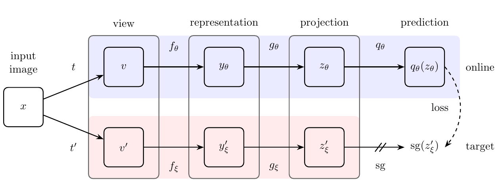

**Figure 3.** BYOL. Two views $v$ and $v'$ of an image $x$ pass through an encoder $f$ and a projector $g$. The online branch with weights $\theta$ adds a predictor $q_\theta$. The target branch has moving-average weights $\xi$. Its output $z'_\xi$ enters the loss under a stopped gradient (sg). From Grill et al. (2020).

### 2.5. Shared properties: repulsion ignores which input is which, shape is separate from content, the drift vanishes only at equal densities

With the forms of 2.2-2.4 side by side, the table reads off what plays the role of $\mu^-$ in each family. Some properties hold for all of them regardless of how the repulsion is built.

| Family                                              | What plays the role of $\mu^-$                                                                                   |
| --------------------------------------------------- | ----------------------------------------------------------------------------------------------------------------- |
| Explicit negatives (SimCLR, MoCo)                   | softmax-weighted centroid of negatives                                                                            |
| Regularizer with a target distribution (SIGReg, SPHERE-JEPA) | the batch itself (self-repulsion); attraction goes to a sample of the target                                      |
| Redundancy reduction (VICReg, Barlow Twins)         | a push along the correlation matrix of the batch, $\lambda Fu$ (Tao et al.)                                   |
| Siamese and distillation (BYOL, SimSiam, DINO)      | the predictor, which encodes $F$ (Tao et al., linear predictor); ==centering for DINO==                       |

The first shared property concerns what the repulsion can see. Every repulsion term in the table is computed from the empirical distribution of the batch, which forgets which point came from which input.

*Proposition 2.11 (this work).* Variance, covariance, $\mathcal N(0,I)$-target and uniformity terms depend only on the multiset of rows of $Z$; any relabeling of the inputs leaves them unchanged.

Which input lands close to which is therefore set by the attraction term, that is by $G$, and by the inductive bias of the architecture; the repulsion keeps the space from degenerating and gives it no meaning. A function that is injective on the batch and invariant to the augmentations satisfies perfect alignment and every multiset repulsion at once, whatever it encodes. This yields a prediction that needs no data. A shortcut feature that supplies such a function should defeat contrastive and regularizer losses alike, which chapter 7 tests.

The second property separates the shape of the embedding cloud from its content, so that the two can be discussed apart. Two densities on one connected manifold can be transported into each other by a continuous invertible map, built coordinate by coordinate from conditional distribution functions.

*Proposition 2.12 (Knothe-Rosenblatt; Moser).* For positive smooth densities $\pi_1,\pi_2$ on one connected manifold $M$ of dimension $m$ ($\mathbb R^m$ or a compact manifold such as the sphere) there is a homeomorphism $T:M\to M$ with $T_\#\pi_1=\pi_2$, that is, $T(x)$ has density $\pi_2$ when $x$ has density $\pi_1$.

A cloud can therefore change its distribution without gluing points or losing information. ==The repulsion sets the shape==: an isotropic Gaussian for LeJEPA, the uniform distribution on the sphere for SPHERE-JEPA and for InfoNCE as $K\to\infty$. For shapes there are minimax theorems (5.3), which say that if the information is already in the embeddings, this shape hurts a probe least in the worst case over tasks. ==The attraction sets the content, what counts as one object, and has no theorem of that kind.== The assumption of one manifold in Proposition 2.12 matters. If the inputs lie on a manifold of dimension $m<D$, a Lipschitz encoder maps them onto a set of dimension at most $m$, since Lipschitz maps do not raise Hausdorff dimension, so no such encoder reaches a distribution with a density on $\mathbb R^D$. The encoder can only fold the image of the data until it fills the space, which places distant inputs next to each other, or leave some axes empty. A network has finite capacity, so shape and content compete, positives asking for clusters and the target distribution asking for spread. ==Where shape starts to displace content as the width or dimension of the network shrinks is open.==

The third property says when the flow stops. The drift is the gradient of the log-ratio of two densities. A gradient vanishes everywhere only for a constant function, so the drift vanishes only where this ratio is constant, which for two normalized densities means they are equal.

*Proposition 2.13 (this work; Gretton et al., Thm 3, for a Gaussian kernel).* $V\equiv0$ on the whole space if and only if $\hat p^+=\hat p^-$. With a characteristic kernel, one for which equal smoothed densities imply equal distributions (the Gaussian kernel is one), this means the two distributions are equal.

Training evaluates $V$ only at batch points, so the flow can stop at a state where the field vanishes on the points while the cloud differs from its target (4.6). ==The drift also gives a label-free monitor. By Proposition 2.4, $\|V\|^2=\sigma^4\|\nabla\log(\hat p^+/\hat p^-)\|^2$, whose batch mean estimates $\sigma^4$ times a Fisher divergence (the mean squared difference of two scores). By Propositions 2.5 and 2.6 the same quantity exists for SIGReg and SPHERE-JEPA.== ==Its link to the kernelized Stein discrepancy (KSD), a distance between a sample and a density that needs only the score of the density, is unchecked.== The kernel width is the softmax temperature in InfoNCE, the weight width in Epps-Pulley and the time of a heat kernel on the sphere, the kernel of diffusion on the sphere. ==The hypothesis that the positive-pair distance sets it in all three, as it does in PPS (4.5), is untested.==

A unifying language earns its place only if it predicts something that is not known without it. Proposition 2.11 gives one such prediction, tested in chapter 7. The drift monitor gives a tool. Collapse structure, which also follows from the field, is the subject of 3.1.

### 2.6. The flow is a score difference

The drift $V$ also has a reading outside SSL, since by Proposition 2.4 $V/\sigma^2=\nabla\log\hat p^+-\nabla\log\hat p^-$ is a difference of scores, the object that score matching learns and diffusion models integrate (Song and Ermon; Ho et al.; Song et al.). Mean shift moves points along $\nabla\log\hat p$ at a fixed width (Fukunaga-Hostetler). Denoising score matching learns the score of a density smoothed by Gaussian noise, which is a KDE of width $\sigma$ when the noise has variance $\sigma^2$ (Vincent, 4.6). Drifting generators move generated samples by $\mu^+-\mu^-$ with data as positives and their own samples as negatives (Deng et al.). Turan et al. show that this drift is score matching. Gretton et al. show that it is a Wasserstein gradient flow (steepest descent of a functional of a distribution, with distances between distributions measured by optimal transport) only after one more smoothing, ==which 4.6 identifies with the terms of other anchors==. The PPS paper derived Proposition 2.4. DriftSSL, the author's earlier attempt to train SSL with the drift as the loss (4.6), used it to rewrite contrastive losses as score matching. In score matching and in generation the target density is the data distribution and stays fixed. In SSL both clouds are outputs of the encoder, so the density the embeddings move toward moves with them. The target also moves along other axes: the batch is resampled every step, the kernel width can be computed from the batch, the network ties the points to each other, and siamese methods parametrize the target with a second branch. The table in 4.6 lists these axes and what holds each still. The moving target explains why siamese methods need a stopped gradient and why a gradient-flow reading of SSL needs a frozen target (Conjecture 4.18). Which proofs carry over between these models is decided by which of their assumptions survive the moving target, and 4.6 sorts them.

The kernel of Proposition 2.2 depends only on distances, so the whole flow can be written in terms of the pairwise distance matrix of the batch. ==In DriftSSL, describing points by pairwise distances made the link to score matching fit much better than coordinates did; whether Propositions 2.4 and 2.13 carry over to a distance-matrix form without extra assumptions is open.==

## 3. Regularities of training seen across methods

Chapter 2 says what pushes each embedding at one step. Training composes many such steps through one shared encoder. Over many steps, regularities appear that no single step shows. They hold across methods and datasets. Each has a local explanation, but none has a global one. A theory of SSL has to reproduce them, so chapter 4 checks which theorem reproduces which. As in chapter 2, the text gives the step that leads to each proposition. The proofs are in Appendix A.2.

### 3.1. Collapse is a saddle when repulsion is in the loss

Section 2.1 showed that collapse is a stable minimum of alignment. Negatives add a term that grows when embeddings come together, so they may turn this minimum into a point the loss can leave. Whether they do shows in a second-order expansion of InfoNCE around the collapsed state. There all similarities equal one. A small perturbation $z_a=c+\varepsilon u_a$ lowers the similarity of $a$ and $b$ by $\tfrac{\varepsilon^2}2\|u_a-u_b\|^2$. So the loss of an anchor changes by the distance to its positive minus the mean distance to all its candidates, so a perturbation that keeps the two views of each input together while separating inputs lowers the loss.

*Proposition 3.1 (this work).* The state with all embeddings of a batch equal to $c$ is a critical point of InfoNCE in the batch embeddings, and the Hessian at this point has a negative eigenvalue.

The escape direction separates different inputs and keeps the two views of each input together. Its rate scales as $1/\tau$, since the second-order term carries the factor $1/(2\tau)$. Proposition 3.1 treats the embeddings as free, whereas training changes weights and moves the embeddings only along the directions that the Jacobian $J$ of the encoder reaches. ==Over the parameters, collapse is therefore a strict saddle only if $J$ does not annihilate the escape direction (Proposition 4.1).==

Stationarity alone does not decide the question, because attraction and repulsion cancel at the collapsed state. The state is stationary for InfoNCE, and for the MMD field of Proposition 2.5 when the target distribution is symmetric about the collapse point, like the uniform distribution on the sphere or a Gaussian centred there. Only the instability rules collapse out. ==For MMD to the uniform distribution on the sphere the instability is unchecked.== Ziyin et al. find the same structure in the weights of linear models, where contrastive and non-contrastive losses share their collapse critical points and differ in what stabilizes the non-trivial minimum.

### 3.2. The temperature decides where the push goes and when the pull stops

Proposition 2.3 gives each negative a softmax weight $w_k\propto e^{s_k/\tau}$, which makes the weights a Gibbs distribution over the negatives with inverse temperature $\beta=1/\tau$. The entropy of a Gibbs distribution changes with $\beta$ at the rate $-\beta$ times the variance of the similarities, so the weights spread out as $\tau$ grows.

*Proposition 3.2 (after Wang-Liu).* The entropy of the weights $w_k$ over negatives is non-decreasing in $\tau$.

A small $\tau$ therefore concentrates the push on the nearest negatives, which a large $\tau$ spreads over all of them. One might expect the softmax to repel similar inputs less, since an augmentation could blur them into each other. The gradient does the opposite, because the weight of a negative grows with its similarity, so close pairs are tolerated only at a large $\tau$. Wang and Liu call the resulting trade-off the uniformity-tolerance dilemma. A small temperature spreads the cloud and also pushes apart different inputs of one class, which a class-level task wants close.

The pull toward the positive also changes during training, because Proposition 2.3 multiplies it by $1-w^+$. This factor vanishes once the positive outweighs the negatives, so the contrastive gradient switches itself off when the relative gap is won. Nie et al. call this gradient dissipation. They show that optimizing alignment and uniformity as separate terms, which lacks the switch-off, keeps pushing absolute distances and underperforms InfoNCE on sentence embeddings. Decoupled contrastive learning (DCL) removes the same factor from the positive term and does better at small batch. ==Nie et al. gain from the switch-off and DCL gains from removing it, so when switching off the pull helps and when it hurts is unreconciled.==

Both regularities use weights computed on a finite batch, whereas most theory studies the limit $K\to\infty$. The batch loss takes the concave logarithm of a sample mean of $e^{s/\tau}$. By Jensen's inequality the batch loss therefore underestimates the limit. A second-order expansion of the logarithm around the mean gives the size of the gap.

*Proposition 3.3 (this work, by the delta method).* The bias of the batch loss relative to its $K\to\infty$ limit is $\approx-\mathrm{Var}(e^{s/\tau})/\big(2K(\mathbb Ee^{s/\tau})^2\big)$.

The variance of $e^{s/\tau}$ grows as $\tau$ falls, so a small temperature needs a large batch. Gradient accumulation cannot replace the batch, because the logarithm is taken inside each batch, and averaging the gradients of several small batches averages their biases.

### 3.3. Positive pairs contract to a floor; the spread between inputs decides collapse

The temperature acts on distances between embeddings, so the two distances of chapter 1 show its effect directly. In every PPS run on CIFAR-10, CIFAR-100 and ImageNet-100 they behave differently. The positive distance $p$ falls toward a floor $p_{\min}>0$ under every temperature schedule tried, because the two views are distinct augmentations and the encoder has finite capacity. The inter-input distance $q$ is the coordinate that can collapse. The gap $g=q-p$ opens early only if the kernel is wide while the gap is still small. Section 4.5 derives the first half of this regularity in a reduced model and models the second half.

### 3.4. Repulsion does not prevent dimensional collapse

A large $q$ keeps the cloud from shrinking to a point. Spreading points over the sphere was also expected to use every direction of the space, which Jing et al. show it does not. SimCLR embeddings avoid complete collapse, yet several singular values of the embedding covariance $Z^\top Z$ fall to zero, so the cloud lives in a lower-dimensional subspace (Figure 4). In a one-layer linear model the weight dynamics is driven by a matrix equal to a weighted data covariance minus a weighted augmentation covariance. Along directions where the augmentation varies more than the data, its eigenvalues are negative, so the corresponding singular values decay. A two-layer linear model collapses even with mild augmentations. Gradient descent first aligns adjacent weight matrices, after which each singular value grows in proportion to itself. Small singular values then lag behind large ones, so the product of the weight matrices, and with it the embedding covariance, becomes effectively low-rank.

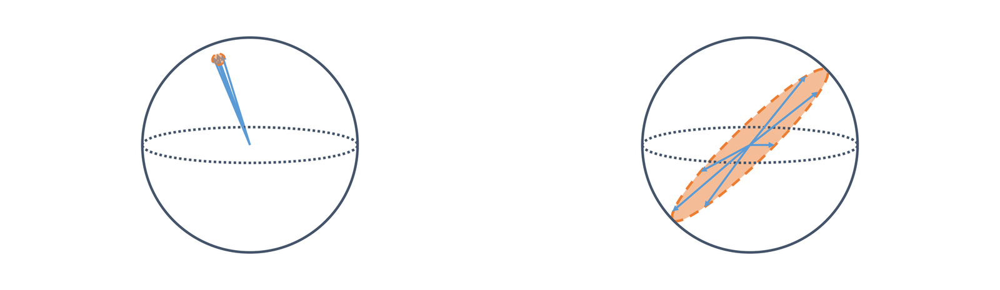

**Figure 4.** Complete collapse (left), where all embeddings shrink to one point, and dimensional collapse (right), where the embeddings spread over a lower-dimensional subspace of the sphere. From Jing et al. (2022).

A measure of spread should register dimensional collapse, yet the uniformity of Wang and Isola does not. Fang et al. ask a uniformity metric to stay unchanged when inputs are permuted or duplicated, and to react when features are cloned or constant dimensions are added. They prove that the Gaussian-potential uniformity meets only the first of these demands. The $W_2$ distance between a Gaussian fitted to the batch embeddings and $\mathcal N(0,I/D)$ meets them all. ==Their demands concern a finite batch and its coordinates, whereas Wang and Isola designed their metric for its limit on the embedding distribution, which is why the two judgements differ (4.1).==

Since dimensional collapse shows in the eigenvalues of the embedding covariance, the rank of the embeddings is a natural label-free check. RankMe shows that the effective rank of the matrix of outputs on a set of inputs tracks downstream accuracy well enough to select hyperparameters without labels. Rank is necessary for quality and falls short of sufficient. Random features have full rank. Once the rank exceeds the intrinsic dimension of the task, accuracy saturates, and extra rank can hold nuisance factors. ==Simon et al. find that Barlow Twins, SimCLR and VICReg learn the eigenvalues of the embedding covariance one at a time, largest first, so a weak direction may never be reached within the schedule.==

### 3.5. A feature available early in training suppresses the features learned later

Which directions are learned first is a question about features. Uniformity asks only that the inputs be spread and says nothing about which features spread them, so when two features both separate inputs, the loss can be indifferent between them (Figure 5). Robinson et al. call a feature easy when the network can read it after a small change of its weights, such as colour, which is linearly readable already at initialization (7.1), or a constant extra channel (chapter 7). Gradient descent learns such features first, a tendency called simplicity bias.

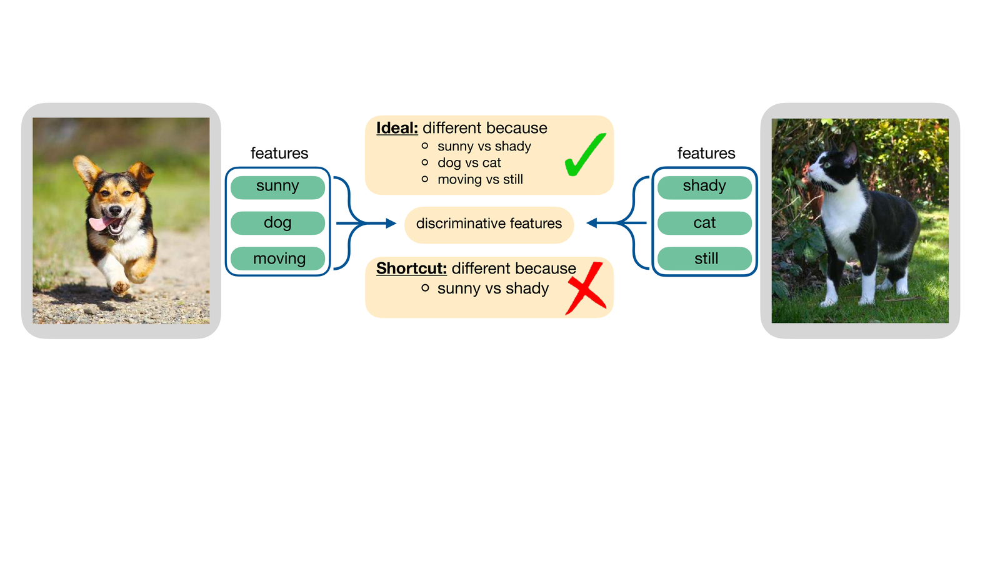

**Figure 5.** A shortcut in instance discrimination. The two images differ in lighting, animal and motion. An encoder that separates them by lighting alone already solves the contrastive task. From Robinson et al. (2021).

Once the easy feature is learned, what the loss still gains from a useful one decides whether the useful one is learned at all. Robinson et al. compare the loss of an encoder that reads only the easy feature with one that reads both. With the easy feature alone, alignment is perfect, and only the negatives that share the anchor's easy feature stay as similar as the positive, each adding $e^0=1$ to the sum. Reading the useful feature as well pushes these negatives away, so the gain is bounded by the expected number of such negatives.

*Proposition 3.4 (after Robinson et al.).* Let $x$ carry an easy feature $a$ and a useful feature $t$, and let positives agree on both. A random negative shares the anchor's $a$ with probability $\delta$. If an encoder reads only the easy feature, so that its embedding $z(a)$ depends on $a$ alone and $z(a)^\top z(a')\le0$ for $a\ne a'$, its loss is at most $\log(1+K\delta+K(1-\delta)e^{-1/\tau})$. Using $t$ as well removes the $K\delta$ term and lowers the loss by $\log\frac{1+K\delta+Ke^{-1/\tau}}{1+Ke^{-1/\tau}}\le K\delta$.

If $K\delta\ll1$, the gain is small, so the gradient does not force the encoder to learn $t$. So a lower InfoNCE need not mean a lower error on each factor. Chen, Luo and Li observe the extreme case. A few bits of a feature shared by both views suppress the image features entirely, temperature and batch size barely help, BYOL suffers as much, and a VAE barely suffers. Xue et al. trace suppression to the simplicity bias of SGD and find that a larger embedding dimension and better augmentations reduce it. Wen and Li show that augmentations decorrelate dense features between positives and leave sparse ones intact, so contrastive learning extracts sparse features and needs stronger augmentations than supervised learning. ==Littwin et al. find that JEPA prefers features with a large regression coefficient and MAE features with large variance.== A narrow model has to drop some features, and by Proposition 3.4 the easy ones already give most of the loss, so the hard ones go first. ==Whether a small network width alone selects semantics is untested (chapter 9).==

### 3.6. The loss acts on the projector output and the probe reads the encoder output

The features of 3.5 compete inside the projector output $z$, the vector the loss acts on. A probe reads $h$ before the projector instead, because features there are consistently better for downstream tasks (guillotine regularization, Bordes et al.). DirectCLR goes further, removing the trainable projector and applying the loss to a subvector of $h$. In the PPS ablation the controller that maximizes the gradient norm collapses the projected geometry almost at once, yet kNN accuracy on $h$, the class vote of the nearest training embeddings, still rises, because the encoder keeps extracting weak structure under a degenerate projection (Figure 6). Every statement of chapter 2 is about $z$ and reaches $h$ only through the projector, ==for which no theory exists beyond linear models.== ==Bordes et al. (2023) report that changing the width of the last encoder block, before the projector, controls how much of the pretraining bias reaches the representation; only the abstract is read.==

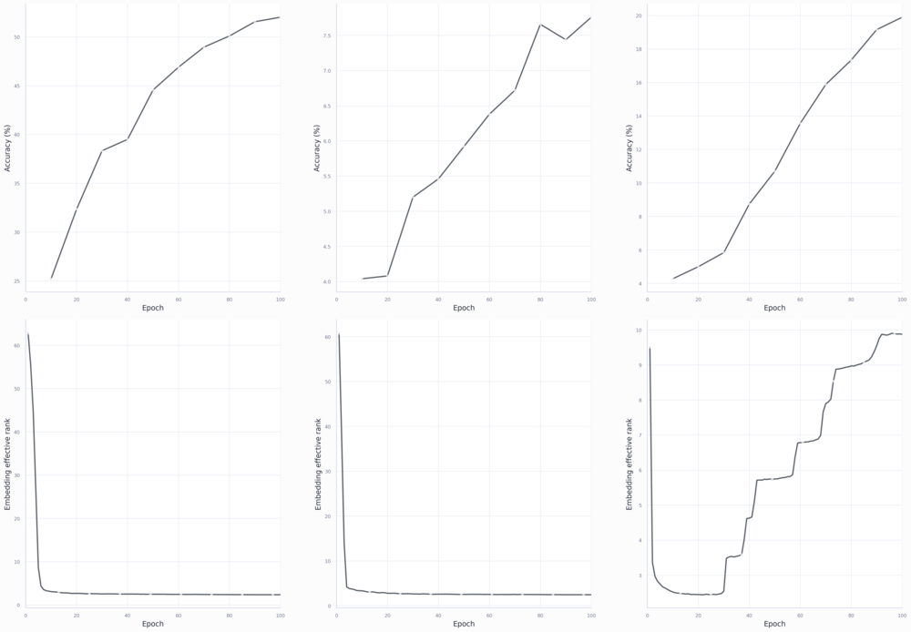

**Figure 6.** The gradient-optimal temperature controller of 4.5, one column per dataset of the PPS paper. Top: kNN accuracy on $h$ keeps rising over 100 epochs. Bottom: the effective rank of the projector output $z$ falls to about 3 within the first epochs. From the PPS paper, Figures A.1 and A.2.

### 3.7. An adaptive temperature closes a feedback loop, and the loss can rise during training

The controller of Figure 6 changes the temperature during training, so the loss itself changes with the embeddings. For a fixed loss, gradient flow decreases it, $\dot{\mathcal L}=-\|\nabla\mathcal L\|^2\le0$, so the loss is a Lyapunov function of training, a quantity that never increases along the trajectory and therefore certifies that training settles. For free embeddings this flow is an ODE for $N$ interacting points. As $N\to\infty$ its mean-field limit, where each point feels only the average effect of all the others, is a continuity equation $\partial_tp_z+\nabla\cdot(p_zv)=0$ for the embedding distribution, with the drift field as the velocity $v$. Mei, Montanari and Nguyen and Chizat and Bach take the same limit in parameter space, where the particles are the hidden units of a two-layer network (4.4). An adaptive temperature computes $\tau$ from the current embeddings, so the embeddings set the temperature, the temperature sets the gradient, and the gradient moves the embeddings. The temperature and the embeddings thus form a closed loop in the sense of control theory. The loss now depends on the embeddings directly and through $\tau$, and only the direct dependence enters the gradient step, so the chain rule leaves an extra term in the derivative of the loss.

*Proposition 3.5 (this work).* Let $\tau=\tau(z)$ be computed from the batch and held fixed in the backward pass, so that $\dot z=-\nabla_z\mathcal L(z,\tau)$. Then $\frac{d}{dt}\mathcal L(z,\tau(z))=-\|\nabla_z\mathcal L\|^2+\partial_\tau\mathcal L\,\dot\tau$. The second term has no fixed sign.

Under an adaptive schedule the loss can rise during training without anything going wrong. So a stability argument has to use another function of the geometry, such as the $\Phi=p-p_{\min}$ of PPS (4.5). ==Every published adaptive-temperature rule is a controller in this loop==, so 5.2 compares them as controllers. Analogies with physical particles (Debye or Yukawa potentials, phase transitions) help intuition and fail as models, since the particles are embeddings of one shared encoder and cannot move independently (4.1).

### 3.8. SSL needs more epochs than supervised learning

The regularities above unfold over a long trajectory. For SSL the trajectory is also longer, since it needs many more epochs than supervised training on the same data. One explanation is that the target moves with the encoder (BYOL, DINO) or depends on the negatives, so each step aims at a point that the next step shifts. Another is that each example carries a weaker signal, a pair instead of a label. A third holds that semantics comes from the weak cuts of $G$, which are learned late, ==as the order of features in 3.4 and 3.5 suggests.== ==Comparing representation trajectories of SSL and supervised learning under a moving target would separate these explanations (10.1).==

## 4. Published theorems, their assumptions, and why they do not combine

The regularities of chapter 3 are observations with local explanations. A theorem turns an explanation into a guarantee by fixing assumptions. How strong the guarantee is depends on how far the assumptions are from a trained network, so each published result below is placed on one scale together with what it assumes. The same scale shows why the results do not combine into one account. The proofs are in Appendix A.3.

### 4.1. Levels of rigour, the network kernel, and why results do not stack

Placing a result on a scale needs a description of what it connects. A statement about SSL connects two points of the chain from features to loss, gradient, trajectory, geometry and downstream accuracy. Each link of this chain can be established with different strength. The weakest link between two points is a heuristic or an analogy. Next comes an exact identity, which holds at every step and says nothing about where training goes, such as the drift identity of Proposition 2.4. Above it are local stability of one state (Proposition 3.1), a Lyapunov region of a reduced model (the mean-field model of 4.5), and global convergence of a full model. The strongest level, a guarantee for a real network trained by SGD that ends at a representation optimal for a task, no published result reaches. The state of training has its own ladder. A configuration can be stationary, locally stable, globally optimal for the loss or semantically useful. Each step up needs new assumptions.

The first link of the chain, from features to trajectory, is where most theorems simplify, since they treat the embeddings as free particles that the gradient moves independently. A network moves them together through shared weights. The chain rule relates the two flows exactly, since the weights move by the transposed Jacobian applied to the gradient on the embeddings, and the embeddings move by the Jacobian applied to the change of the weights.

*Proposition 4.1 (after Jacot et al.).* Let the batch embeddings be $Z=F_\theta(X)$ and train $\theta$ by gradient flow on $\mathcal L(Z)$. Then $\dot Z=-\Theta\,\nabla_Z\mathcal L$, where $\Theta=JJ^\top$, $J=\partial\,\mathrm{vec}Z/\partial\theta$, is the empirical neural tangent kernel on the batch.

The free-particle flow is the case $\Theta=I$. Since $\Theta$ is positive semidefinite, the loss still decreases, $\dot{\mathcal L}=-\nabla_Z\mathcal L^\top\Theta\nabla_Z\mathcal L\le0$. Every stationary point of the particle flow is also stationary for the network, since a zero gradient stays zero after multiplication by $\Theta$. The converse fails. The network also stops where the gradient lies in the null space of $\Theta$, it moves fastest along the top eigenvectors of $\Theta$, and an escape direction from a saddle helps only if $\Theta$ does not annihilate it. The kernel is fixed during training only in the lazy regime (Jacot et al.). With feature learning it changes along the trajectory. A theorem about particles reaches a network only through an assumption on $\Theta$, so a minimizer of the loss over distributions is a statement about what the encoder would do if it could reach that distribution. The distance between such a minimizer and what the network reaches is the realizability gap. The order in which features are learned (3.4, 3.5) lives inside this gap, because $\Theta$ decides it and the minimizer does not see $\Theta$.

The ladder also explains why published theorems cannot be stacked into one result. Each proves one link of the chain for its own object from the table of 1.2. Wang and Isola study the embedding distribution under a limit functional, HaoChen et al. a function on all inputs minimizing a population loss on a graph, Tian et al. the weights of a linear network, PPS two scalars of the batch in a mean-field model where each anchor sees the average of the others, and Saunshi et al. a classifier over latent classes. Stacking two theorems needs the conclusion of one to satisfy the assumptions of the next, which none of them does. ==The uniform minimizer of Wang and Isola and the spectral minimizer of HaoChen et al. minimize two idealizations of the same SimCLR loss, yet they are different points.== The table in 4.7 lists, for each result, the link it proves and the assumptions it pays for it.

The same bookkeeping explains why a result that is sound in its own paper fails in the next one. Fang et al. test the uniformity of Wang and Isola on a finite batch with duplicated inputs and added dimensions, whereas the theorem concerns the embedding distribution, where duplicates have measure zero and the dimension is fixed. Jing et al. find dimensional collapse in the covariance of the batch and explain it by the parameter flow, two levels at which the limit functional says nothing. Nie et al. find the switch-off of the pull in the drift, a first-order object, whereas the limit keeps only values and minimizers. Luthra et al. (4.3) bound the values of the self-supervised loss for every encoder and get neural collapse only for the minimizers of a model with free features. ==In each case the theorem holds. The test asks about a cell of Figure 11 that the theorem leaves blank.==

### 4.2. Wang and Isola: the minimizer of the limit loss and what the limit misses

The first result to place on this scale is Wang and Isola's analysis, the most influential reading of InfoNCE, which still fails to cover all properties of the original loss. What their limit keeps and what it drops decides how much of chapter 3 it can explain. The limit takes the number of negatives to infinity. After subtracting $\log K$, the sum over negatives becomes an expectation, and the positive term in the denominator vanishes.

*Proposition 4.2 (Wang-Isola, Thm 1).* As $K\to\infty$,

$$
\mathcal L-\log K\to-\tfrac1\tau\,\mathbb E\,z^\top z^+\;+\;\mathbb E_x\log\mathbb E_{x^-}e^{z^\top z^-/\tau}.
$$

The first term is alignment. The second is uniformity, the log-mean of a Gaussian kernel, which is smallest for spread-out embeddings (Figure 7). Alignment is smallest when positives coincide, and uniformity when the embeddings cover the sphere evenly, so an encoder that achieves both at once minimizes the sum. Whether the uniform distribution is also stable against small changes of the distribution shows in a second-order expansion of uniformity in spherical harmonics, the analogue of a Fourier basis on the sphere, because the kernel acts on each degree of harmonics by multiplication.

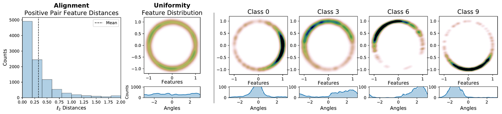

**Figure 7.** Alignment and uniformity of contrastive features on CIFAR-10, trained with outputs on the circle $S^1$. Left: histogram of distances between positive pairs. Middle: the density of all features on the circle, close to uniform. Right: the density of four single classes, each concentrated on an arc. From Wang and Isola (2020).

*Proposition 4.3.* If an encoder exists with perfect alignment ($z=z^+$ a.s.) and $z$ uniform on the sphere, it is a global minimum of the limit functional (Wang-Isola). The second variation at the uniform distribution is positive in every direction (this work).

The statement is conditional on reachability. By Proposition 4.1 this condition concerns $\Theta$, which the theorem does not model. The repulsion term also has an exact density form, since at $K\to\infty$ the inner expectation of uniformity is the convolution of $p_z$ with the vMF kernel, evaluated at the anchor.

*Proposition 4.4 (this work).* At $K\to\infty$ the uniformity term equals $\mathbb E_{p_z}\log(p_z*k_\tau)+\text{const}=-H(p_z)-\mathrm{KL}(p_z\,\|\,p_z*k_\tau)+\text{const}$, where $k_\tau$ is the vMF density.

The term is a KL divergence to the uniform distribution only as $\tau\to0$, where $-H(p_z)=\mathrm{KL}(p_z\|\mathrm{unif})-\log|S^{D-1}|$. ==Whether it matches the KL variant of Expanding SPHERE-JEPA is unchecked.==

The work that followed found effects of InfoNCE that its limit does not describe, each at a level the limit leaves out. The limit keeps the minimizer and changes the gradient field, so the switch-off of the pull that Nie et al. found (3.2), a first-order effect, is invisible to it. Uniformity separates all inputs, including inputs of one class that a task wants close. Only the temperature trades spread against this tolerance (Wang-Liu), whose right amount depends on a task family. Pairwise spread is blind to how many directions the cloud uses, so a representation with a good uniformity score can have a low-rank batch covariance (Jing et al.). Fang et al. prove that the uniformity metric misses added zero dimensions and cloned features. Where augmentation noise exceeds data variance, the parameter flow removes a direction whatever the limit prefers (3.4). The loss has many minimizers, among which simplicity bias selects the one SGD finds, again a property of the parameter flow (3.5). The loss acts on $z$ and the probe reads $h$ (3.6). Each of these gaps is a property of the finite batch, the temperature, the augmentations, the architecture or the optimizer. None is a property of the limit functional.

The kernel width follows the same pattern. Read as functionals of kernel density estimates of the embeddings, alignment equals $p$, the first moment of the positive cluster, and contains no width; uniformity with the usual $t=2$ is the log Rényi-2 energy of the embeddings (the logarithm of the mean kernel over pairs) at the fixed kernel width $1/\sqrt8$; the drift acts at the training width $\sigma$ (PPS, Appendix C). Effective rank is a functional of the batch covariance and lies outside this family. In the PPS runs it is the metric that separates schedules, whereas the density functionals move together. The theorem therefore fixes neither the training width nor the semantics. ==Wang and Isola is a zero-order model of contrastive learning at the level of the embedding distribution. Its statements concern the values and the minimizers of a functional of $p_z$, an equilibrium described by two scalars. It is right about which final distribution the loss rewards and silent about the path, the eigenvalues of the batch covariance and the content.== In Figure 11 its column concludes only in the rows of the embedding distribution and of order 0, with its assumptions in the rows of the relation, the batch and the parameters. ==Koromilas et al. compare finite and asymptotic losses and kernel losses. AnInfoNCE shows that the number of recovered factors does not fix downstream accuracy. Both are unread in detail.==

### 4.3. Downstream guarantees: latent classes, the augmentation graph, captured energy, identifiability

Wang and Isola describe what the loss prefers and never mention a task. The results of this section reach a task by assuming where the classes are or by measuring how much of a task the features keep. All of them conclude about a task family and a probe. They differ in the object their assumption fixes, which is the data distribution (Saunshi et al.), the relation (HaoChen et al., Luthra et al. 2026), the minimizers of a model with free embeddings (Luthra et al. 2025), or the class statistics of the representation $h$ (Luthra et al. 2026, directional CDNV).

The first way to reach a task assumes that the data come with latent classes. If positives share a class and negatives are drawn from the marginal, a negative of the anchor's own class is a collision that the loss pays for although a classifier would be right, so the bound has to subtract the collision probability.

*Proposition 4.5 (Saunshi et al. 2019).* If positives come from one latent class, negatives from the marginal, and $\delta$ is the probability that a negative has the anchor's class, the supervised loss of the class-mean classifier is $\lesssim\frac1{1-\delta}(\mathcal L-\delta)$, where $\mathcal L$ is the contrastive loss.

The bound assumes that positives are independent draws from one class, which two augmentations of one image are not. HaoChen et al. replace the classes with the graph $G$ of chapter 1 (Figure 8). If classes were connected components of $G$, the zero eigenvectors of $L$ would be class indicators and the probe would be perfect. Weak edges between classes perturb this picture. The Davis-Kahan theorem bounds how far eigenvectors move under a small perturbation of the matrix, which gives the error in terms of the crossing edges and the sparsest cut.

*Proposition 4.6 (HaoChen et al., Thm 3.8).* Let labels be recoverable from augmentations with error $\alpha$, so that few edges of $G$ cross classes, and let $\mathrm{cond}_k(G)$ be the conductance of the sparsest partition of $G$ into $k$ parts, the largest fraction of edge weight that leaves a part, minimized over partitions. The linear-probe error of the population minimizer of $\mathcal L_{\rm spec}$ with $2k$ dimensions is $\tilde O(\alpha/\mathrm{cond}_k(G)^2)$.

The theorem assumes that the graph reflects the classes, which is the outside information of chapter 6. Augmentations of different images almost never overlap, so the real graph is nearly discrete, yet the method still works. The theorem survives this, but its explanation does not. ==Whether a guarantee exists for a soft graph, where closeness in a learned metric replaces a shared edge, is open.==

The soft graph of the open question above has one guarantee, for a fixed metric on the inputs (Huang, Yi, Zhao and Jiang). Their augmented distance $d_A(x_1,x_2)$ is the smallest distance between a view of $x_1$ and a view of $x_2$, so two inputs are close when some of their views nearly coincide. An augmentation is $(s,\delta_A)$-concentrated when each class has a main part of mass at least $s$ whose $d_A$-diameter is at most $\delta_A$. For an $L$-Lipschitz encoder, their Thm 1 bounds the error of the nearest-centre classifier by $(1-s)+R_\varepsilon$, where $R_\varepsilon$ is the probability that two views of one input land more than $\varepsilon$ apart, provided the class centres in the embedding space lie far enough apart. Alignment controls $R_\varepsilon$, InfoNCE and Barlow Twins keep the centres apart (their Thms 2-4), and the augmentation sets the concentration. Their experiments support this last factor. Weaker augmentations lower the concentration and the kNN accuracy together, for all four methods they test.

The width of such a graph decides whether it can separate the classes at all (Wang 2024). If the inputs lie on $C$ manifolds of dimension $d$ at distance at least $\delta(M)$ from each other, a graph Laplacian with radius $r$ recovers the manifolds when $(\log n/n)^{1/d}\ll r<\delta(M)$. No method recovers them when $\delta(M)$ falls below $c(\log n/n)^{1/d}$ (his Thms 1-3). Augmentations help when each manifold splits into an invariant part of dimension $d_s$ and a part that the augmentations move. Edge weights averaged over augmentations act as a kernel on the invariant part alone, so $d_s$ replaces $d$ in the rate (Thms 4-5). With at least one label per manifold, a logistic probe has an error bound independent of the number of labels (Thm 6). ==This radius window is a rule for the kernel width. The kernel must be wider than the sampling gap of the invariant coordinates and narrower than the gap between classes, the window in which 4.5 places the temperature.==

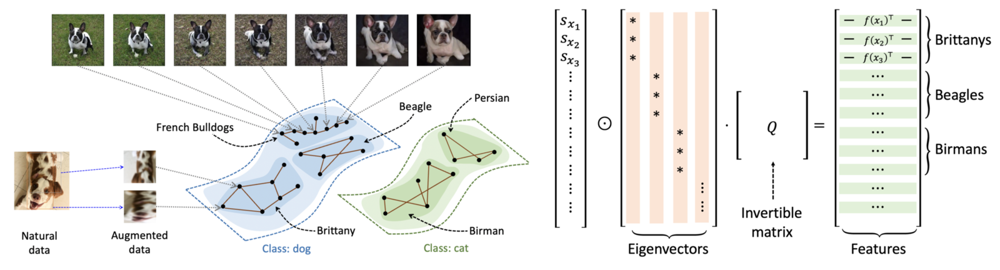

**Figure 8.** The augmentation graph. Left: natural images and their augmentations are vertices, edges join views that can come from one image, and the classes dog and cat are clusters with few edges between them. Right: the features are the top eigenvectors of the normalized adjacency matrix up to an invertible matrix $Q$, so inputs of one class get nearly equal rows. From HaoChen et al. (2021).

Luthra, Bryant, Zhu and Galanti (2026) ask the converse question, how much of a task given features keep. For a task with posterior $\eta$ and features $F:\mathcal X\to\mathbb R^r$, the captured posterior energy is $B(F)=\|\Pi_F\eta\|^2_{L^2(P_X)}$, the squared length of the part of $\eta$ that a linear readout of $F$ can express. For centered and whitened features, $\mathbb EF=0$ and $\mathbb EFF^\top=I_r$, it equals $\|\mathbb E[YF]\|^2$. The quantity belongs to a task together with a function on inputs, so the remaining question is which functions SSL selects. The two-view operator $\mathcal T$ of chapter 1 answers it. The two-view objective is a quadratic form of $\mathcal T$, which is self-adjoint with the constant as its top eigenfunction, so by Ky Fan's theorem the maximum over centered whitened features lies on the top non-constant eigenfunctions.

*Proposition 4.7 (Luthra et al. 2026, Prop. 4.1 and Cor. 4.2).* Let $W$ be symmetric and let $\psi_1,\psi_2,\dots$ be the eigenfunctions of $\mathcal T$ in $L^2(P_X)$ orthogonal to constants, ordered by decreasing eigenvalue. Among centered whitened $F:\mathcal X\to\mathbb R^r$, the two-view objective $\mathbb E[F(x)^\top F(x^+)]$ is maximized when the coordinates of $F$ span $\psi_1,\dots,\psi_r$, and then $B(F)=B_r=\sum_{j\le r}\langle\eta,\psi_j\rangle^2$.

Proposition 4.7 and the spectral picture of HaoChen et al. both end in eigenvectors of a graph matrix, so they may select the same functions. Since $\bar A=\mathcal D^{-1/2}W\mathcal D^{-1/2}$, the two-view operator is $\mathcal T=\mathcal D^{-1}W=\mathcal D^{-1/2}\bar A\mathcal D^{1/2}$, a similarity transform. So $\mathcal T$ and $\bar A$ have the same eigenvalues, and an eigenvector $u$ of $\bar A$ gives the eigenfunction $\psi=\mathcal D^{-1/2}u$. By Proposition 2.7 and Eckart-Young, the minimizer of $\mathcal L_{\rm spec}$ is $F=\mathcal D^{-1/2}U_k\Lambda_k^{1/2}$, whose columns are the top $k$ eigenfunctions of $\mathcal T$ scaled by $\sqrt{\lambda_j}$. The top one is the constant, which the centering of Proposition 4.7 removes and a linear probe with a bias absorbs. ==The two minimizers therefore span the same functions, a link neither paper makes.== A task survives SSL when its posterior lies in the top eigenfunctions, the smooth functions on $G$ that change value only across its weak cuts (6.1). $B_r$ measures how much of the posterior lies there. ==Appendix D of the paper writes BYOL, SimSiam and JEPA as reduced-rank regression with a whitened prediction surrogate; it is unread.==

The captured energy also predicts the few-shot error, because a classifier built from class means errs as much as the classes vary along the line between their means. For a balanced binary task $Y\in\{\pm1\}$ and centered whitened features, the class means are $\pm\beta$ with $\beta=\mathbb E[YF]$ and the average within-class covariance is $I-\beta\beta^\top$. So the variance along the mean difference is $1-B$, against $r-B$ over all directions. Luthra et al. normalize these by the squared distance between the means. The result is the directional class-distance normalized variance (CDNV) $\tilde\nu=(1-B)/(2B)$, the spread of a class along the line to the other class mean, and the classical CDNV $\nu=(r-B)/(2B)$, which counts every direction (their Prop. 3.1). They bound the error of a nearest-class-centroid (NCC) classifier built from $m$ examples per class (Thm 3.4) by

$$
\mathrm{err}^{\rm NCC}_m(F)\le1-B+\frac{r-B}m+\frac{1-B}{1-B+2mB}.
$$

As $m$ grows only $1-B$ remains, so with many examples the error is set by the variance along the mean difference. The variance in the other $r-1$ directions only costs examples. On finite samples they estimate $\hat B=\hat\beta^\top\hat G^{-1}\hat\beta$ with $\hat\beta=\hat{\mathbb E}[YF]$ and $\hat G=\hat{\mathbb E}[FF^\top]$, which needs labels. They also reconstruct it from a two-view spectral basis estimated without labels. On ImageNet-pretrained VICReg, Barlow Twins and I-JEPA encoders the median absolute difference between the two estimates is below 0.05. The directional CDNV predicted from $B$ matches the measured one across the 40 CelebA attributes.

Both guarantees above reach the task through the graph. Luthra, Yang and Galanti (2025) instead compare the self-supervised loss directly with a supervised one. The decoupled contrastive loss (DCL) removes the positive from the denominator of InfoNCE. The negatives-only supervised contrastive loss (NSCL) also removes every sample of the anchor's class. The two losses therefore differ only by the same-class samples that DCL keeps in its denominator. Each term of the denominators is bounded on the unit sphere, which bounds the gap.

*Proposition 4.8 (Luthra et al. 2025, Thm 1).* For unit-norm embeddings, $\tau=1$ and a batch of $N$ samples whose largest class has $n_{\max}$ samples, $\mathcal L_{\rm NSCL}\le\mathcal L_{\rm DCL}\le\mathcal L_{\rm NSCL}+\log\big(1+n_{\max}e^2/(N-n_{\max})\big)$. With $C$ balanced classes the gap is $\log\big(1+e^2/(C-1)\big)$.

The bound holds for every encoder, so it is an order-0 statement about the values of two losses on any batch. Neural collapse, where the embeddings of each class shrink to their mean and the means form a simplex equiangular tight frame (Papyan et al.), is a statement about minimizers. Luthra et al. prove it for NSCL only in the unconstrained features model, where every embedding is a free variable and $D\ge C-1$ (their Thm 2). ==The gap also depends on the temperature. With $\tau$ the terms lie in $[e^{-1/\tau},e^{1/\tau}]$, so $e^2$ becomes $e^{2/\tau}$. At $\tau=1$ the gap is 0.60 nats for 10 classes and 0.007 for 1000; at $\tau=0.2$ it is 7.8 and 3.1.== Self-supervised contrastive learning is approximately supervised in the regime of many classes and a large temperature. At the temperatures used in practice with few classes the bound says little.

The bounds so far concern the embedding or a minimizer, whereas a probe reads the representation $h$ of a trained encoder. Luthra, Salunkhe and Galanti (2026) measure the variance along the mean difference on $h$ directly. For classes $i,j$ with means $\mu_i,\mu_j$, within-class covariance $\Sigma_i$ and $u_{ij}=(\mu_i-\mu_j)/\|\mu_i-\mu_j\|$, the directional CDNV is $\tilde\nu_{ij}=u_{ij}^\top\Sigma_iu_{ij}/\|\mu_i-\mu_j\|^2$. They bound the few-shot NCC error by the average of $4\tilde\nu_{ij}$ over pairs of classes plus terms that vanish as the number of examples grows, assuming only finite fourth moments. The constant 4 cannot be lowered (Cantelli's inequality, a one-sided Chebyshev bound). Across SimCLR, VICReg, MAE, DINOv2, CLIP, SigLIP and I-JEPA, $\tilde\nu$ falls during training from about 2 to between $2^{-5}$ and $2^{-3}$, whereas the classical CDNV barely changes. ==Proposition 3.1 of the paper on captured energy explains the difference. Under its assumptions the ratio of the two measures is $(r-B)/(1-B)$, so the classical CDNV stays large as $B\to1$, because it counts the variance in the $r-1$ directions orthogonal to the mean difference, which the NCC error stops paying for once there are enough examples.== Of the results in this chapter this is the only one that concludes about $h$, the representation the probe reads.

The guarantees above either assume the classes or measure them. Identifiability asks a prior question, whether the latent variables that generated the data can be recovered at all. Reizinger et al. argue that SSL theory should be built on identifiability measured in practice. Zimmermann et al. answer it for latents on a sphere whose positive pairs are vMF neighbours. At $K\to\infty$ their contrastive loss becomes a cross-entropy between the true conditional of the positive and the model conditional, which is minimal when the encoder reproduces the inner products of the latents.

*Proposition 4.9 (Zimmermann et al.).* If latents $c$ are uniform on $S^{d-1}$, $p(\tilde c|c)\propto e^{\kappa c^\top\tilde c}$, the data are $x=\gamma(c)$ with an injective generator $\gamma$, and the encoder $f$ maps to the sphere, every minimizer of the contrastive loss at $K\to\infty$ satisfies $f\circ\gamma=R$ with $R$ orthogonal.

The rotation left over in Proposition 4.9 cannot be removed by a better loss. A standard Gaussian, like the uniform distribution on the sphere, looks the same after every rotation, so no data can tell the coordinates of $c$ from those of $Rc$. Locatello et al. extend this to any factorized prior, with nonlinear bijections in place of rotations.

*Proposition 4.10 (Locatello et al.).* Without assumptions on the model or the data, disentanglement is impossible.

Recovery up to a rotation is therefore the best a loss without further assumptions can give, though even that requires the assumptions of Proposition 4.9. ==Saunshi et al. (2022) show that the graph-based guarantees become vacuous without the architecture, because a rich enough function class minimizes the loss without useful features. So the architecture belongs in the theory next to the graph, which is the subject of this thesis.== Wen and Li (3.5) give the complementary result for features, that which features survive depends on the augmentations. ==Whether both assumptions can be stated as weak cuts of $G$ (6.1) is open.==

### 4.4. Theorems about training dynamics exist only for linear or two-layer models

Chapter 3 described the trajectory, so a theory has to cover it. Theorems about trajectories exist only for reduced models. Tian, Chen and Ganguli analyse BYOL and SimSiam on a linear network and show that the predictor aligns with the eigenspaces of the embedding correlation matrix (2.4). Jing et al. derive dimensional collapse on one- and two-layer linear networks (3.4). Ziyin et al. map the loss landscape of linear models for contrastive and non-contrastive losses (3.1). Simon et al. solve the dynamics of Barlow Twins in a linear kernel setting and find stepwise learning of eigen-directions.

Deeper networks and the temperature enter the dynamics through a two-player reading of the contrastive loss (Tian 2022). For a family of losses that includes InfoNCE, gradient descent on the loss is gradient ascent on a covariance of the embeddings, $E_\alpha=\frac12\mathrm{tr}\,C_\alpha[z,z]$, with pairwise weights $\alpha_{ij}\ge0$ held under a stopped gradient (his Thm 1). For InfoNCE these weights are the kernel weights of Proposition 2.3, the softmax of $-d_{ij}^2/\tau$. They minimize $E_\alpha-\tau\sum_iH(\alpha_i)$, where $H(\alpha_i)$ is the entropy of the weights of anchor $i$ (Thm 2). Training thus alternates a min player that sets the pair weights and a max player that trains the network. For a deep linear network with normalized layers, every local maximum of the max player is global and of rank one, aligned with the top eigenvector of the $\alpha$-weighted data covariance when this eigenvector is unique (Cor. 2, Thm 3). For a two-layer ReLU network with orthogonal one-hot input patterns and augmentations that only rescale the input, local optima are of rank one or higher (Thm 6), which the paper reads as a push toward diverse features. ==The temperature is the weight of the entropy term of the min player, so a schedule of $\tau$ sets how far the pair weights may concentrate on near pairs (4.5).==

Mean-field theory (Mei-Montanari-Nguyen, Chizat-Bach) describes a wide two-layer network as a flow of the density of its hidden units in parameter space. It has not been applied to an SSL loss in the work reviewed here. The limit of 3.7 is the same construction for the embeddings. All of these reach the Lyapunov or convergence level for a reduced model. By Proposition 4.1 what they leave out is the kernel $\Theta$ of a deep nonlinear encoder.

### 4.5. PPS: the temperature set to the positive-pair distance

The Positive-Pair Schedule (PPS) is another result about a reduced model, the author's own, written up as a paper for ICOMP 2026. It is the one piece of this thesis that goes from an identity to a rule tested in training. Its derivation is a sequence of questions, each forced by the answer to the previous one, with each answer at its own level of the ladder of 4.1.

The first question is what the temperature is. Proposition 2.2 answers that $\tau=\sigma^2$ is the squared width of the kernel of a density estimate of the embeddings. The second question is what the gradient does at that width. Proposition 2.4 answers that it moves each anchor by the drift $V=\mu^+-\mu^-$, a difference of scores at width $\sigma$. So a width that follows the current geometry should replace a grid search. The natural target is the width that maximizes the gradient, since the gradient is what moves the representation. Modelling the positives and the negatives as isotropic Gaussian clusters around fixed centroids makes the gradient norm an explicit function of $\sigma$, and setting its derivative to zero gives an equation of the form $ye^y=\text{const}$, solved by the Lambert W function.

*Proposition 4.11 (PPS).* For an anchor-gradient proxy with isotropic Gaussian clusters and fixed centroids, the width that maximizes the gradient norm is $\sigma^{*2}=\max\big(0,((d^-)^2-(d^+)^2)/c_N-d_{\rm clust}^2\big)$ with $c_N=2(1+W(N_{\rm eff}/e))$, where $d^\pm$ are the distances from the anchor to the positive and negative centroids, $d_{\rm clust}$ the common cluster width, $N_{\rm eff}$ the effective number of negatives and $W$ the Lambert W function, the inverse of $y\mapsto ye^y$.

At initialization $d^+\approx d^-$, so $\sigma^*=0$, which makes an online controller built on this optimum collapse. A rule that optimizes the current step ignores that the width chosen now changes the geometry every later step sees. The third question is therefore which schedule $\sigma(t)$ keeps training away from collapse. Answering it needs a model of the trajectory. The model is mean-field. Each anchor sees the average of the other anchors, so the state of the batch reduces to the scalars $p$ and $q$, with the encoder entering only through a closure for $q$. If the two views of an image see nearly the same weighted negatives, these negative terms cancel in the equation for $p$, which leaves a contraction of $p$ toward its floor.

*Proposition 4.12 (PPS, mean-field model).* Assume that the two views of an image induce nearly equal weighted negative terms, $(1-w_i^+)\mu_i^-\approx(1-w_{i^+}^+)\mu_{i^+}^-$ (A1), that the batch is spread on the sphere with mean near the origin (A2), and that the positive distance stays above a floor $p_{\min}>0$ (A3). Then $\dot p=-a\,\phi\,(p-p_{\min})$ with $a>0$ and $\phi=(1-w^+)/\sigma^2$, and $\Phi=p-p_{\min}$ is a Lyapunov function. The inter-input coordinate $q$ has a fixed point $q^*(\sigma)$ that rises continuously from zero with $\sigma$. A schedule stays in the healthy region when its length scale is free of $\sigma$, large while the gap is small, and above zero.

The model thus derives the first half of the regularity of 3.3, that positives contract, and models the second, that $q$ decides collapse. ==The model also gives the function that replaces the loss as a Lyapunov candidate under an adaptive temperature (Proposition 3.5).== The fourth question is which length meets the safety condition. The loss splits into alignment, which equals $p$ and contains no $\sigma$, and uniformity, which does, so asking the uniformity kernel to resolve at the alignment scale sets $\sigma=\sqrt p$. Density estimation reaches the same length, since its data-driven bandwidth rules scale the width with the local spread of the data, which for a positive cluster is $\sqrt p$. In mid-training, where the distances to the positive and negative centroids share a scale, the optimum of Proposition 4.11 is a multiple of $\sqrt p$. Finally, $\sqrt p$ is the only label-free length the objective defines that is free of $\sigma$ and still carries signal, since the negative scale saturates at orthogonality and kernel-weighted scales bring $\sigma$ back. The schedule is $\tau(t)=p(t)$, large at initialization, where $p\approx2$, and above zero late in training because of the floor $p_{\min}$ (Figure 9).

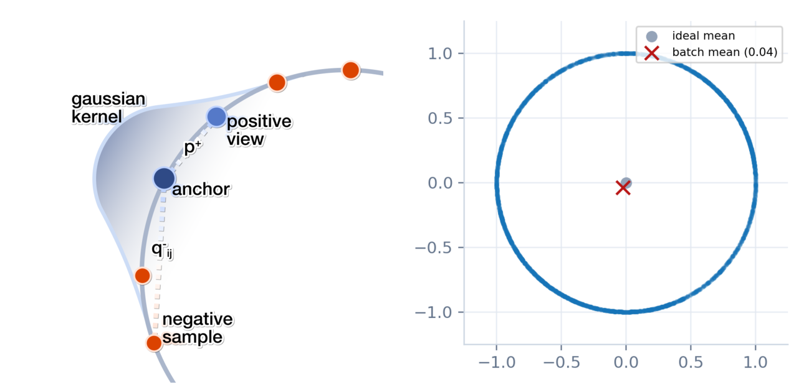

**Figure 9.** PPS. Left: an anchor on the unit sphere, its positive view at distance $p^+$ and negatives at distances $q^-_{ij}$; the batch mean squares of these distances are $p$ and $q$, and the Gaussian kernel around the anchor has width $\sqrt p$. Right: the check of assumption A2 in a PPS run whose projector maps to the circle $S^1$. The projector outputs of one validation batch cover the circle, and the batch mean (cross, norm 0.04) stays at the origin. From the PPS paper, Figures 1 and 5.

The density-estimation argument has a classical counterpart, which transfers only as an analogy. For a KDE the width trades the bias of smoothing, which grows with $\sigma$, against the variance of too few points under each kernel, which falls with $n\sigma^D$, so the optimal width balances the two.

*Proposition 4.13 (Silverman).* The asymptotic mean integrated squared error (AMISE) of a KDE is minimal at the width $\sigma^*\propto n^{-1/(D+4)}$; Silverman's rule is $\sigma=\hat s(4/((D+2)n))^{1/(D+4)}$, and the error falls as $n^{-4/(D+4)}$.

At large $D$ the dependence on $n$ nearly vanishes and the data scale $\hat s$ dominates, which agrees with taking the scale from the positive cluster. The contrastive loss has no analogue of this error criterion. ==What the InfoNCE kernel width minimizes, the contrastive analogue of AMISE, is open.==

The geometry of the sphere gives the same weak dependence on the number of points without any error criterion. It also fixes how the spacing changes with the dimension. A uniformity term spreads the embeddings toward the uniform distribution on $S^{D-1}$, so the scale it leaves for the kernel is the typical distance from an embedding to its nearest neighbour among $N$ points drawn uniformly. This distance is where the expected number of other points closer than it reaches one, so it solves $N\,A_D(\theta)=1$, where $A_D(\theta)$ is the fraction of the sphere within the angle $\theta$ of a point. A chord of angle $\theta$ has the squared length $d^2=2-2\cos\theta$.

On the circle $S^1$ the fraction is $A_2(\theta)=\theta/\pi$, so $\theta=\pi/N$ and the spacing falls as $1/N$. On the sphere $S^2$ a cap of angle $\theta$ has the area $2\pi(1-\cos\theta)$ out of $4\pi$, so $A_3(\theta)=(1-\cos\theta)/2=d^2/4$ and the condition gives $d^2=4/N$. In general the fraction is

$$A_D(\theta)=\frac{\Gamma(D/2)}{\sqrt\pi\,\Gamma((D-1)/2)}\int_0^\theta\sin^{D-2}\phi\,d\phi ,$$

which for a small angle grows as $\theta^{D-1}$. The nearest-neighbour angle therefore scales as $N^{-1/(D-1)}$. At $D=128$ a dataset 200 times larger shortens it by the factor $200^{1/127}\approx1.04$. For a large $D$ the cosine $u$ between a fixed point and a uniform one has the density $\propto(1-u^2)^{(D-3)/2}\approx e^{-Du^2/2}$, so most of the sphere lies near the equator of every point. So the fraction with cosine above $u$ is about $e^{-Du^2/2}$, and $N e^{-Du^2/2}=1$ gives to leading order

$$\cos\theta\approx\sqrt{\frac{2\ln N}{D}},\qquad d^2\approx2-2\sqrt{\frac{2\ln N}{D}} .$$

The nearest neighbour thus moves toward the distance $\sqrt2$ of two orthogonal points as the dimension grows. The number of points enters only through $\ln N$. A kernel whose width is half the spacing has $\sigma^2=(d/2)^2$, which rises with $D$ toward $1/2$ and falls with $N$ only as $\sqrt{\ln N}$. For $D=128$ and $N=512$, random points have the mean squared nearest-neighbour distance 1.47 against 1.50 from the condition. Solving $N A_D(\theta)=1$ exactly gives the squared nearest-neighbour distance $d^2$ and the squared half spacing $(d/2)^2$ below.

| $D$ | $d^2$ at $N=512$ | $(d/2)^2$ at $N=512$ | $d^2$ at $N=5\cdot10^4$ | $(d/2)^2$ at $N=5\cdot10^4$ |
| --- | --- | --- | --- | --- |
| 3 | 0.008 | 0.002 | 0.00008 | 0.00002 |
| 16 | 0.68 | 0.17 | 0.34 | 0.09 |
| 32 | 1.02 | 0.26 | 0.70 | 0.17 |
| 128 | 1.50 | 0.37 | 1.29 | 0.32 |

PPS ends at $\tau=p\approx0.22$ with a 128-dimensional projection, between the squared half spacings for $D=32$ and $D=128$. The trained embeddings are grouped by class, so the distances between neighbouring inputs are shorter than in a uniform spread. Where training ends relative to these distances can be stated as a hypothesis of this work.

==*Hypothesis H1 (this work).* At the end of training the kernel width reaches the scale at which the two views of an input are as far apart as the nearest other input, so the views of all inputs spread evenly over the sphere and $p$ settles at the squared distance from an input to its nearest neighbour.==

A weaker version keeps the two views inside the cell of their input and sets $p$ to the squared half of this distance. Both versions can be checked at the end of a PPS run through the ratio of $p$ to the squared nearest-neighbour distance between inputs. H1 puts this ratio near 1 and the weaker version near 1/4 (10.2). Both also predict that the best constant temperature rises with the dimension of the projection as in the table above.

The weaker version of H1 has a counterpart in Gaussian denoising (Saremi and Hyvärinen). Noise of width $\sigma$ in $d$ dimensions puts a noisy copy of a point $x_i$ near a sphere of radius $\sigma\sqrt d$ around $x_i$. The spheres of two points overlap once $\sigma>\|x_i-x_{i'}\|/(2\sqrt d)$, half their distance per dimension. Their experiments show what happens above this width. The learned estimate of the clean point pulls inputs toward attractors that mix several of them, so on MNIST a test digit 3 ends at a 7. ==The weaker version of H1 is this overlap condition on the sphere. The views of each input stay inside the half spacing, so the kernel does not merge two inputs before training ends.==

The width at the end leaves the shape of the kernel open. A Gaussian kernel gives almost no weight to inputs beyond a few widths, whereas a Laplace kernel $e^{-d/\sigma}$ or a Cauchy kernel $1/(1+d^2/\sigma^2)$ decays slowly, so distant inputs keep acting as candidates. Hu et al. replace the Gaussian kernel of SimCLR with a Student-t kernel (t-SimCLR). Damrich et al. derive t-SNE and UMAP, which use heavy-tailed kernels in the embedding space, as contrastive methods. In t-SNE, heavier tails separate finer clusters (Kobak et al.).

==*Hypothesis H2 (this work).* A schedule of the kernel shape that starts heavy-tailed, gathering many inputs as candidates, and narrows quickly to a peaked kernel of the final width of H1 reaches the accuracy of the best constant temperature in fewer epochs than a schedule of the Gaussian width alone.==

The t-SNE result points the other way, since a heavy tail at the start may separate fine clusters first, against the coarse-to-fine order discussed below. The comparison of the two schedules at an equal final width decides between them (10.2).

These arguments give a rule, which the PPS paper tests in training. With SimCLR and ResNet-18 on CIFAR-10, CIFAR-100 and ImageNet-100, PPS reaches the useful regime of a tuned constant temperature without a search. On CIFAR-10 it matches the best constant (probe 75.62, kNN 80.74) and the adaptive schedules of Kukleva, Huang, Manna and Qiu. On the larger datasets it stays competitive (Figure 10). In the rigour ladder, the identity is exact, the contraction of $p$ is a Lyapunov result inside a reduced model whose assumptions were checked empirically, the safety condition rests on a modelled sign structure for $q$, and $\sqrt p$ is a heuristic supported by the arguments above. The model locates a safe region and leaves the optimum inside it to the encoder, whose effect on $q$ has no closed form. All runs used one seed, one architecture and one batch size. ==Whether PPS transfers to other seeds, architectures, batch sizes, methods and domains is untested (10.2). Whether the schedule changes convergence speed as well as the final accuracy is unmeasured. The loss has many minimizers of equal value that differ downstream (Saunshi et al. 2022, 4.3), so a schedule can change which of them training reaches as well as how fast it gets there.==

The speed question above has a theorem only for drifting generators, whose target density is fixed (Turan, Dufour and Ovsjanikov). Near the target, the gap $\delta=q-p$ between the particle density $q$ and the data density $p$ in $\mathbb R^d$ obeys a linear equation, so each Fourier mode of $\delta$ decays at its own rate. For a Gaussian kernel of width $\sigma$, this rate peaks at the frequency $|\xi|=\sqrt2/\sigma$ and falls as $e^{-\sigma^2|\xi|^2/2}$ above it. A fixed width therefore needs a time exponential in $K_\xi^2$ to reach the frequency $K_\xi$, whereas a Laplace kernel needs polynomial time. A width that shrinks as $\sigma_0e^{-rt}$ moves the peak through the frequencies in turn and needs a time only logarithmic in $K_\xi$. The proof assumes a small gap $\delta$ and a locally homogeneous smoothed target. All experiments are two-dimensional.

==On the sphere of SSL, spherical harmonics play the role of these Fourier modes, because convolution with the vMF kernel multiplies each degree of harmonics by its own factor (4.2). The eigenvectors of the kernel matrix of a batch are their finite-sample version. A wide kernel keeps only the top eigenvectors, the coarse partition of the batch. A narrower kernel resolves more of them. So a falling temperature learns coarse structure first, in the order in which a diffusion model generates the low spatial frequencies of an image (Rissanen, Heinonen and Solin). The theorem needs a fixed target, which SSL lacks (4.6). It also sides with the objection to H2, since a heavy-tailed kernel keeps high frequencies and resolves fine structure early.==

==*Hypothesis H3 (this work).* The width acts on what is learned only through this filter, so the effective rank of the embeddings follows the current temperature more closely than the epoch, for rising, falling and cosine schedules alike (10.1).==

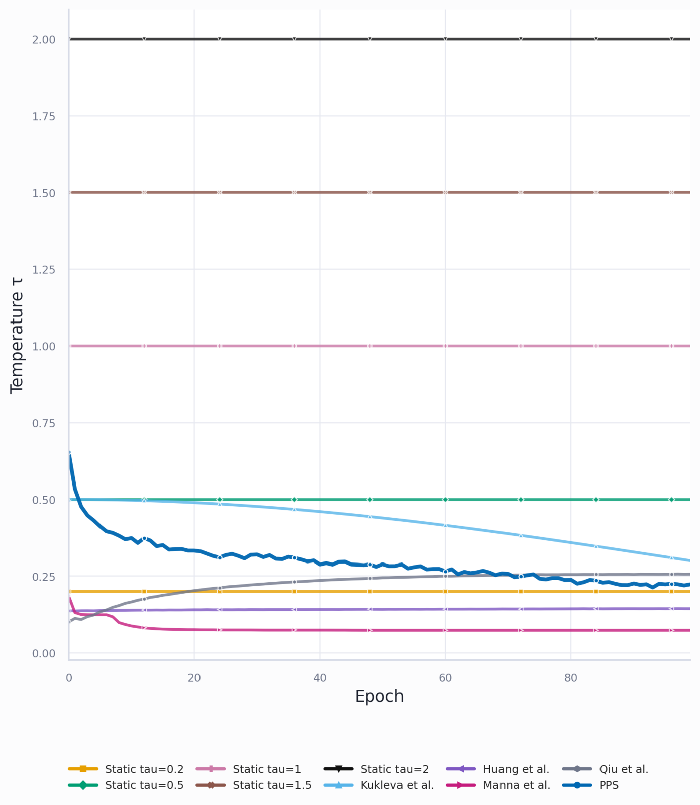

**Figure 10.** Temperature over training on CIFAR-10 for constant temperatures from 0.2 to 2, the adaptive schedules of Kukleva et al., Huang et al., Manna et al. and Qiu et al., and PPS. The PPS temperature equals $p$, starts near 0.65 and settles near 0.22, so the floor $p_{\min}$ of assumption A3 is visible directly. From the PPS paper, Figure 2.

### 4.6. Score matching and drifting generators: identities transfer, convergence needs a fixed target

Section 2.6 showed that the SSL flow is a difference of scores. Score matching has a mature theory, so the question is which of its results hold when the target density moves with the model. Its starting point is that the distance between the model score and the unknown data score can be computed without the data score. Expanding the square leaves one cross term with the data score, and integration by parts moves the derivative from the data density onto the model.

*Proposition 4.14 (Hyvärinen).* For a data density $P$ and a model density $Q$ that decay fast enough, $\mathbb E_P\|\nabla\log Q-\nabla\log P\|^2=\mathbb E_P[\|\nabla\log Q\|^2+2\Delta\log Q]+\mathrm{const}$, where $\Delta$ is the sum of second derivatives.

The second derivatives in $\Delta\log Q$ are expensive for a network, which Vincent avoids by adding noise. The gradient of a noised density is an average of kernel gradients, each known in closed form for a Gaussian noise kernel. Regressing on the kernel score therefore gives the score of the noised data up to a constant.

*Proposition 4.15 (Vincent).* Let a network $s_\theta$ estimate the score and let $k_\sigma(\tilde x|x)$ be a Gaussian noise kernel. Denoising score matching $\mathbb E\|s_\theta(\tilde x)-\nabla_{\tilde x}\log k_\sigma(\tilde x|x)\|^2$ and explicit score matching to the noised marginal $(P*k_\sigma)(\tilde x)=\int k_\sigma(\tilde x|x)P(x)\,dx$ differ by a constant that does not depend on $\theta$.

A network can thus learn a score without the density. Saremi and Hyvärinen add the identity of Miyasawa and Robbins, $\hat x(y)=y+\sigma^2\nabla\log p_\sigma(y)$ for Gaussian noise, so the same learned score also gives a one-step denoiser (4.5). A Gaussian smoothing of width $\sigma$ is the kernel of Proposition 2.2, so these identities are algebra on kernels and transfer to SSL unchanged. The repulsion of SSL has a classical relative too. Contrastive divergence trains a model by lowering its energy $-\log Q$ on data and raising it on samples drawn from the model itself. With one Langevin step, a gradient step on $\log Q$ plus Gaussian noise, it becomes score matching as the step shrinks to zero (Hyvärinen 2007). ==SSL repels each embedding from samples of the current embeddings in the same way, so contrastive divergence is the classical estimator closest to its repulsion term.==

Results about where a flow ends need more, starting with the flow itself. The drift $V$ of Proposition 2.4 moves an anchor by the gradient of its own loss term, whereas a gradient flow over the embedding distribution also moves a point through every term in which it is another anchor's negative. The first variation of uniformity, its derivative with respect to the density, contains both contributions. Perturbing $p_z$ changes the point at which each anchor evaluates its density and also the kernel sum in the denominator of every other anchor.

*Proposition 4.16 (first variation of uniformity, this work).* For a symmetric kernel $k$ and the uniformity term $U(p_z)=\mathbb E_{p_z}\log(p_z*k)$ of Proposition 4.4,

$$
\frac{\delta U}{\delta p_z}(w)=\log(p_z*k)(w)+\Big(k*\frac{p_z}{p_z*k}\Big)(w),
$$

and the Wasserstein gradient flow of $U$ moves mass with velocity $-\nabla_w\,\delta U/\delta p_z$.

With the Gaussian kernel of width $\sigma$, the first term gives $-\nabla\log(p_z*k)(w)=(w-m(w))/\sigma^2$, the push away from the kernel-weighted mean of the other points, which is the repulsion half of $V/\sigma^2$. The second term gives $\frac1{\sigma^2}\int\frac{k(w,w')}{(p_z*k)(w')}(w-w')\,p_z(w')\,dw'$, the push that $w$ receives as a negative of every other anchor $w'$, weighted by its softmax weight in the denominator of $w'$. The anchor drift keeps the first term only, whereas the gradient computed on a batch contains both, because backpropagation differentiates every denominator in which a point appears. When $p_z$ varies slowly at the scale $\sigma$, $p_z/(p_z*k)$ is nearly constant and the second term nearly vanishes. At widths comparable with the structure of the cloud the two terms are of the same order.

The correction of Proposition 4.16 appears again in drifting generators (Gretton et al. 2026). Their kernel is $k_\tau(x,y)\propto e^{-\|x-y\|^2/\tau}$, so their $\tau$ is $2\sigma^2$. The smoothed densities $P_\tau=P*k_\tau$ and $Q_\tau=Q*k_\tau$ belong to the data distribution $P$ and the generator distribution $Q$. The drift is $V=\frac\tau2(\nabla\log P_\tau-\nabla\log Q_\tau)$, the field of Proposition 2.4 with the data as positives. The Wasserstein gradient flow of $\mathrm{KL}(Q_\tau\|P_\tau)$ has instead the velocity $-\nabla_y\int k_\tau(x,y)\log\frac{Q_\tau(x)}{P_\tau(x)}\,dx$ (their Prop. 2), the log-ratio smoothed once more by the kernel, because a sample enters the divergence through $Q_\tau$ at every point its kernel covers. ==Proposition 4.16 is the same fact for the uniformity of InfoNCE. In both cases the drift evaluates a log-ratio at the point, whereas the exact velocity convolves it. Their Theorem 3 is Proposition 2.13 for a Gaussian kernel==, $V=0$ everywhere if and only if $P=Q$.

This field reaches the weights of a drifting generator through a regression. The generator regresses its samples onto the samples moved by the field, with the moved target under a stopped gradient. So the residual is the field itself, and the gradient passes through the generator once, which connects the field to the parameters.

*Proposition 4.17 (Gretton et al., Prop. 8).* Let a generator $f_\theta$ push noise $\xi$ to the distribution $Q_\theta$, and let $V=-\nabla\,\delta\Psi/\delta Q$ be the velocity of the Wasserstein gradient flow of a functional $\Psi(Q)$. For a step $\varepsilon>0$ the regression loss $\mathcal L(\theta)=\mathbb E_\xi\|f_\theta(\xi)-\mathrm{sg}\big(f_\theta(\xi)+\varepsilon V(f_\theta(\xi))\big)\|^2$ has gradient $\nabla_\theta\mathcal L=2\varepsilon\,\nabla_\theta\Psi(Q_\theta)$.

The stopped gradient thus turns a regression onto moved samples into gradient descent on the functional, a statement about the parameter flow. ==The induced motion of the samples is $-\Theta\nabla\,\delta\Psi/\delta Q$ by Proposition 4.1, an Euler step of the Wasserstein flow only when $\Theta=I$.== Without the stopped gradient the same loss is $\varepsilon^2\mathbb E\|V\|^2$, a different objective that every state with a vanishing field at the samples minimizes, ==which is consistent with the collapse of a drift loss written without a BYOL-like scheme in DriftSSL (below)==. Turan et al. reach the same split from the JKO scheme of Jordan, Kinderlehrer and Otto, which computes each step of a Wasserstein flow as a small optimization problem. A field frozen at the current samples turns this step into an explicit Euler step. They suggest that the moving-average encoders of SSL freeze the field in the same way. ==For a linear SimSiam, Thm 2 of Tian, Chen and Ganguli (2.4) confirms the other half of this split, since collapse is certain without the stopped gradient.==

Gretton et al. also treat the field that drifting models use in practice, normalized by a Sinkhorn-type preconditioner that rescales the kernel weights so that rows and columns sum to fixed values. This normalized field is a Wasserstein gradient flow only when the gradients of the preconditioner and of the score difference are parallel everywhere (their Prop. 4). They also show that the field moves mass between distant modes slowly, since for two point masses at distance $d$ the velocity carries the factor $e^{-d^2/(2\sigma^2)}$, the kernel at that distance (their Prop. 5). ==Read in SSL, a narrow kernel early in training cannot move embeddings between distant groups, which would be a second reason for the wide initial kernel of PPS besides the safety condition of Proposition 4.12; this reading is untested.==

With the correct velocity, the Wasserstein reading of SSL can be stated precisely. A gradient flow over $p_z$ needs a fixed target density, which a stopped gradient on the positives supplies. The right functional is $\Psi(p_z)=\mathbb E_{p_z}\log\big((p_z*k_\sigma)/\hat p^+\big)$. Its first variation is $\log(p_z*k_\sigma)-\log\hat p^++k_\sigma*\frac{p_z}{p_z*k_\sigma}$, so its velocity $\nabla\log\hat p^+-\nabla\log(p_z*k_\sigma)-\nabla\big(k_\sigma*\frac{p_z}{p_z*k_\sigma}\big)$ is $V/\sigma^2$ with the term of Proposition 4.16 added.

*Conjecture 4.18 (this work).* Let a stopped gradient freeze the positives, so that the target $\hat p^+$ of each anchor, the kernel around its positive, is fixed during a step. At $K\to\infty$, a gradient step of InfoNCE on free embeddings is an explicit Euler step of the Wasserstein gradient flow of $\Psi(p_z)=\mathbb E_{p_z}\log\big((p_z*k_\sigma)/\hat p^+\big)$, whose velocity is $V/\sigma^2$ plus the other-anchor term of Proposition 4.16.

Proposition 4.17 is the parameter-side version of the same statement for a generator. ==The step needs a written proof, in particular for the attraction, which in InfoNCE pulls toward one positive and matches $\nabla\log\hat p^+$ only through Proposition 2.4. Whether the sequence of flows, with $\hat p^+$ rebuilt after every step, converges is open.== SIGReg compares the batch with a fixed $\mathcal N(0,I)$ and needs no stopped gradient for its target.

Convergence of such flows is proved only for a fixed target, and sometimes not even then. MMD is not displacement-convex, that is, convex along the optimal-transport paths between distributions. Arbel et al. show that the MMD flow converges to its target only under extra conditions, so a state where the field vanishes at the particles while the cloud differs from the target cannot be excluded (Proposition 2.13). ==Whether stable stalls exist for the vMF kernel on the sphere is open; a proof that they do not would close one piece of the theory.==

Drifting generators sit between the two settings, since their target, the data, stays fixed. Deng et al. train a generator with the drift $\mu^+-\mu^-$, data as positives and generated samples as negatives. With a Gaussian kernel this drift is a difference of smoothed scores, $V=\sigma^2\nabla\log(p_\sigma/q_\sigma)$, so a drifting generator does score matching at the scale of the kernel (Turan et al.). The field determines the target when the Fourier transform of the kernel vanishes nowhere. Their variational reading takes the functional $\sigma^2\mathrm{KL}(q_\sigma\|p_\sigma)$, whose Wasserstein velocity matches the drift up to an error $O(\sigma^2\|\nabla^2\log(q_\sigma/p_\sigma)\|)$, the correction of Gretton et al. and of Proposition 4.16.

With its target fixed, this field has a convergence proof (Cao, Wei and Liu). They derive it as the Wasserstein gradient flow of the KL divergence between two kernel density estimates (KDEs) with bandwidth $\sigma$ (their Thm 4.9), which holds up to the extra convolution of Gretton et al. Along this flow the divergence decreases to the target, its only stationary point, for kernels that are characteristic (2.5), positive, smooth and of bounded gradient. They extend the flow to the sphere with a vMF kernel, the case of SSL. A Laplace kernel, which is not differentiable at zero, makes the particles jitter. Their experiments are two-dimensional, and they name the main limit themselves, a minibatch KDE whose variance grows with the dimension.

The balance between attraction and repulsion in such a field is visible without a network (Liu 2026). Liu simulates fixed positive charges for the data and negative charges, released at random positions, for the generated samples, with the force $re^{-r/\tau}$ of the kernel of Deng et al. With the balanced field $V^+-V^-$, each negative ends paired with a positive. With $2V^+-V^-$, the samples collapse toward the centre of the data. With $V^+-2V^-$, they spread too far out. The simulations are two-dimensional and come without a theory. ==The collapse under extra attraction is Proposition 2.1. The neutral pairing is the end state that H1 describes for views and their nearest neighbours.==

In generation the data density is fixed and these convergence arguments apply. In SSL both clouds move, so exact identities transfer, convergence results transfer only with a frozen target (a stopped gradient, a moving-average teacher, or a fixed distribution as in SIGReg), and bandwidth rules transfer as analogies because the error criteria differ.

The target of SSL moves along several axes at once, most of which score matching fixes. The table lists the axes, the level of Figure 1 at which each lives, and what holds it still.

| Axis            | What moves in SSL                                                                                          | Level               | In score matching                      | What holds it still                                                |
| --------------- | ---------------------------------------------------------------------------------------------------------- | ------------------- | -------------------------------------- | ------------------------------------------------------------------ |
| Target distribution      | $\hat p^+$ and $\hat p^-$, built from the moving embeddings                                            | embedding distribution       | the data distribution, fixed                    | a stopped gradient, a moving-average teacher, a fixed distribution (SIGReg) |
| Kernel width    | $\tau(Z)$ computed from the batch (PPS, Huang, Qiu)                                                      | control             | a noise schedule fixed before training | a constant $\tau$                                                 |
| Relation        | fixed by the augmentation distribution; moves when views are learned (Viewmaker, lens)                              | relation $G$       | a fixed noise kernel                   | a fixed augmentation distribution                                           |
| Batch           | a new sample every step, and a biased estimate because the logarithm wraps the negatives (Proposition 3.3) | batch               | an unbiased minibatch                  | a large $K$, a queue                                              |
| Parametrization | $\Theta$ couples the points to the target that pulls them                                                | parameters          | present, moves only the estimate       | the lazy regime                                                    |
| Second branch   | a moving-average target and a trained predictor                                                            | parameters, control | absent                                 | a fixed teacher                                                    |

The batch, the parametrization and the kernel width also exist in score matching, where they do no harm. A minibatch of data gives an unbiased estimate of the score-matching loss, because the loss is an average of per-sample terms, whereas the logarithm around the negatives of InfoNCE biases the batch estimate. A network parametrizes the score in both settings. In score matching it changes only the estimate while the target stays the data distribution, whereas in SSL the same parameters produce the target. The noise level is a schedule in diffusion, fixed before training, whereas an adaptive temperature computes it from the embeddings and closes the loop of Proposition 3.5. ==Every axis that moves turns a convergence theorem with a fixed target into a statement about a sequence of problems. The methods of chapter 5 differ in which axes they freeze.== ==JEPA has no generator. A generator trained by denoising score matching on the same latent would supply one without a separate decoder. Whether it keeps the quality of the representation is open (10.1).==

The DriftSSL project tested these transfers in training and recorded where they fail. A loss written directly from the drift collapses almost at once without a BYOL-like scheme, because shrinking the norm of every vector pulls all points together, which is locally optimal. The drift identity holds throughout, so an identity alone does not prevent collapse, as Proposition 3.1 already says for any stationary point. Deriving $\sigma$ from the loss collapses at initialization for the reason of Proposition 4.11. A moving average for stable statistics has not fixed it. A controller on the drift norm is unstable. The kernel argument extends from the Laplace distribution to all symmetric exponential distributions, so Laplace is not special. The parts that preserve local structure match baselines without hand-tuned hyperparameters and do not beat them.

### 4.7. Table of results: what each concludes about and what it assumes

Placed side by side, each result of 4.2-4.6 proves one link of the chain of 4.1 for the objects of one or two levels of Figure 1 and takes the other levels as given.

| Work                                | Concludes about                     | Proves                                                                                                             | Assumes                                                        | Gives in practice                               |
| ----------------------------------- | ----------------------------------- | ------------------------------------------------------------------------------------------------------------------ | -------------------------------------------------------------- | ----------------------------------------------- |
| Wang-Isola (4.2-4.4)                | embedding distribution, order 0              | the minimum of the limit functional is perfect alignment plus uniformity                                           | $K\to\infty$; the uniform distribution is reachable                   | uniformity as a metric                          |
| First variation (4.16)              | embedding distribution, order 1              | the velocity of uniformity is the anchor drift plus a term from other anchors                                      | a symmetric kernel; free embeddings                            | a correction to the drift                       |
| Wang-Liu (3.2)                      | batch, order 1                      | $\tau$ redistributes the push among negatives                                                                    | the loss form; no optimal $\tau$                              | the uniformity-tolerance trade-off              |
| Collapse saddle (3.1)               | batch, order 2                      | collapse is a strict saddle of InfoNCE                                                                             | free embeddings                                                | why repulsion in the loss escapes collapse      |
| Saunshi 2019 (4.5)                  | task family, order 0                | bounds through latent classes                                                                                      | positives independent within a class                           | a bound                                         |
| Saunshi 2022                        | task family                         | ==graph bounds are vacuous without the architecture==                                                          | ==an architecture bias==                                   | ==a bound==                                 |
| HaoChen (4.6)                       | task family, order 0                | bounds through the augmentation graph                                                                              | the graph reflects classes; the population minimizer           | a bound                                         |
| Luthra 2026, two-view (4.7)         | task family, relation               | SSL keeps the top eigenfunctions of $\mathcal T$; the recoverable part is $B_r$; a few-shot bound through $B$ | centered whitened features; the optimum is reached             | $\hat B$ on a trained network                 |
| Luthra 2025, NSCL (4.8)             | order 0; minimizers                 | DCL is close to NSCL for many classes; neural collapse of NSCL minimizers                                          | unit norm; free embeddings with $D\ge C-1$ for the minimizers | a bound                                         |
| Directional CDNV                    | representation $h$, task family    | few-shot error is bounded by the variance along the mean difference                                                | finite fourth moments                                          | $\tilde\nu$ on a trained network               |
| Zimmermann (4.9)                    | embedding $z$, order 0             | latent recovery up to rotation                                                                                     | vMF positives, injective generator                             | identifiability                                 |
| Klindt-LeCun-Balestriero            | embedding $z$, data distribution            | linear recovery of world latents; the Gaussian is the only latent distribution for which it holds                           | stationary additive-noise transitions                          | identifiability                                 |
| Network flow (4.1)                  | embedding flow, parameter flow      | the network moves the batch by $-\Theta\nabla_Z\mathcal L$                                                        | gradient flow                                                  | the bridge between particle and network results |
| Ziyin; Jing; Simon (4.4)            | parameter flow, batch covariance    | landscape, dimensional collapse, stepwise learning                                                                 | linear networks                                                | spectral control                                |
| Tian, Chen, Ganguli 2021 (2.4)      | parameter flow, batch covariance    | the stopped gradient makes collapse a saddle; weight decay sets which eigen-directions survive                     | linear network; isotropic data; symmetric predictor; target proportional to online weights | DirectPred                                      |
| Tian 2022 (4.4)                     | parameter flow                      | gradient descent is a max player over the network against a min player over pair weights; deep linear optimum is rank one along the top eigenvector of $X_\alpha$ | fixed layer norms; distinct top eigenvalue; one-hot modes for the ReLU case | stopped pair weights                            |
| Tao et al. (2.4)                    | parameter flow                      | the gradients of the three families share one form, pull plus $\lambda Fu$                                         | a linear predictor for the asymmetric case                     | UniGrad                                         |
| Garrido et al. (2.3)                | batch                               | sample- and dimension-contrastive penalties bound each other                                                       | unit-norm samples                                              | the families differ by tuning and projector     |
| Huang et al. (4.3)                  | task family, relation               | nearest-centre error from alignment, divergence of centres and concentration of augmentations                      | $(s,\delta_A)$-concentration; Lipschitz encoder                | augmentation strength as a measured factor      |
| Wang 2024 (4.3)                     | relation, task family               | a radius window for recovering class manifolds; the optimal rate depends on the invariant dimension                | separated manifolds; product structure of invariant and nuisance parts | a bandwidth window                              |
| Zhang, Wang, Wang (9.3)             | relation, task family               | MAE aligns on a two-hop mask graph; U-MAE bounds the spectral loss                                                 | an approximate inverse encoder; a bi-Lipschitz decoder         | U-MAE; the mask ratio as a graph parameter     |
| Turan et al. (4.5, 4.6)             | order 1, embedding flow             | the drift is a score difference; Fourier modes decay at a kernel-set rate; annealing makes the time logarithmic in frequency | a fixed target; linearization; free particles in $\mathbb R^d$ | an exponential width schedule                   |
| Koromilas; AnInfoNCE                | order 0                             | ==finite losses; anisotropy of factors==                                                                       | ==a data-generating form==                                 |                                                 |
| PPS (4.11-4.13)                     | batch ($p$, $q$), control       | Lyapunov contraction of $p$; a safe width schedule                                                                | A1-A3; a modelled closure for $q$                             | the rule $\tau=p$                              |
| Gretton et al. (4.17)               | order 1, embedding flow, parameters | the drift is not the flow velocity; regression with a stopped target is gradient descent on the functional         | a fixed data distribution; a Gaussian kernel                            | a correction; a training rule for generators    |
| Score matching (4.14-4.15)          | order 1                             | a score is learnable without the density                                                                           | a fixed data distribution                                               | losses without a density                        |
| LeJEPA                              | embedding distribution, task family          | isotropy is worst-case optimal over tasks                                                                          | unknown task; ridge and kNN probes                             | the SIGReg target                               |
| SPHERE-JEPA                         | embedding distribution, task family          | ==the uniform distribution on the sphere is optimal for a kNN probe==                                                   | ==the same, plus kNN==                                     | the spherical target                            |
| InfoMin (6.3)                       | relation, task family               | optimal views share exactly the information about $y$                                                             | the task $y$ is known                                         | a principle for views                           |

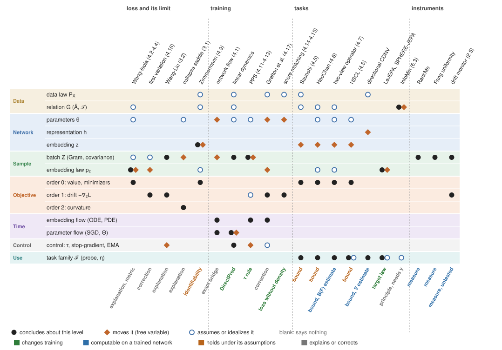

**Figure 11.** Where each result looks. Rows are the levels of Figure 1, columns are results grouped by what they study. A filled circle marks the level a result concludes about, a diamond the level it moves as its free variable, and a ring the level it assumes or idealizes; a blank cell means the result says nothing there. The label under each column says what the result gives to practice, coloured by kind.

Figure 11 shows that a column rarely concludes in two groups of rows at once. Results about the loss conclude at the level of the embedding distribution or the batch and assume the parameters away. Results about training conclude about a flow and assume a fixed data distribution or a linear network. Results about tasks conclude about the task family and assume the relation or a minimizer. ==Every transfer of a result from one paper to another crosses at least one row in which the source result has only a ring or nothing. This is how the failures listed in 4.1 arise.==

The rows that stay nearly empty are the representation $h$, the parameter flow of a deep network, the control loop and the curvature. The regularities of chapter 3 live in these rows, namely the projector gap, the order of features, the feedback of an adaptive temperature and the escape from collapse. Some of the results that give something usable are rules that change training, such as PPS, the target distributions of LeJEPA and SPHERE-JEPA, DirectPred and the spectral losses. Others are measures computable on a trained network without retraining, such as RankMe, the uniformity of Fang et al., $\hat B$, $\tilde\nu$, and the drift monitor of 2.5 once it is validated. The bounds hold under their assumptions and do not tell a practitioner what to change.

No column covers the link from features to trajectory for a deep network, which is where Proposition 4.1 places the realizability gap. No column says which semantics the representation carries either. The columns differ in which source of semantics they take as given.

## 5. Methods grouped by how they build the repulsion

Chapters 2-4 describe one flow and its theory. The methods that implement it arrived in waves, each fixing a failure of the previous one. Sorting them by how they build the repulsion shows which failure each wave answered and which regularity of chapter 3 it was fighting. The proofs are in Appendix A.4.

### 5.1. Waves of methods and their families

The first wave (CPC, SimCLR, MoCo, 2018-2020) used explicit negatives. The second (BYOL, SimSiam, DINO, 2020-2021) removed negatives and relied on an asymmetric architecture. The third (Barlow Twins, VICReg, 2021-2022) replaced the asymmetry with statistics of the batch. The fourth (I-JEPA, LeJEPA, SPHERE-JEPA, 2023-2026) moved the attraction to prediction in latent space and the repulsion to a target distribution. Each method sets where $G$ comes from (augmentations, time, masks), what prevents collapse, and what is predicted.

This grouping matches the one of the Cookbook of Self-Supervised Learning (Balestriero et al.). Its deep-metric-learning, self-distillation and canonical-correlation families are the contrastive, siamese and regularizer families of chapter 0. Chapter 9 treats masked image modeling, which the Cookbook also keeps apart. The table groups the methods by what prevents collapse.

| Family                   | Methods                                                                                                                                   | What prevents collapse                                                                  | Negatives                          |
| ------------------------ | ----------------------------------------------------------------------------------------------------------------------------------------- | --------------------------------------------------------------------------------------- | ---------------------------------- |
| Explicit negatives       | SimCLR, MoCo, NNCLR                                                                                                                       | InfoNCE denominator                                                                     | batch, momentum queue, memory bank |
| Siamese and distillation | BYOL, SimSiam, DINO, I-JEPA                                                                                                               | asymmetry: moving-average teacher and predictor (BYOL), centering and sharpening (DINO) | implicit                           |
| Regularizers             | VICReg, Barlow Twins, LeJEPA, SPHERE-JEPA                                                                                                 | variance and covariance terms; a target distribution                                             | implicit                           |
| Related                  | SwAV (online clustering, Sinkhorn), W-MSE (whitening and MSE), DirectPred and DirectCLR (spectral control instead of a trained predictor) | partition constraint, whitening, spectrum                                               | implicit                           |

Which of these count as contrastive depends on the definition. With an explicit negative denominator, SimCLR, MoCo, NNCLR and DirectCLR are contrastive. With attraction and repulsion both present, nearly every method is, since DINO repels through centering, VICReg and Barlow Twins through decorrelation and W-MSE through whitening. Proposition 2.10 and the bounds of Garrido et al. make the boundary a matter of normalization. Pure BYOL and SimSiam remain outside, because their repulsion is not in the loss. One representative per group is enough for experiments: SimCLR, BYOL, VICReg or SIGReg.

### 5.2. Contrastive methods: fixes to InfoNCE and temperature rules

The contrastive family is the oldest. Its first wave justified InfoNCE through mutual information. The softmax over the positive and $K$ negatives is a classifier that has to pick the positive, which it can do better than chance only if $x$ carries information about $x^+$. Barber and Agakov bound mutual information from below by the expected log-likelihood of any model of the conditional density. InfoNCE is this bound with a model that is normalized over the $K+1$ candidates instead of over all inputs (Poole et al.).

*Proposition 5.1 (CPC, van den Oord et al.).* For any critic, a learned score of how well $x^+$ matches $x$, $I(x;x^+)\ge\log(K+1)-\mathcal L$; the bound is tightest for a critic $\propto p(x^+|x)/p(x^+)$.

In CPC the positive is the true future step of a sequence and the negatives are other steps. Its appendix derives this bound only approximately for large $K$. Poole et al. prove it for every $K$. Since $\mathcal L\ge0$, the bound never exceeds $\log(K+1)$, however much information the views share (McAllester-Stratos). Maximizing information also does not by itself give good representations (Tschannen et al.). The later waves therefore dropped this justification and kept the loss.

The patches inside the family each answer a regularity of chapter 3. Decoupled contrastive learning (Yeh et al.) removes the positive from the denominator, which removes the factor $1-w^+$ from the pull (3.2) and keeps the $K\to\infty$ limit. It does better at small batch, where the factor weakens the pull exactly when the negatives are easy. Debiased contrastive learning (Chuang et al.) assumes a fraction $\delta$ of the negatives shares the anchor's class and subtracts their estimated contribution with a floor of $e^{-1/\tau}$. Hard-negative sampling (Robinson et al.) draws negatives $\propto e^{\beta s}p(x^-)$ by importance sampling. FNC (Huynh et al.) and IFND (Chen et al.) use the current encoder to mark negatives close to the anchor as false negatives and drop or attract them, so a shared background can pass for a shared class. Implicit feature modification (Robinson et al.) perturbs embeddings to remove the shortcut of Proposition 3.4.

The temperature rules are the latest patches. ==By Proposition 3.5 each is a controller in a feedback loop. Read through $\sigma=\sqrt\tau$, each tracks one length. The safety condition of Proposition 4.12 sorts them by whether that length is free of $\sigma$ and large early.==

| Work                    | Length tracked                                                           | Signal                 | Level         | Free of $\sigma$ | Large early                    |
| ----------------------- | ------------------------------------------------------------------------ | ---------------------- | ------------- | ----------------- | ------------------------------ |
| Kukleva et al.          | cosine in the epoch                                                      | time only              | global        | yes               | yes, then periodically small   |
| Manna et al. (DySTreSS) | bounded function of the pair cosine                                      | pair similarity        | pair          | yes               | no                             |
| Huang et al. (MACL)     | $\sqrt{\tau_0(1+A/2)}$, $A=1-p/2$                                    | alignment              | global        | yes               | no; grows as positives tighten |
| Qiu et al. (iSogCLR)    | per-anchor $\tau_i$ holding the softmax entropy at $\log k$           | negative distribution  | anchor        | no                | no                             |
| Khaertdinov et al.      | ==$\tau$ from an external autoencoder==                            | external model         | pair          | ==unchecked== | ==unchecked==              |
| Wang et al. (AMCL)      | ==$\tau_{ij}^{(c)}$ per head and pair, by regularized likelihood== | likelihood over heads  | head and pair | ==unchecked== | ==unchecked==              |
| PPS                     | $\sqrt p$                                                              | positive-pair geometry | global        | yes               | yes                            |

Huang et al. move in the opposite direction to PPS, since their temperature grows as positive pairs tighten. Qiu et al. derive $\tau_i$ as the dual variable of a distributionally robust objective. Among these rules only theirs and PPS derive the temperature from a principle. The two differ in the principle (robustness against kernel geometry) and the level (anchor against global). Because Qiu's signal passes through the current softmax, it is the one rule that can feed back on itself. Kim's temperature-free loss and the learned temperature of CLIP stand apart. ==Whether any work sets the width inside the uniformity term by density estimation, separately from the softmax temperature, is unknown.==

### 5.3. Regularizer methods: how much of the distribution to constrain

The regularizer waves replaced negatives with statistics of the batch. The question each wave answers is how much of the distribution to constrain. VICReg adds the mean squared error between the embeddings of the two views, a hinge that keeps the standard deviation of each coordinate above a threshold, and the sum of squared off-diagonal covariances, each with its own weight. Barlow Twins pushes the cross-correlation matrix of the two views to the identity. By Propositions 2.8 and 2.9 these are soft spectral embeddings of $G$. Both fix two moments and leave everything above free, so embeddings may have heavy tails or several modes at zero VICReg loss. LeJEPA constrains the whole distribution through SIGReg (2.3) and justifies the Gaussian target by the downstream risk of a probe on an unknown task.

A simplified case shows why the risk prefers equal variances. A ridge probe with parameter $\lambda$ shrinks its estimate along an embedding direction of variance $\sigma_j^2$ by the factor $\lambda/(\sigma_j^2+\lambda)$, so a task that lies along a direction of small variance loses most of its signal to the bias. If the task direction is unknown and every direction is equally likely, the expected bias is the average of the squared factors over the directions. The squared factor is a convex function of $\sigma_j^2$, and by Jensen's inequality a convex function averaged under a fixed total of its arguments is smallest when the arguments are equal.

*Proposition 5.2 (after Balestriero and LeCun, LeJEPA; simplified).* Take a ridge probe with parameter $\lambda$, an unknown task direction $w$ uniform on the sphere, and an embedding covariance with eigenvalues $\sigma_1^2,\dots,\sigma_D^2$ and fixed $\sum_j\sigma_j^2$. The expected bias $\frac{\|w\|^2}{D}\sum_j\big(\frac{\lambda}{\sigma_j^2+\lambda}\big)^2$ is minimal at $\sigma_1^2=\dots=\sigma_D^2$.

The variance term of the ridge risk, $\sum_j\sigma_j^2/(\sigma_j^2+\lambda)^2$, is concave for $\sigma_j^2<2\lambda$, so the Jensen step covers only the bias. ==The full LeJEPA argument uses Fisher information instead.== Both arguments assume that no direction is more useful than another. LeJEPA assumes $\mathbb E[\nabla\eta\nabla\eta^\top]\propto I$ with $\eta(z)=\mathbb E[y|z]$. Proposition 5.2 assumes the same through $w$ uniform on the sphere. The result is a minimax statement about shape (2.5), optimal in the worst case over tasks. When the task is known, an anisotropic distribution can be better, since isotropy erases global scale structure. Against contrastive methods, uniformity on the sphere is also a full target distribution, but it comes from the asymptotics of the loss, has no downstream derivation, and needs negatives or large batches. LeJEPA drops the stopped gradient, the teacher and the schedules and keeps one hyperparameter. ==Its reported results are 79% linear probe on ImageNet-1k with ViT-H/14, stability across dozens of architectures and a shorter schedule than I-JEPA, comparable to DINOv2 with fewer components; these are unreproduced here.== The augmentations, the architecture and the choice of layer stay outside the argument.

==SPHERE-JEPA replaces the Gaussian target with the uniform distribution on the sphere, with the same random projections. Its argument is that a Gaussian density is non-uniform, so kNN neighbourhoods are anisotropic. So the worst case over tasks for a kNN probe favours a uniform density. In high dimension a projection of the uniform distribution is close to $\mathcal N(0,1/D)$, so per direction SIGReg nearly equals uniformity. The difference is mostly the radius. Expanding SPHERE-JEPA integrates the projections analytically into a family of sphere regularizers (MMD, KSD, KL over a KDE; heat and band-limited kernels). In this family MMD and KSD give local clusters, whereas KL gives instance separation.== Klindt, LeCun and Balestriero ask when LeJEPA learns a world model and find linear recovery of the latents only for Gaussian latents with isotropic stationary transitions. ==How many moments a regularizer needs is open. If only two matter, the gap between VICReg and LeJEPA should vanish where embeddings are nearly Gaussian. Weak-SIGReg, which projects into a sketch space and pushes the covariance to the identity, was tested only as a supervised stabilizer (10.3).==

### 5.4. Siamese and distillation methods: competing explanations of why they do not collapse

The siamese wave removed the repulsion from the loss and kept collapse away through the training procedure (2.4). BYOL trains an online network with a predictor against a moving-average target under a stopped gradient. SimSiam drops the moving average. DINO uses a teacher whose outputs are centered and sharpened. I-JEPA and data2vec predict masked targets in latent space against a moving-average encoder. Nothing in these losses repels, so the reason they do not collapse has to lie in the procedure. The literature offers competing reasons. The first is that the predictor and the stopped gradient align the predictor with the eigenspaces of the correlation matrix (Tian et al.). DirectPred sets the predictor from the eigendecomposition of this correlation matrix directly and matches a trained one. A second reason is that normalization layers center the batch implicitly and act as a hidden repulsion. ==Bao (2023) shows that feature normalization prevents collapse in the learning dynamics of non-contrastive methods, which supports this reason. Only the abstract is read.== A third is that the moving-average teacher changes slowly enough that the online network chases a non-collapsed target. None of them closes the question. DirectCLR (Jing et al.) applies the loss to a subvector of $h$ with no trainable projector and keeps the representation full-rank, which ties this group to the projector gap of 3.6. ==Where the explanations make different predictions is unmapped. The disagreements would show what SSL does not understand (10.3).==

### 5.5. Places in the pipeline where a method intervenes

Sections 5.2-5.4 sort methods by family. Two methods of one family can still change different things, so a finer map sorts them by the place in the pipeline they change. The places follow from the form $V=\mu^+-\mu^-$, since each changes what $\mu^+$ averages, how $\mu^-$ weights the negatives, what the cloud is compared with, or which semantics counts. A new paper usually changes one place, so a paper is located by the place it moves. A gap is a combination of places that no paper or theorem covers. The table lists the places with the failure each answers.

| Place                     | What it sets                               | Failure it answers                                                                   | Methods                                                                    |
| ------------------------- | ------------------------------------------ | ------------------------------------------------------------------------------------ | -------------------------------------------------------------------------- |
| Positive pairs            | content: what counts as one object         | easy feature wins (Proposition 3.4); constant distractor wins as the slowest feature | augmentations, time windows, masks                                         |
| Negatives and temperature | weights of the repulsion                   | false negatives, shortcuts, temperature mismatch                                     | DCL, hard negatives, FNC/IFND, IFM, PPS                                    |
| Target distribution                | shape: the distribution the cloud is pushed toward  | collapse                                                                             | InfoNCE, VICReg, SIGReg (Gaussian), SPHERE-JEPA (uniform)                  |
| Domain of the repulsion   | the function of $z$ the distribution is imposed on | the static part fills the variance budget                                            | SIGReg on $z$; TC-LeWM: SIGReg on the temporally centered residual        |
| Prediction target         | what the attraction predicts               | temporal feature collapse                                                            | next embedding, frame differences (MotionJEPA), temporal differences (TDV) |
| Task signal               | which semantics counts                     | semantics is not in the loss                                                         | labels, downstream-guided SSL (chapter 8)                                  |

Section 2.5 separates shape, the distribution the cloud is pushed toward, from content, what is attracted. Which part of $z$ the repulsion acts on stays implicit there. The table calls this part the domain. A repulsion acts on the embeddings only through its gradient. A loss evaluated on a linear map of the sequence has a gradient that passes back through the transpose of that map, which has no component along the sequences that the map sends to zero.

*Proposition 5.3 (domain of the repulsion, this work).* Let $M$ be a linear map from the sequence $Z=(z_1,\dots,z_T)$ to the residuals $MZ$, for example $z_t-\bar z_t$ over a window. For any repulsive loss $\mathcal L(MZ)$, the gradient in $Z$ is orthogonal to $\ker M$, the sequences that are constant within every window.

A repulsion on a sum constrains the sum; a repulsion on the residual has no force on the persistent part. ==Proposition 5.3 thus explains why TC-LeWM frees the residual, and also why nothing in its loss keeps the persistent part from collapsing.== ==The persistent part of TC-LeWM carries 47-67% of the variance in the reported runs, so partial collapse of the persistent part is not seen, but no term excludes it. Which regularizer on which function of $z$ prevents both failures is open. MotionJEPA changes the prediction target and TC-LeWM the domain of the repulsion. Both aim at the dynamic part. Whether they are the same fix in two places is open.==

## 6. Semantics comes from the relation, the architecture or the task

Every method of chapter 5 shapes the cloud. By Proposition 2.11 the repulsion treats all inputs alike, so it cannot decide which inputs end up close. That decision has to come from outside the loss, from the relation $G$, the architecture, or a task. The proofs are in Appendix A.5.

### 6.1. A representation is optimal only for a chosen task family

The task comes first among these sources, because a representation is good only for some tasks. A representation may merge two inputs exactly when no task of interest tells them apart. For a family of tasks $\mathcal F$, the inputs that no task of $\mathcal F$ tells apart form the classes of an equivalence relation. The coarsest representation that keeps every task of $\mathcal F$ computable merges exactly these classes.

*Proposition 6.1 (after Lehmann and Scheffé).* Given $\mathcal F$, set $x\sim_{\mathcal F}x'$ if $f(x)=f(x')$ for all $f\in\mathcal F$. The minimal sufficient representation is the quotient $\mathcal X/\!\sim_{\mathcal F}$.

If $\mathcal F$ contains all functions, $\sim_{\mathcal F}$ is equality and the representation must be injective. Any compression chooses which differences do not matter, shape over colour or the reverse. Semantics is therefore the choice of $\mathcal F$. The relation $G$ makes its own choice, which Proposition 2.1 describes. Perfect alignment makes $z$ constant on the components of $G$, so on a connected graph it gives a constant and on a nearly discrete graph it constrains nothing across images. In neither case does the zero eigenvalue carry semantics, which therefore comes from the weak cuts of $G$ together with the architecture. ==Proposition 4.7 makes this quantitative for a linear probe. The features SSL keeps are the top eigenfunctions of $\mathcal T$, which change value only across weak cuts. A task survives to the extent $B_r$ that its posterior lies in them.==

How weak a cut is can be read from the spectrum of $G$. A function that is constant on each side of a cut with little edge weight across it has a small Laplacian energy, so a weak cut forces a small second eigenvalue. The converse, from a small eigenvalue to a weak cut, is the harder direction, which Cheeger's inequality gives.

*Proposition 6.2 (Cheeger inequality for graphs, Chung).* Let $\lambda_2$ be the second-smallest eigenvalue of the normalized Laplacian $L$. Then $\lambda_2/2\le \mathrm{cond}(G)\le\sqrt{2\lambda_2}$, where the conductance is $\mathrm{cond}(G)=\min_S w(S,\bar S)/\min(\mathrm{vol}\,S,\mathrm{vol}\,\bar S)$, with $w(S,\bar S)$ the edge weight between a set $S$ and its complement and $\mathrm{vol}\,S$ the total degree of $S$.

A small $\lambda_2$ thus means one cut of low conductance. For $k$ classes the higher-order Cheeger inequality $\mathrm{cond}_k(G)\le O(k^2)\sqrt{\lambda_k}$ (Lee, Oveis Gharan, Trevisan) turns the conductance of Proposition 4.6 into a spectral gap. HaoChen et al. use a version of it (their Lemma B.4). Augmentations are the manual way to place these cuts. Where to place them depends on the task, as InfoMin makes precise. Views that share more than the task needs carry the excess into the representation, and views that share less lose part of the task.

*Proposition 6.3 (InfoMin, Tian et al.).* Views that are minimal sufficient for a task $y$ share exactly the information about $y$: $I(v_1;v_2)=I(v_1;y)=I(v_2;y)$.

A good choice of augmentations therefore needs knowledge of $y$. A network that compresses well and an optimizer that finds a good minimum give good geometry. Which semantics that geometry carries is still set by $G$ (Proposition 2.1), by the architecture, and by the task family (Proposition 6.1).

### 6.2. Augmentations are hidden supervision

Among the sources, the relation is the one every SSL method sets by hand, through augmentations. Requiring $f(x)\approx f(Tx)$ for every augmentation $T$ declares $x$ and $Tx$ equivalent. The transitive closure of this relation partitions $G$ into the components of Proposition 2.1. Cui et al. write the downstream risk as a function of the augmentation choice. In their analysis strong augmentations reduce within-class variance and also erase task features. By Proposition 6.3 the optimal views share exactly the information about the task (Figure 12), so a rule for choosing augmentations needs the task. ==Invariant, random and equivariant augmentations have not been compared on one task (10.1).==

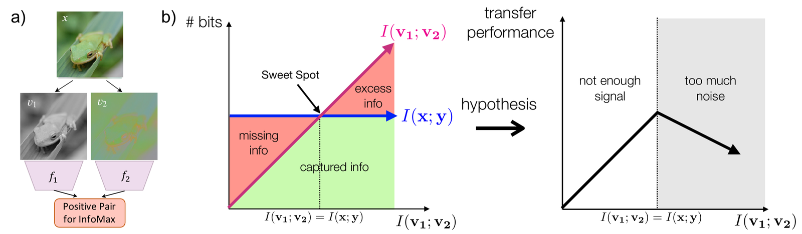

**Figure 12.** InfoMin. (a) Two views $v_1$ and $v_2$ of an image $x$ pass through encoders $f_1$ and $f_2$. (b) Views that share more information $I(v_1;v_2)$ than the task information $I(x;y)$ keep excess information, views that share less miss task information, and transfer performance is highest at equality. From Tian et al. (2020).

Besides augmentations, the encoder itself can supply the relation. NNCLR (Dwibedi et al.) replaces the positive of an anchor with its nearest neighbour in a queue of past embeddings. Mean Shift (Koohpayegani, Tejankar and Pirsiavash) does the same in a BYOL-style method with a target network and no negatives. Both still draw two augmented views, so the augmentations keep fixing part of $G$. Without augmentations, $G$ becomes the nearest-neighbour graph of the current encoder, which moves with the encoder like the target of 4.6. Training then starts from the neighbour graph of an untrained network. What it reaches depends on how good this graph is and on which of its links training can still change.

The neighbour graph of an untrained network is far from random because random weights average out. The inner product of the features of two inputs is a sum over channels, so in a wide network with independent random weights it approaches its expectation over the weights, a fixed kernel of the two inputs. Cho and Saul compute this kernel for fully connected ReLU layers. Novak et al. compute it for convolutional networks, where it compares local patches and, with pooling, hardly changes under small shifts. Gaussian-process regression with the kernel of a random convolutional network with pooling reaches 77.4% on CIFAR-10 with no trained weight (Novak et al.). The neighbour graph of a wide random network is close to the neighbour graph of this kernel, so its purity is a property of the architecture and can be computed before training. Finite networks show the same signal. A linear probe on the first convolutional layer of a randomly initialized AlexNet reaches 57.8% on CIFAR-10 against 66.5% for the same layer trained with labels (Asano, Rupprecht and Vedaldi 2020). On ImageNet the best layer of the random network reaches 17.1% against chance at 0.1% (Caron et al. 2018). DeepCluster (Caron et al. 2018) builds its training on this signal. It clusters the features of the current network with k-means, trains the network to predict the cluster of each image and repeats, starting from random weights. So its first clusters are only as good as the neighbour graph of the random network.

==Which links training can change follows from the loss near a partition whose parts contain all the neighbours of their points. The attraction pulls each point toward its part and the repulsion pushes it away from the others, so the neighbour graph stays the same. Every such partition is therefore a stationary point of training, a semantic one and an arbitrary one alike, so the loss prefers neither. A point can join another part only by first leaving its current neighbours, which raises the attraction term before the new neighbours can lower it. Between updates of the graph, gradient descent with a small step lowers the loss at every step, so it does not cross this rise. A link can still change through the noise of SGD or through a step large enough to jump the rise, with a probability that falls as the rise grows. Lloyd's algorithm for k-means behaves the same way, since each of its steps lowers the cost and it stays in the local minimum where it started. Exchanging the positions of two whole parts keeps every distance, so it leaves the loss and every link unchanged. Points whose neighbours already lie in more than one part face no rise and move first, in a direction set by the initial graph.==

The limitation has one source. The relation that trains the encoder is computed from the encoder outputs, so by the data-processing inequality it carries no information about the classes beyond what the encoder already holds. Training a model on its own outputs meets the same limit in simpler settings. Mobahi, Farajtabar and Bartlett prove that each round of self-distillation in a Hilbert space shrinks the set of basis functions the model uses, so repeated rounds first regularize and then underfit. Pseudo-labelling fits its own mistakes, which Arazo et al. call confirmation bias. Wei, Shen, Chen and Ma give the condition under which self-training does correct its labels. Every small set of inputs must have a neighbourhood of larger probability under input transformations chosen in advance. The model must also give consistent outputs on these neighbourhoods. This neighbourhood comes from outside the model. ==A method that improves on its own neighbour graph therefore needs a relation fixed outside the encoder, such as hand-made augmentations. An asymmetry such as the target network of BYOL changes which stationary point training reaches without adding information about the inputs.==

==*Hypothesis H4 (this work).* Without augmentations, training with neighbour positives does not raise the purity of the neighbour graph of the initial encoder, so the final quality follows this initial purity. The same training with augmentations raises the purity even from an initial graph that was made wrong on purpose.==

The purity of neighbours has been measured before. MNN (Long, Peng and Li) defines it as the fraction of neighbours with the label of the anchor and finds that strong augmentations lower it. AFGRL (Lee, Lee and Park 2022) drops augmentations on graphs and measures the purity under a random graph network. ==For images without augmentations, how the final quality depends on the purity of the initial graph is untested (10.1).==

The other extreme drops the positives altogether. A loss with repulsion alone is minimized by any evenly spread arrangement of the embeddings, so it links no inputs. Whatever grouping survives training then comes from the architecture alone. ==Since the repulsion pushes neighbours apart, it may also erase the grouping of the untrained network (10.1).==

### 6.3. A prediction loss learns the conditional mean of the target

Augmentations build $G$ from two views of one input. JEPA, MAE and data2vec replace the second view with a target to predict. What a squared prediction loss learns then follows from splitting its error. The squared error of any predictor is the error of the conditional mean plus the squared distance between the predictor and the conditional mean, because the cross term has zero mean given the context.

*Proposition 6.4 (bias-variance decomposition).* The minimizer of the squared prediction loss of a target $y$ from a context $c$ is $\mathbb E[y|c]$.

In pixel space with a multimodal target the prediction is the mean of the modes, which is the blur of MAE. In latent space (I-JEPA, data2vec) the target encoder can drop what is unpredictable. So a regularizer or a moving average must keep the target from collapsing (Figure 13). Reconstruction keeps information that need not be linearly readable (MAE-CT, superposition). VICRegL applies the same losses to local features. Prediction learns what the context makes predictable, which need not be what is useful. A wall is easier to predict than gripper fingers, yet control needs the fingers. Under partial observability the target is a belief state. For a multimodal target the conditional mean falls between the modes, so prediction loses what control needs. Sobal et al. show the extreme case. A constant distractor is the slowest and most predictable signal, so a JEPA with a slow-feature objective prefers it to the useful one (chapter 7).

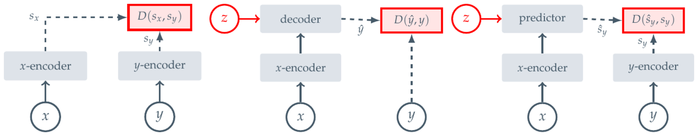

**Figure 13.** Three self-supervised architectures. Joint-embedding: two encoders and a distance $D(s_x,s_y)$ between their outputs. Generative: a decoder predicts the input $y$ itself from $x$. Joint-embedding predictive (JEPA): a predictor predicts the embedding $s_y$ of $y$ from $x$. The red $z$ is a latent variable of the source paper and differs from the embedding $z$ of this text. From Assran et al. (2023).

Recovering the generating factors does not help either. By Propositions 4.9 and 4.10, the best a loss gives is the world up to a rotation. A rotation of the latents is not a set of coordinates meaningful for a task. The open question is whether labels are needed or a structure that links observations, such as time, motion, actions or modalities, is enough. Closeness in time is a free graph $G$ that needs video. It fails when a constant distractor is the slowest feature.

### 6.4. A weighted graph gives invariance; equivariance needs an operator on each edge

Augmentations and prediction targets both enter the loss as a graph with one weight per edge. Such a graph stores only how similar two inputs are, so it can teach invariance and nothing more. Equivariance needs to know how one embedding maps onto the other, which an operator $R_{ij}$ on each edge supplies, so the energy compares $z_i$ with $R_{ij}z_j$. Walking around a cycle of the graph applies the operators of its edges in turn. If their product differs from the identity, the cycle returns to its start rotated, so no non-zero embedding satisfies every edge. If every cycle closes, a frame fixed at one vertex and carried along a spanning tree is consistent at every vertex.

*Proposition 6.5 (connection Laplacian, after Singer and Wu).* Let $G$ be connected, take orthogonal $R_{ij}\in O(D)$ with $R_{ji}=R_{ij}^{-1}$, and the energy $\mathcal E(z)=\sum w_{ij}\|z_i-R_{ij}z_j\|^2$. If the product of the $R$ along every cycle is $I$ (for a triangle, $R_{ij}R_{jk}R_{ki}=I$), then $R_{ij}=U_iU_j^{-1}$ for some $U_i\in O(D)$ and $\min\mathcal E=0$ at a non-trivial $z$; at $R\equiv I$ this is the usual Laplacian.

Cycle consistency is thus the condition for a global coordinate system. It can also serve as a penalty on learned operators (10.3). Without consistency one gets Vector Diffusion Maps and sheaf networks. Hierarchy needs several scales, as in the diffusion wavelets of Coifman and Maggioni, which extend the diffusion maps of Coifman and Lafon. Exact equivariance (G-CNN, tensor field networks, NequIP) gives a large gain when the symmetry is known and exact. ==Learned symmetries (LieGAN, Neural Isometries, Self-supervised Transformation Learning, Equivariance by Contrast, and nearby ContextSSL and AIL) are unread in detail.== A learned equivariance has its own collapse. For $\sum\|F(x)-R\,F(Tx)\|^2$ the choice $F\equiv0$, $R\equiv I$ gives zero, so it needs variance or whitening terms, reconstruction, or a penalty against $R=I$. Each method fixes something in advance, whether the neighbourhood, the positive pairs, the symmetry family, the graph or the scale.

The connection Laplacian is one tool of graph theory, which is a second language for the same questions and a side topic of this thesis. HaoChen et al. read contrastive learning as spectral clustering on the augmentation graph. ==Tan et al. (2024) prove that InfoNCE performs spectral clustering on a similarity graph. Wang et al. (2022) explain the success of contrastive learning on a nearly discrete graph through augmentation overlap between images of one class ("chaos is a ladder"). Both are unread in detail. Whether they close the soft-graph question of 4.3 is open.==

### 6.5. Quality is defined through the task

The relation, the prediction target and the operators each serve some task family, so there is no general quality of an embedding. Proxies such as alignment, uniformity and RankMe are many, yet none suffices (4.2, 3.4). Quality is the match between the representation and the task family $\mathcal F$. Measuring it against the world requires fixing $\mathcal F$ on a toy with known factors and comparing the proxies with probe error and retrieval ==(10.1)==. ==A good manifold may have low local complexity, smoothness with respect to the learned geometry, repeatability and locality, several scales, robustness to transformations, high effective rank and easy readout of important factors; no single property defines a useful geometry, since smoothness depends on the metric.== ==Token fields, hyperbolic manifolds (Nickel and Kiela) and product manifolds (Gu et al.), subspaces and distributions are candidate alternatives to a point in $\mathbb R^d$. No theory compares them yet.==

### 6.6. Open questions of SSL theory

With quality tied to the task, the explanation of chapters 2-5 reaches its limit. "Push and pull" explains optimization and leaves generalization unexplained, because the loss acts on augmentation pairs whereas evaluation is a linear probe on clean images from another layer. The table lists the questions that stay open, each with its known explanation and the weak point of that explanation.

| Question                                    | Known explanation and its weak point                                                                                                                                                                 | Where    |
| ------------------------------------------- | ---------------------------------------------------------------------------------------------------------------------------------------------------------------------------------------------------- | -------- |
| Why instance discrimination gives semantics | ==augmentation graph (HaoChen); the graph is nearly discrete, so the assumption fails; closeness to a supervised loss (Luthra et al. 2025) holds only for many classes and a large temperature== | 4.3, 6.1 |
| Augmentations as a hidden prior             | ==all semantics lives in the augmentation choice, and there is no theory of the choice==                                                                                                         | 6.2      |
| Why BYOL and SimSiam do not collapse        | ==several competing explanations, none closes it==                                                                                                                                               | 2.4, 5.4 |
| The projector                               | ==guillotine regularization names the effect and does not explain why features before the projector are better==                                                                                 | 3.6      |
| The loss does not predict quality           | ==two runs with equal InfoNCE give different probes; RankMe and effective rank are partial remedies==                                                                                            | 3.4, 6.5 |
| Which embedding distribution is good                 | ==every anti-collapse term answers implicitly; downstream results exist only in the worst case==                                                                                                 | 2.5, 5.3 |

Each question can be answered from several theories at once. The places where their predictions differ map what is unknown (10.3). The gaps also point to research directions. Self-calibrating SSL replaces hand-set weights with health constraints on the geometry, as PPS does for the temperature. Latent geometry derived from data builds $G$ from unlabeled data instead of hand-made augmentations. Predictive sufficiency asks for a representation that is sufficient for a task family, minimal, and readable in convenient coordinates. The second part of the thesis applies this picture to a shortcut channel (chapter 7), a task signal during pretraining (chapter 8) and small samples (chapter 9), where the needed semantics must be known in advance.

## 7. RandBit: a shortcut channel defeats contrastive and regularizer losses

Proposition 2.11 predicts, before any run, that a feature supplying an injective, augmentation-invariant function of the input should defeat contrastive and regularizer losses alike. Such a function satisfies perfect alignment. A multiset repulsion only asks that the values differ, so the same function satisfies every such repulsion without encoding anything useful. If the prediction holds, one task can show where the families of chapter 5 lose semantics. The same task can test whether a downstream signal repairs the loss. It also touches the conditions under which semantics is hardest to obtain, namely few samples, structure that lives between samples, and a downstream goal that is unknown during pretraining.

### 7.1. Choosing the test: Trifeature and STL-digits fail, RandBit works

Testing the prediction needs a task where a shortcut can be switched on. The first candidate was the shortcut setting of Robinson et al., SimCLR with ResNet-18 on Trifeature (colour, shape, texture; Hermann-Lampinen) and STL-digits, with $\tau=0.5$, 200 epochs, batch 512 and one seed. It did not isolate a failure. On STL-digits, SimCLR raised logistic-regression accuracy against random initialization from 19.4% to 35.4% on STL-10 and from 12.5% to 75.1% on MNIST, so both features were learned. Implicit feature modification gave 35.4% and 75.9%, so the joint improvement claimed by Robinson et al. did not reproduce. On Trifeature the probe error ended near 4% for all three factors. Colour is linearly available already at initialization. A useful test needs a shortcut whose strength can be set exactly and whose presence does not help the probe.

RandBit (Chen, Luo, Li) provides it. Each STL-10 image (32×32) receives $b$ extra channels holding a fixed random $b$-bit code of the image, constant over pixels. The augmentations change only the RGB channels, so both views carry the same bits. The bits are useless for the class and solve instance discrimination once $2^b$ is large compared with the batch, so $b$ sets one quantity, how much information the shortcut supplies. SSL runs on 20,000 unlabeled STL-10 images. A probe is trained on 5,000 labeled images and evaluated on 8,000 test images, each with its own random bits. The encoder has four convolutional blocks (64, 128, 256 and 512 channels) and global average pooling, $h\in\mathbb R^{512}$, with a projector 512→512→128 whose output the losses read. The augmentations are those of SimCLR. The losses are InfoNCE ($\tau=0.2$), VICReg (weights 25, 25, 1) and SIGReg in the LeJEPA form (Epps-Pulley over 256 random projections, $\lambda=0.05$), trained with Adam at learning rate $10^{-3}$, batch 256, for 15 epochs with seed 0. The readouts are logistic regression on the class from standardized $h$ and the fraction of bits recoverable from $h$ by ridge regression.

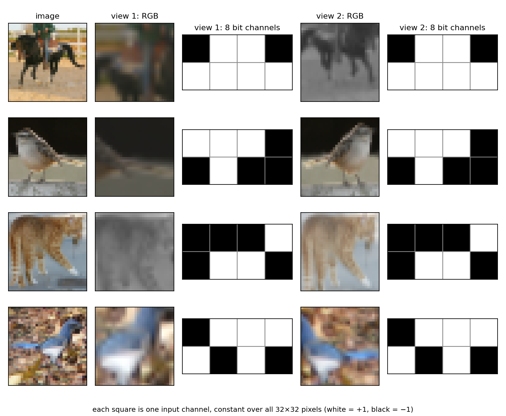

**Figure 14.** RandBit input with $b=8$. Each STL-10 image gets a fixed random code of $b$ bits, stored as $b$ extra input channels that are constant over all pixels. The augmentations (crop, flip, colour jitter, grayscale) act only on the RGB channels, so the two views of an image differ in content and carry identical bits. The bits alone already tell the views of one image from all other images once $2^b$ exceeds the batch.

### 7.2. All three losses lose the image: VICReg at 4 bits, SIGReg at 6, InfoNCE at 8

Without labels during pretraining, linear accuracy on the STL-10 test set falls with the number of bits for every loss:

| $b$          | 0     | 2     | 4     | 6     | 8     | 16    |
| -------------- | ----- | ----- | ----- | ----- | ----- | ----- |
| initialization | 0.391 | 0.358 | 0.316 | 0.285 | 0.258 | 0.191 |
| InfoNCE        | 0.622 | 0.575 | 0.525 | 0.409 | 0.106 | 0.097 |
| VICReg         | 0.601 | 0.534 | 0.123 | 0.105 | 0.097 | 0.103 |
| SIGReg         | 0.569 | 0.499 | 0.398 | 0.217 | 0.102 | 0.100 |

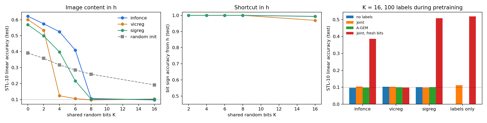

**Figure 15.** RandBit results. Left: linear accuracy on the STL-10 class from $h$ against the number of bits, with the untrained encoder as a dashed line and chance at 0.1. Middle: fraction of bit signs decoded from $h$. Right: accuracy at $b=16$ with 100 labels during pretraining (7.3).

At large enough $b$ all three losses reach the chance level of 0.1 and fall below the untrained encoder at the same $b$, so training actively removes the image from $h$. The bits, by contrast, are read from $h$ with 97-100% accuracy at every $b>0$. The prediction of Proposition 2.11 holds for the contrastive and the regularizer families. ==The threshold differs between losses. It agrees with how many distinct values each repulsion needs.== VICReg breaks at 4 bits. Sixteen codes satisfy its invariance term, since both views carry the same bits. They also satisfy its variance hinge, which only needs each coordinate to spread. These two terms carry the weights 25 and 25. Only the covariance term, with weight 1, pays for the missing rank, since 16 points span at most 15 of the 128 directions. SIGReg falls below the untrained encoder at 6 bits and reaches chance at 8, because each projection must look Gaussian, which needs more distinct values than unit variance. InfoNCE stays above the untrained encoder at 6 bits and reaches chance at 8. In a batch of 256 images each anchor has 510 negatives. A negative carries the anchor's code with probability $2^{-b}$, so about 8 negatives share the code at 6 bits, 2 at 8 bits and 0.008 at 16 bits. ==These negatives are the $K\delta$ term of Proposition 3.4. Only they make the image worth learning.== ==The order of the thresholds, VICReg first, then SIGReg, then InfoNCE, rests on one seed and 15 epochs.==

==The number of bits at which the code alone satisfies a repulsion can be computed for each kind of repulsion, with $N=256$ images in a batch, $D=128$ dimensions of the projector output and $K=510$ negatives. A whitening loss such as SIGReg needs a batch covariance of full rank. Since $2^b$ distinct codes span at most $2^b-1$ centered directions, the code fills all 128 axes from $b=8$. At $b=7$ it leaves one direction for the image. Instance discrimination needs a distinct code for every input of the batch, $2^b\ge N$, which again gives $b=8$. The negatives that share the anchor's code number $K2^{-b}$, about 2 at $b=8$. VICReg is bound by none of these counts, since its two heavy terms are satisfied with 16 codes. At $b=6$ the code spans at most 63 directions and leaves 65 free, yet SIGReg is already below the untrained encoder there. The counts give the point where the shortcut satisfies the loss alone. The earlier loss of the image is a candidate for the dynamics of 3.5, in which the easy feature is learned first and suppresses the rest. The knobs of 10.4 test the counts.==

### 7.3. Labels help only when the shortcut cannot satisfy them

The same task tests downstream guidance (chapter 8). At $b=16$, 100 labeled images (10 per class) enter pretraining either jointly, through a cross-entropy of a linear head on $h$ added to the SSL loss, or through A-GEM (Proposition 8.2), which projects the SSL gradient so that it does not oppose the label gradient. A control trains on the labels alone. In a further variant the labeled images receive fresh random bits at every step, so the cross-entropy cannot be satisfied by memorizing the code of each of the hundred images.

|             | no labels | joint | A-GEM | joint, fresh bits |
| ----------- | --------- | ----- | ----- | ----------------- |
| InfoNCE     | 0.097     | 0.104 | 0.098 | 0.386             |
| VICReg      | 0.103     | 0.103 | 0.099 | 0.097             |
| SIGReg      | 0.100     | 0.098 | 0.100 | 0.508             |
| labels only | –        | 0.112 | –    | 0.518             |

With fixed bits neither joint training nor A-GEM recovers anything. The control explains why, since labels alone give 0.112. A hundred labeled images are memorized through their unique 16-bit codes, so the cross-entropy is itself satisfied through the shortcut. So its gradient tells the SSL gradient nothing about the image. A-GEM is useless here by construction, since it projects one shortcut gradient against another. When the labels cannot be satisfied through the bits, the losses separate. SIGReg with labels reaches 0.508, close to labels alone (0.518), so the regularizer neither hurts nor helps. InfoNCE with labels reaches 0.386, so the SSL loss pulls against the labels. VICReg with labels stays at 0.097, because the regularizer fills $h$ with the bits so that a linear head on a hundred images cannot recover the class. Labels alone at $b=0$ give 0.562. Guidance works only when the downstream signal is not itself solved by the shortcut. On RandBit this condition had to be created by hand; on real data it means that the labeled sample must cover the variation of the shortcut feature.

### 7.4. The same failure on natural data: static backgrounds and small moving objects

Natural data show the same failure wherever one feature is easier to learn than the useful one. Sobal et al. place a moving dot on a noise background. With a fixed background, VICReg and SimCLR learn the background and lose the dot. ==In MotionJEPA on Pong, Dino and Golf, SIGReg in LeWorldModel keeps the score and the paddles and loses the ball (ball NMSE 1.001 against 0.005 for the DISReg regularizer, which predicts the embedding of frame differences). The loss does not show the collapse. Strohm et al. report that on SLIM, where 0.37% of pixels change per step, LeWorldModel with SIGReg solves 0.3% of tasks. An auxiliary inverse-dynamics loss raises this to 34.8%. In TC-LeWM, SIGReg on the whole latent leaves the temporally centered residual with little variance, because the persistent part fills the unit variance budget of each projection and prediction favours it. Applying SIGReg to $r_t=z_t-\bar z_t$ over a window of four frames raises the success of a policy on frozen features from 63.6% to 83.8% on LIBERO (suite-wise, 10 tasks). The variance argument behind it is a Monte Carlo toy with independent Gaussian parts. Zhu et al. measure the failure in a scene with two balls. Under LeWorldModel with SIGReg the Spearman correlation between latent distance and position difference is $-0.0008$ for the controlled ball and $0.40$ for the ball moved by the environment. An auxiliary head that predicts Fourier features of the ground-truth boxes and masks raises planning success with one ball at horizon 4 from 1.2% to 90.0%. Since the head takes its targets from the simulator during training, it is task supervision of the kind chapter 8 studies. TDV learns from temporal differences and reaches kNN top-5 of 17.05 on ImageNet-1k after pretraining on SSv2, against 40.19 for DINO with full augmentations, which suggests that dynamics alone do not give semantics.== In every case the easy feature is a static part that the repulsion can spread at no cost, the analogue of the bits.

### 7.5. RandBit and the hard conditions: few samples, structure between samples, an unclear goal

RandBit gives one task on which the contrastive and the regularizer families lose semantics. It also touches the conditions named at the start of the chapter. The bits are structure between samples, an instance code that distinguishes inputs and says nothing about their content. The number of samples enters through the threshold, since the shortcut wins once it can separate everything the loss compares, which for InfoNCE is a batch. With $n$ images, $\log_2n$ bits identify every image. ==The threshold should therefore fall as the dataset shrinks, which the sample-size sweep of 10.4 tests.== The unclear goal is the reason guidance failed, since the labels did not specify that the class must not be read from the code. Structure within a sample, the static and dynamic parts of a frame, appears in the natural cases of 7.4. Each condition has its own remedy. Structure within samples is handled by changing the prediction target or the domain of the repulsion (Proposition 5.3), or by reconstruction, which suppression barely affects (a VAE in Chen et al., PrCL in Li et al.). Structure between samples is handled by augmentations that randomize the shortcut, like the fresh bits, or by augmentations in feature space (Hamidieh et al.). Few samples are handled by building the graph from patches (chapter 9). An unclear goal is handled by labels that cover the variation of the shortcut (chapter 8).

==The runs cover the contrastive and the regularizer families. The siamese family is untested, though Chen et al. report that BYOL suffers as much as SimCLR. The next runs are three seeds near the thresholds ($b=4,6,8$), a BYOL row, guidance at the threshold ($b=6$ for SIGReg and InfoNCE, $b=4$ for VICReg) where suppression is partial and labels have something to hold on to, a reconstruction control, a natural shortcut, and a sweep over the number of images (10.4).==

## 8. Downstream-guided SSL

If semantics is the choice of the task family $\mathcal F$ (Proposition 6.1), a task or a few labels can state that choice directly. Since there is no general embedding quality (6.5), the task has to enter training or at least the measurement. Chapter 7 adds a condition, that the task signal helps only when the shortcut cannot satisfy it. ==What to measure, and how to use the task, is open.== The proof is in Appendix A.6.

### 8.1. Families of methods that use a task

Classical semi-supervised learning is the oldest way to let a task in (Chapelle et al.). It relies on the manifold, smoothness and low-density assumptions (FixMatch, ==S4L==, ==PAWS==). Supervised contrastive learning uses labels to define positives. Pretraining aware of the downstream task includes BiSSL, V-pretraining and task-customized pretraining. Continual learning projects gradients (A-GEM, ==PCGrad==). Some methods choose the invariance by task (==AIL, ContextSSL==). All of them assume that the structure of $p(x)$ is tied to $p(y|x)$. ==What each method assumes, and where reports on them disagree, is uncollected (8.5).==

==A second group prepares the representation for a task that is unknown during pretraining. These methods are read at the level of abstracts. Multistage contrastive learning (MCL, Zhang et al.) samples the negatives of each stage within clusters of the features learned in earlier stages, so those features no longer separate the negatives and the next stage has to learn others. Zhang et al. test it on unimodal and multimodal encoders and report the largest gains on the attribute questions of MMVP. LooC (Xiao et al.) keeps several embedding spaces, each invariant to all augmentations but one, so information that one augmentation destroys survives in another space. CASSLE (Przewięźlikowski et al.) conditions the projector on the augmentation parameters, so the encoder may keep what the augmentations change. DivDis (Lee et al.) trains several heads that disagree on unlabeled data and chooses among them with a few labels. The lens of Minderer et al. and the Viewmaker of Tamkin et al. learn adversarial changes of the input that raise the SSL loss, which removes a shortcut at the input, where RandBit places it. Steerable representations (Ruthardt et al.) let a query choose which features the representation exposes. Task-robust pretraining (Wang et al. 2023) and the representation-learning game of Uzan and Weinberger optimize against the worst task of a class, which turns the task family $\mathcal F$ of chapter 6 into the objective. MCL acts on the negatives and the adversarial views act on the input, where RandBit puts its code, so they are the first candidates to test on RandBit.==

What MCL does to the RandBit code follows from where it samples the negatives. A stage hides the code from the negatives only where every cluster holds a single code. ==*Hypothesis H5 (this work).* With $k$ clusters per stage, one stage of MCL removes a $b$-bit RandBit code when $2^b\le k$. A longer code needs about $b/\log_2k$ stages, since each stage uses up about $\log_2k$ of its bits. SIGReg has no negatives, so its analogue for a JEPA applies the distribution term within the clusters of earlier stages. The same count of stages holds for this analogue.== Testing H5 needs a reproduction of MCL on the RandBit setup of chapter 7 before the SIGReg variant is trained on the same clusters (10.4).

### 8.2. Predictive information measures structure

Measuring what a task adds requires a measure of what the representation keeps without it. A measure of structure that needs no task is predictive information, the information one part of the data carries about another. In time it is $\mathrm{PI}=I(x_{\le t};x_{>t})$ (Bialek-Nemenman-Tishby); MotionJEPA splits a static term on $z$ from a dynamic term on frame differences, with two hand-set weights. In space it is $I(x_A;x_B)$ for two regions of one frame. Flat background and noise give $I\approx0$, whereas objects and texture give a large $I$. I-JEPA, MAE and InfoNCE already estimate such a quantity. For Gaussians the capacity it assigns to each feature is explicit. Whitening each region and rotating both by the singular vectors of their cross-covariance splits the pair into independent one-dimensional pairs, each with its own correlation $\rho_i$. Mutual information adds over independent pairs. A Gaussian pair with correlation $\rho$ carries $-\frac12\log(1-\rho^2)$. A code of $k$ dimensions therefore keeps the most when it takes the pairs with the largest $\rho_i$.

*Proposition 8.1 (Gelfand-Yaglom; CCA, Hotelling).* For a Gaussian pair $(x_A,x_B)$ the best $k$-dimensional linear code $z$ of $x_A$ for $I(z;x_B)$ is the projection on the top $k$ canonical directions, the projections of the two regions with the largest correlations $\rho_i$, and $I=-\frac12\sum_{i\le k}\log(1-\rho_i^2)$.

A feature with a small canonical correlation $\rho$, like a ball of a few pixels, is dropped at small $k$. Such a feature is not chaotic; it carries little information per unit of capacity, and large predictable features (colour, lighting, continuation of texture) take capacity first. Augmentations and masks exist to take that role away from easy features. A universal measure decides what counts as structure. The correlations $\rho_i$ with the budget $k$ decide how much capacity each feature receives, which is the mechanism of chapter 7 in its simplest form.

### 8.3. The task subspace from probe gradients

Predictive information weights each feature by its correlation alone. A task weights information through $I(z;y)$ (information bottleneck) or through the sensitivity $\partial y/\partial z$. A linear probe reads $z$ only along its weight vectors, so the directions a task reads are spanned by them. For a linear probe with vectors $w_j$, the task matrix $\Gamma=\frac1k\sum_jw_jw_j^\top$ (in general with the sensitivities $\partial\hat y_j/\partial z$ in place of $w_j$) is positive semidefinite. Its range is the subspace the task reads, and $\Pi=\Gamma\Gamma^{+}$ projects onto it. Its cost is about 30 labels. For one task and a whitened representation the least-squares probe is $w=\mathbb E[Yz]$, so ==$\mathrm{tr}\,\Gamma=\|w\|^2$ is the captured energy $B$ of Proposition 4.7. The matrix $\Gamma$ extends it to several tasks and to the directions each task reads.== ==Whether the directions of different tasks are nearly orthogonal in trained encoders, which would let $\Gamma$ compose over tasks as a sum, is unchecked.==

### 8.4. Gradient projection with a ridge probe

Once the task gradient is available, the simplest way to let a task correct SSL is to remove from the SSL step the component that hurts the task. Let $u$ be the gradient of the probe loss and $v$ the SSL gradient. To first order a step $-\eta v$ changes the probe loss by $-\eta\,u^\top v$, so the step hurts the probe exactly when $u^\top v<0$. Subtracting from $v$ its projection on $u$ leaves a step orthogonal to $u$.

*Proposition 8.2 (A-GEM, Chaudhry et al.).* If $u^\top v<0$, set $v'=v-\frac{u^\top v}{\|u\|^2}u$; then $u^\top v'=0$, so the step does not worsen the probe loss to first order.

The signal $u^\top v$ matches V-pretraining (Ke-Fanti), which uses 1,024 GSM8K examples only as feedback to a task designer; here it corrects the step. The ridge probe has the closed form $(Z^\top Z+\lambda I)^{-1}Z^\top Y$, so $u$ is computed through $Z$ without an inner optimization. The construction is a strong baseline more than a new method. Chapter 7 shows its limit, since when the labels are satisfied through a shortcut, it projects one shortcut gradient against another.

### 8.5. Research directions and the quantities to measure

The first direction that 8.1-8.4 leave open replaces a hand-made prior with labels. It asks whether 30 labeled ball positions give the effect of the frame-difference regularizer of MotionJEPA (on Pong, ball NMSE 0.005 against 1.26 for the forward-only baseline). It has a baseline and a clear criterion, so it goes first. The second puts the task subspace $\Gamma$ in $z$ instead of the parameters, as one object that plugs into SimCLR, JEPA or DINO without changing their loss and composes over several tasks. The task is held there by a lower bound on the information in $\Pi z$. Nothing else has to be removed adversarially. The third is a diagnostic of when and which information each SSL method washes out, on tasks with known factors. Luthra et al. (2026) give part of it. Their $\hat B$ per task measures how much of each factor a linear readout keeps. The directional CDNV gives the few-shot counterpart on $h$. What remains is to follow both along training and to attribute the loss to a regularity of chapter 3.

Each direction needs a measurement. Downstream accuracy alone does not measure how the task changes the representation. The quantities to measure are the contribution of each feature (the sensitivity $\partial y/\partial z$ and $\Gamma$), the share of task-relevant information in $z$, the captured energy $\hat B$ and the directional CDNV $\tilde\nu$ of each task, and the amount of task information SSL removed. For each downstream-guided method, an assumption table like 4.7 records what it assumes (task, number of labels, domain), where reports disagree and what critics say. ==Reproducing two or three methods on their own data and transferring them to other fields (medical images, time series, audio) is planned (10.5).==

## 9. Information inside and between small samples

Chapters 7 and 8 assume enough images to train an encoder and ask what labels add to them. In medical imaging and the other fields that 8.5 names, the images themselves are often scarce, which moves the question one step back, to what a few dozen unlabeled images can teach an encoder. Every method of chapters 2-8 learns by distorting an image and comparing the result with something, so the answer depends first on the distortion (9.1). The size of the patterns a network needs to undo a distortion decides whether one image is enough to learn them (9.2). A distortion also has a parameter, such as the angle of a rotation, which the loss either erases or keeps (9.3). Section 9.4 applies these results to a sample of thirty images.

### 9.1. What a distortion does to an image

Without labels, the training signal comes from an operation that changes the image, and what the network must know to undo or ignore this operation is what it learns. The simplest distortion hides part of the image. Context encoders (Pathak et al.) inpaint a missing region, MAE hides 75% of the patches and reconstructs their pixels (Figure 16), and I-JEPA predicts the embeddings of hidden blocks (6.3). To fill a hidden region the network must know what usually surrounds it, so masking teaches the relations between nearby parts, with a separate prediction task for every mask of one image.

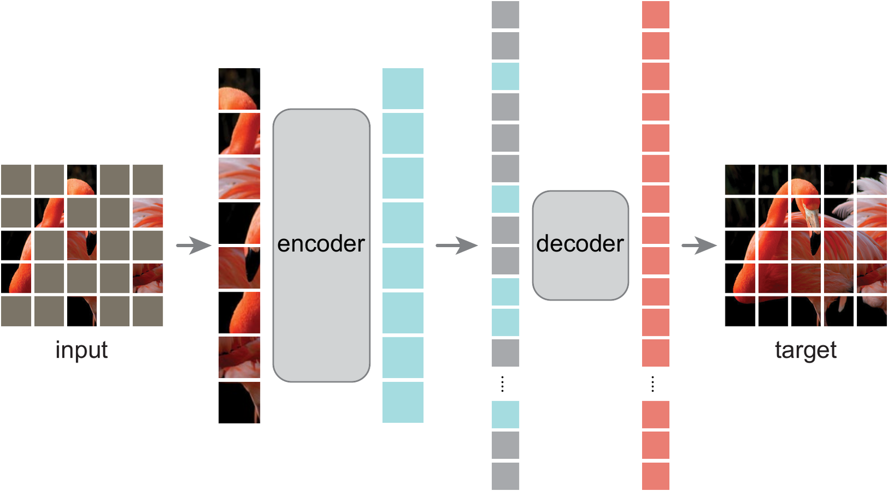

**Figure 16.** MAE. The encoder sees only the visible 25% of the patches. A light decoder reconstructs all patches from the encoded visible ones and mask tokens. From He et al. (2022).

A distortion can also keep every part of the image and change their order. Jigsaw (Noroozi and Favaro) cuts an image into nine tiles, shuffles them and asks for the permutation (Figure 17). Models Genesis shuffles small patches inside a subvolume of a CT scan and asks for the original. Restoring the order requires knowing how the parts of an object fit together.

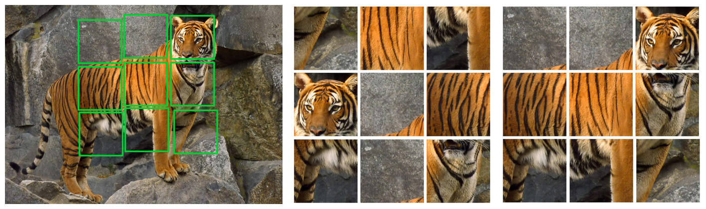

**Figure 17.** Jigsaw puzzle. Nine tiles cut from an image (left) are shuffled (middle). The network predicts the permutation that restores the arrangement (right). From Noroozi and Favaro (2016).

Additive noise changes every pixel a little instead of hiding or moving parts. A denoising autoencoder (Vincent et al. 2008) restores the input from a noisy copy. To remove the noise the network has to know which images are likely, and at small noise this objective is score matching, which estimates the gradient of the log-density of the data (Vincent 2011; 4.6).

The joint-embedding methods of chapters 2-5 rely mostly on transformations of the whole image, such as a random crop, a change of colour or a blur. Their loss restores nothing. It compares the embeddings of two transformed copies, so what the network learns depends on how the loss treats the parameter of the transformation (9.3).

Restoring the input and making a feature easy to read are different goals. A restoration loss needs every detail its decoder uses, so MAE features hold background and texture along with the object. Its linear probe trails that of contrastive methods until contrastive tuning on top of MAE (MAE-CT) closes much of the gap. ==Which of masking, permutation, noise and JEPA works best across domains (medicine, time series, audio, molecules) under one protocol is open (10.6).==

### 9.2. What a network learns inside one image and across images

Every distortion of 9.1 is undone with patterns of some size. A small pattern such as an edge repeats at many positions inside one image. A whole object usually appears once per image, so the size of a pattern decides how many images a network needs to learn it.

A convolutional network learns patterns of growing size through its layers. Each layer computes its features from a small window of the output of the previous layer, so the region of the input image that a feature depends on, its receptive field, grows with depth. Features of the first layers see a few pixels and respond to edges, colour blobs and simple textures. Deeper layers combine them into object parts and whole objects, as Zeiler and Fergus showed by visualizing the features of a network trained on ImageNet.

The features of the first layers therefore get many observations from one image. Zontak and Irani measured how often small patches of a natural image recur inside the same image and found many recurrences across positions and scales. Older methods that learn only such local features need few images for this reason. Olshausen and Field trained a sparse dictionary on patches of natural images and obtained localized oriented filters similar to the receptive fields of the primary visual cortex. Coates, Ng and Lee matched the best unsupervised methods of 2011 on CIFAR-10 with k-means on whitened patches applied densely over the image. U-Net was trained on 30 densely labeled images, since every pixel is a labeled example for one local detector shared across positions.

The same recurrence lets a network train on a single image. ZSSR trains a network for super-resolution on the one image it has to enlarge, with training pairs built from the image and its downscaled copies (Figure 18). Tirer et al. review learning from a single input as a field of its own. Asano, Rupprecht and Vedaldi tested the layer argument directly. They trained a network with self-supervision and strong augmentation on one image (Figure 19). Its first layers matched those of a network trained on a million ImageNet images, whereas its deeper layers fell behind.

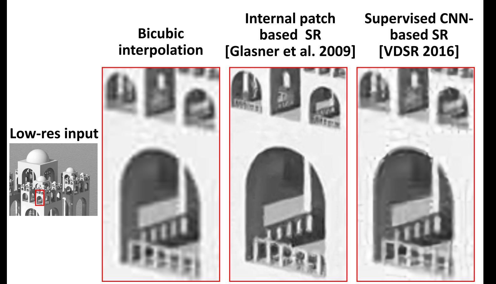

**Figure 18.** Super-resolution of one low-resolution image by bicubic interpolation, by internal patch recurrence (Glasner et al. 2009) and by a supervised network trained on an external dataset (VDSR). Internal recurrence recovers the repeated window structure that the external network blurs. From Shocher, Cohen and Irani (2018).

**Figure 19.** The three single images on which Asano et al. train the first layers of a network with self-supervision: a crowded street, a dense illustration of animals and a bridge. From Asano, Rupprecht and Vedaldi (2020).

A pattern that appears once per image gets one observation per image, however the image is cut. One small tumor in a large scan is such a pattern, so learning it needs many scans. Models Genesis restores distorted subvolumes of CT scans and relies on the recurring anatomy of the body, yet it used 623 scans.

Across images, the network has to find features that many inputs share. One pair of images fixes no such feature, since infinitely many encoders give the two images equal coordinates. A network trained to make them agree can memorize the pair instead. A coordinate becomes identifiable when it must describe the same factor across many pairs, because the third pair rules out an explanation that fits only one pair. ==Roundness can survive dozens of images, whereas "a tumor in the upper left" fails on the third.==

### 9.3. Random noise and a specific transformation

The transformations of 9.1 each draw a parameter at random, such as the noise sample, the mask, the crop box or the angle of a rotation. Whether the distortion should be random noise or a specific transformation, such as a rotation by a given angle, comes down to what the loss does with this parameter. An encoder $f$ is invariant to a transformation $t$ when $f(t(x))=f(x)$, so the embedding carries no trace of $t$. It is equivariant when $f(t(x))=\rho(t)f(x)$ for a known map $\rho(t)$ acting on the embedding, so $t$ moves the embedding in a predictable way and can be read back from it. Invariance is the special case $\rho(t)=I$.

Random noise has a parameter without structure, a fresh vector of pixel values for every image that says nothing about what the image shows. An embedding that ignores the noise loses nothing a task could need, so invariance suits noise. Predicting the noise is still possible. A network that estimates the added noise from $x+\xi$ has also restored $x$, so noise prediction is the denoising of 9.1. It teaches which images are likely, a property of the whole distribution of images, and leaves no coordinate that tracks the noise itself.

A rotation by a multiple of 90° has a parameter with four values, each of which means the same change on every image. A network can therefore learn to predict it, as RotNet (Gidaris et al.) does by classifying which of the four rotations was applied. Photographers keep objects upright, so telling an upright cat from a rotated one requires recognizing the cat, which makes the prediction task a way to learn objects. Jigsaw predicts the permutation in the same way. The predictor of I-JEPA receives the positions of the hidden blocks, so it is conditioned on the parameter of the mask.

Invariance erases the parameter, which helps a task that ignores the transformation and harms a task that needs it. A random crop or a small change of colour rarely changes what an image shows, so invariance to them costs little in ImageNet classification. Colour invariance erases what a flower classifier uses (Xiao et al.). Rotation invariance merges a 6 with a 9, since a rotation by 180° turns one into the other. Ericsson, Gouk and Hospedales measure this trade-off over many downstream tasks. A model transfers better to a task whose invariances it shares. Different tasks need different invariances, some of them opposite. Purushwalkam and Gupta find that the aggressive crops of contrastive methods give invariance to occlusion, whereas invariance to viewpoint, which recognizing an object across poses needs, stays weak. Equivariance keeps the parameter in a known form, so a linear probe can read it for a task that needs it and give its directions zero weight for a task that does not.

The joint-embedding methods of chapters 2-5 are invariant by construction. Their loss compares the embeddings of two views and never receives the parameters that produced them, so equality is the only relation it can ask for. SimCLR, BYOL, VICReg and DINO therefore all train toward invariance to their augmentations. The prediction methods before them (RotNet, jigsaw) and the masked methods after them (MAE, I-JEPA) keep the parameter. Several works add it back to joint embedding. Dangovski et al. (E-SSL) add the prediction of the four rotations to an invariant contrastive loss and improve on the invariant baseline. Xiao et al. (LooC) give each augmentation its own embedding space that stays sensitive to it. InfoMin (Proposition 6.3) states when invariance alone is enough, namely when the two views share exactly the information the task needs (Figure 12).

The ways to keep the parameter differ in where it enters the model. A loss can ask the embedding to predict it, as RotNet and E-SSL do, which keeps the parameter readable without fixing how it acts on the embedding. A predictor can receive it as input, like the block positions in the predictor of I-JEPA, so the parameter shapes the target without a prescribed map $\rho$. The architecture can fix $\rho$ exactly for a known group, as group-equivariant convolutions (Cohen and Welling) do for rotations and reflections (6.4). A loss can learn the operator $R_{ij}$ of Proposition 6.5 for each pair of views, which needs a term against the collapse $F\equiv0$, $R\equiv I$ of 6.4. The embedding can also be split into an invariant part and parts that stay sensitive to chosen augmentations, as in LooC. ==These ways have not been compared in one setting by how readable they keep the parameter and what they cost a task that ignores it (10.6).==

In the terms of 6.4, an invariant loss is a weighted graph on the inputs whose edges say which inputs should coincide. An equivariant loss also needs the operator $R_{ij}$ of Proposition 6.5 on each edge, which says how the embedding changes along it. The parameter of a specific transformation supplies this operator. Random noise supplies none, so it enters a joint-embedding loss only as a source of invariance.

As the view of a joint-embedding loss, with two noisy copies of one image as the positive pair, noise therefore acts only through the graph $G$ (2.2) that these views define. What the encoder learns then depends on which images this graph links. ==Two noisy copies of different images $x$ and $x'$ are hard to tell apart when the noise covers the difference between the images. For Gaussian noise of width $\sigma$ the overlap of the two view distributions, their Bhattacharyya coefficient, is $e^{-\|x-x'\|^2/8\sigma^2}$, so $G$ is a Gaussian kernel graph on pixel distances.== The pixel distance between two images is dominated by the directions in which the data vary most, the top principal components of the data covariance. This spectrum belongs to the dataset, whereas spatial frequencies belong to a single image. The two meet for natural images, whose statistics hardly depend on the position in the image, so their principal components are close to the Fourier modes of an image. Most of their variance lies at low spatial frequencies (Field). ==A loss invariant to pixel noise therefore groups images with a similar overall layout of brightness and colour, which matches the classes only where the class decides the layout. The encoder can also satisfy the invariance by smoothing its input, an easy feature in the sense of 3.5.== Park et al. (2023) measure this tendency in trained models. They take the Fourier transform of the feature maps of self-supervised ViTs over token positions and find that contrastive models use the low spatial frequencies and lose little accuracy under high-frequency noise, whereas MIM uses the high frequencies.

Balestriero and LeCun (2024) prove the matching result for reconstruction. A denoising loss under additive Gaussian noise spends its capacity on the top-variance subspace, which carries little of what perception tasks need, whereas masking makes the network use the other directions. Noise helps when it acts in another space. Chen, Liu, Xie and He reduce a diffusion model step by step to a denoising autoencoder and find that the features stay good as long as the noise is added in a low-dimensional latent space. Xiang et al. read features from the intermediate layers of a diffusion model at a chosen noise level and reach linear-probe accuracy comparable to contrastive methods and MAE. If $G$ alone sets what is learned, the graph of pixel noise bounds what an encoder trained on it can reach. The measure of Park et al. then shows at which spatial frequencies its features lie.

Masking defines a graph too, which links two masked views of an input through the hidden parts they both predict (Zhang, Wang and Wang). If a decoder approximately inverts the encoder, the MAE loss bounds an alignment loss on this graph from above (their Thms 3.2-3.3), so MAE trains alignment without negatives. Alignment alone allows dimensional collapse (Thm 3.6). Their U-MAE therefore adds a uniformity term, which turns the bound into one on the spectral contrastive loss of Proposition 2.7 and improves the linear probe (Thm 3.7). Through this bound, the downstream error depends on the eigenvalues of the mask graph beyond the first $k$, so the mask ratio trades the label error of the graph against these eigenvalues (Thms 4.1-4.2). Their measured class separation is best at a mask ratio of 0.7, near the 0.75 of MAE. ==In both graphs, the Gaussian kernel of noise and the two-hop graph of masks, the size of the corrupted block decides which inputs the graph links (H7 below).==

==*Hypothesis H6 (this work).* An encoder trained with pixel noise as its only joint-embedding view reaches about the kNN accuracy of images projected on their top principal components, whereas latent noise and masking exceed it. Its feature maps keep less Fourier amplitude at high spatial frequencies over token positions than those of a contrastive encoder trained with crops (10.6).==

Masking and noise differ in the scale of the structure they destroy more than in kind. A mask replaces a block of pixels with a constant, whereas pixel noise changes each value independently. A block filled with random colour is therefore noise correlated over the block. Black pixels dropped at random are a mask at the scale of one pixel.

Existing methods already vary this scale. Diffusion models sweep it with the noise level, since at large noise only the components of largest variance stay above the noise, which for images are the low spatial frequencies (Rissanen, Heinonen and Solin). Cold Diffusion (Bansal et al. 2023) replaces the noise with blur, masking and other degradations and still trains a generator. Hierarchical masked encoders learn features at several depths under one mask size, as in ConvMAE (Gao et al. 2022) and Hiera (Ryali et al. 2023). Diffusion Hyperfeatures (Luo et al. 2023) merge the features of several noise levels and layers into one descriptor for matching points between images.

The closest to separate levels is the encoder $E_\phi(x_0,t)$ of Mittal et al., which receives the noise level $t$ as an input. Their score model $s_\theta(x_t,t,E_\phi(x_0,t))$ learns by denoising score matching, so each input gets a curve of codes over $t$, each holding what denoising at its level needs. The best point of this curve is at least as good for any downstream loss as an autoencoder code (their Prop. 2.1), although nothing guarantees that training finds it. On MNIST, codes trained with uniform $t$ encode stroke width, whereas codes weighted toward high noise encode the class. LeCun (2022) proposes a hierarchy of joint-embedding predictive architectures, H-JEPA, without experiments, whose upper levels predict further ahead in time from more abstract representations. ==Neither work separates levels by corruption size. Mittal et al. vary the amount of one corruption for reconstruction, and H-JEPA sets its levels by the prediction horizon.==

==*Hypothesis H7 (this work).* Masking and pixel noise are two ends of one family of corruptions, described by the size of the block over which the corruption is correlated and by the distribution that fills the block, a constant for a mask and random values for noise. The linear-probe accuracy and the Fourier amplitude of the feature maps over token positions depend on the block size more than on the fill (10.6).==

If the block size decides what a corruption removes, each block size can train its own embedding. ==*Hypothesis H8 (this work).* One encoder trained on corruptions of several block sizes, with a separate embedding for each size, gives a representation with one level per scale, in a joint-embedding loss as well as in MAE or I-JEPA. On CIFAR-100 the embedding of coarse corruption separates the 20 superclasses better than the embedding of fine corruption, which in turn separates the 100 classes and textures better (10.6).==

### 9.4. Thirty images

The distortion, the size of the patterns and the fate of the parameter together decide what a sample of thirty unlabeled images can teach. The test case is a small network trained from scratch on these images, whose frozen encoder is read by a linear probe trained on a large labeled set. This setup separates the quality of the representation from the scarcity of labels, since a probe that stays bad with unlimited labels points to the geometry of the encoder.

Inside the sample, the number of observations depends on the loss. Thirty images are thirty observations only for a loss that embeds each image as one point. A masking or denoising loss turns every patch into a task, so by 9.2 the first layers get thousands of observations and train almost as well as on a large dataset. ==A specific transformation adds one predicted parameter per view at no labeling cost, and whether this extra target helps more at thirty images than at a million is untested (10.6).==

The deeper layers are where thirty images fall short. By Proposition 6.4 a squared reconstruction loss learns a conditional mean, and ==a small tumor, a high-frequency detail, enters that mean weakly unless training crops are centered on it, as they are in U-Net training.== ZSSR knows the image it was trained on, so its success says little about an encoder for the scan of a new patient. A regularizer such as SIGReg keeps the axes of the embedding in use without deciding what they encode, so ==SIGReg with prediction is expected to beat SIGReg alone (10.6).==

Across images, thirty images give few pairs, which limits what the relation between them can fix. Neither the graph $G$ nor the function class $\mathcal F$ can be learned from 30 points, so by Propositions 6.1 and 2.1 they must come from the architecture, the patches or the allowed transformations. The centered embeddings of $n$ images span at most $n-1$ directions, so 30 images fix at most 29 axes and cannot match an isotropic Gaussian in 128 dimensions. ==Whether augmented views add task-relevant directions beyond these 29 is open.== A regularizer constrains the distribution only at the training points (Proposition 2.11), so two functions with the same $\mathcal N(0,I)$ on 30 points can differ on the 31st image. Since $2^5=32$ exceeds 30, five bits of a shortcut feature identify every image, which puts the shortcut threshold of chapter 7 low. ==This is a prediction, untested.==

The usual answer to too few points is a smoothness prior. Smoothness alone lifts none of these limits, because infinitely many smooth manifolds pass through 30 points. Manifold regularization (Belkin et al.) penalizes $\sum_{ij}W_{ij}\|f(x_i)-f(x_j)\|^2$, so it fixes the wrong geometry when the graph $W$ comes from poor distances. ==Klindt, LeCun and Balestriero show that a Gaussian target together with alignment identifies the latent variables up to an orthogonal map when the latents are Gaussian and the dynamics is stationary with additive noise.== The relation carries the information there. A Gaussian target alone identifies nothing, since every rotation of a standard Gaussian is again a standard Gaussian (Proposition 4.10).

### 9.5. Built-in priors replace what the sample cannot fix

If neither the sample nor a target distribution fixes the encoder, the architecture can. Wavelet scattering (Bruna and Mallat) cascades wavelet filters and moduli, learns nothing and is provably stable to translations and small deformations, so at $n=30$ its estimation error is zero. Deep Image Prior (Ulyanov et al.) denoises and inpaints a single image with a randomly initialized convolutional generator and no training set, so the architecture alone already prefers the structure of natural images. Random Fourier features (Rahimi and Recht) approximate a Gaussian kernel with a fixed random embedding followed by a linear layer, so a basis in which a large family of functions is linear exists before any data. So the kernel fixes the geometry, and on pixels a Gaussian kernel measures the wrong distances for vision. Gradient descent adds a prior of its own, since networks fit the low frequencies of a function first (spectral bias, Rahaman et al.), which breaks ties between interpolating solutions and works against a small high-frequency target. Each prior helps where the needed structure matches it and loses what does not match. A CNN assumes locality and translation equivariance, scattering assumes stability to deformations, and none of them is a universal prior.

A label per image might seem to replace the missing prior. With a yes-or-no tumor label instead of a mask, each image is one observation, so the effective $n$ stays about 30 and the loss gives a flexible network no reason to prefer one of the many solutions that fit. Few-shot segmentation solves a different problem, since its prior is already in the weights.

### 9.6. How much data suffices: information and sufficiency

Sections 9.1-9.5 ask what a fixed small sample can teach. The converse question asks how many points, and how diverse, give a representation sufficient for a task family, where diversity is measured by the information in the examples. Mutual information cannot be estimated reliably from a small sample, because any distribution-free high-confidence lower bound on mutual information from $n$ samples is at most about $\log n$ (McAllester-Stratos). Usable information (V-information, Xu et al.) accounts for the probe class and replaces it. The information bottleneck gives the frame of a sufficient and minimal representation. Geometry has the same problem. With the optimal width, the error of a KDE falls as $n^{-4/(D+4)}$ (Proposition 4.13), which at $D=128$ barely improves with $n$, so geometry cannot be estimated in the raw space. Only the intrinsic dimension $m$ is workable (minimax manifold estimation, Genovese et al.), which turns the practical question into how to estimate $m$ and the coverage of the data. Empirical work covers size, diversity and domain of the dataset (Cole et al.), SSL on one image (Asano et al.), whether large datasets are necessary (El-Nouby et al.), example selection (Joshi-Mirzasoleiman), data pruning and scaling distributions (Sorscher et al.), and pretraining data diversity (Hammoud et al.).

## 10. Planned experiments and where their results go

Chapters 2-9 leave many claims highlighted as open or untested, which the experiments of this chapter test. Each row names the proposition or section it checks. Every row is planned unless chapter 7 reports it. A finished experiment moves into the chapter whose claim it tests, like the RandBit runs in chapter 7.

### 10.1. Checks of the propositions of chapters 2-6

Most propositions of chapters 2-6 hold under assumptions that a trained network may break, so each check runs a proposition where its assumption is in doubt.

| Experiment                                              | What                                                                                               | Checks               |
| ------------------------------------------------------- | -------------------------------------------------------------------------------------------------- | -------------------- |
| ==Loss gap of an early feature against $K\delta$==                                    | easy feature $a$, useful $t$; sweep $K$ and $\delta$; compare the loss gap with $K\delta$ | Proposition 3.4      |
| ==Hessian at collapse==                             | sign and size of the smallest InfoNCE Hessian eigenvalue against $\tau$                           | Proposition 3.1      |
| ==Graph spectrum against embeddings==               | eigenvectors of $\bar A$ on a small graph against SimCLR, VICReg and spectral-loss embeddings     | Propositions 2.7-2.9 |
| ==Ridge probe against anisotropy==                  | probe on embeddings of varied anisotropy at fixed trace                                            | Proposition 5.2      |
| ==Free particles against a network==                | the same loss on free embeddings and on an encoder; spectrum of $\Theta$ and final geometry       | Proposition 4.1      |
| ==Sign of $d\mathcal L/dt$ under PPS==            | loss trajectory and $\Phi=p-p_{\min}$ under a fixed and an adaptive temperature                   | Proposition 3.5, 4.5 |
| ==Convergence under $\tau$ schedules==            | epochs to a fixed probe accuracy and final accuracy for constant, rising, falling, cosine (Kukleva), exponential annealing (Turan et al.) and PPS $\tau$ ending at one value; effective rank of the embeddings against the current $\tau$ and against the epoch; energy of the embedding density per degree of spherical harmonics along training | H3; the coarse-to-fine reading of Turan et al. on the sphere; 4.5, 5.2 |
| ==Weight decay around the collapse threshold==   | linear and ResNet-18 BYOL with a symmetric linear predictor, DirectPred and a two-layer predictor; weight decay swept across $\beta^2/(4(1+\omega^2))$; surviving eigen-directions of $F$ | the fixed points of Tian, Chen and Ganguli outside their assumptions (2.4) |
| ==Stopped against trained pair weights==         | InfoNCE as in Tian (2022) with $\alpha$ under a stopped gradient and with backpropagation through $\alpha$; top eigenvector of $X_\alpha$ against the first-layer weights | Tian 2022 beyond CIFAR-10 and STL-10 (4.4) |
| ==Concentration against augmentation strength==  | colour, crop and blur strength swept; the mass $s$ and diameter $\delta_A$ estimated on a nearest-view graph, centre divergence and $R_\varepsilon$ along training, against kNN | the three factors of Huang et al. (4.3) |
| ==Radius window of the view graph==              | a radius graph on augmented views of a toy with known invariant dimension $d_s$; class recovery against $r$, $n$ and the class gap | the window $(\log n/n)^{1/d_s}\ll r<\delta(M)$ of Wang (2024) (4.3) |
| ==Neighbour positives without augmentations==     | positives from the nearest-neighbour graph of the current encoder, with InfoNCE and with a BYOL-style target; random and pretrained initialization; neighbour purity at initialization against the final probe; an initial encoder pretrained on shuffled superclass labels, trained with and without augmentations | H4; 6.2                  |
| ==Repulsion without positives==                   | uniformity alone against the untrained encoder, kNN and probe                                      | 6.2                  |
| ==Quality proxies against known factors==             | linear probe and retrieval against similarity of known factors on a toy                            | 6.5                  |
| ==Invariant, random and equivariant augmentations== | three types on one downstream task                                                                 | 6.2                  |
| ==Representation trajectory of SSL and supervised learning==                       | SSL against supervised learning under a moving target                                              | 3.8                  |
| ==JEPA with a generator on the same latent==        | JEPA and a denoising-score generator tied to one latent                                            | 4.6                  |

### 10.2. PPS in other regimes

The PPS runs used one seed, one architecture and one batch size (4.5), so the follow-ups move PPS to other regimes.

| Experiment                                | What                                                                          | Checks                                                             |
| ----------------------------------------- | ----------------------------------------------------------------------------- | ------------------------------------------------------------------ |
| ==Seeds, architectures, batches==     | several seeds, ResNet-50, ViT, batch sizes                                    | whether PPS holds beyond one configuration                         |
| ==Other methods==                     | MoCo, DINO, SupCon; BYOL, VICReg                                              | where "kernel width equals the size of the positive cluster" works |
| ==Other domains==                     | medical images, time series, audio, small samples                             | PPS when $p$ is estimated from few pairs                          |
| ==Transfer protocols==                | collect the transfer protocols of SSL papers                                  | how protocols differ                                               |
| ==Measure $q^*(\sigma)$==           | dynamics of the inter-input coordinate at several fixed $\sigma$             | closing the model of 4.5; a schedule from safe to optimal          |
| ==Width rule in target regularizers== | Epps-Pulley weight width and heat-kernel time from the positive-pair distance | hypothesis of 2.5                                                  |
| ==Final width from packing==          | ratio of the final $p$ to the squared nearest-neighbour distance between inputs in finished PPS runs; the best constant $\tau$ at $D\in\{16,32,128\}$ | H1 against its weaker version (ratio near 1 or near 1/4), and whether the best constant $\tau$ rises with $D$ as the spacing does (4.5) |
| ==Kernel shape schedule==             | Laplace or Cauchy kernel narrowing to a Gaussian of the final width, against a Gaussian width schedule with the same end; Laplace against Gaussian at one fixed width | H2: epochs to the accuracy of the best constant $\tau$; whether the heavy tail resolves fine structure early, as the Fourier rates of Turan et al. predict (4.5) |

### 10.3. The three families compared in one setting

These runs compare the families of chapter 2 in one setting where their common form makes a prediction.

| Experiment                                      | What                                                                                                                                        | Checks                                  |
| ----------------------------------------------- | ------------------------------------------------------------------------------------------------------------------------------------------- | --------------------------------------- |
| ==Log-drift against MMD-drift==             | InfoNCE, SIGReg and SPHERE-JEPA on one sphere toy; compare the fields; Epps-Pulley against $\mathrm{MMD}^2$ on samples                     | Propositions 2.4-2.6                    |
| ==Sample- against dimension-contrastive==   | the two penalties of Proposition 2.10 under the same normalization; probe and geometry; the bounds of Garrido et al. across $N/D$; SimCLR and VICReg with matched tuning and projectors | Proposition 2.10                        |
| ==Siamese as implicit repulsion==           | estimate the effective $\mu^-$ of BYOL from its update and compare with explicit repulsion; InfoNCE, BYOL, Barlow Twins and UniGrad at one target type; the push $\lambda Fu$ against the update of a trained two-layer predictor | 2.4, Tao et al.                         |
| ==Collapse and temperature predicted by Wang-Isola, Huang, PPS and LeJEPA==            | collapse or $\tau$ through Wang-Isola, Huang and PPS, LeJEPA, and the three explanations of BYOL; where predictions differ                 | 5.4, 6.6                                |
| ==MMD-flow stalls for vMF==                 | theory (no stable stalls) and a numerical check on the sphere                                                                               | 4.6                                     |
| ==Drift monitor on SIGReg and SPHERE-JEPA== | $\|V\|^2$ as a label-free diagnostic; compare with KSD and Fisher divergence                                                              | 2.5                                     |
| ==Anchor drift against full velocity==      | the anchor term $V$ and the other-anchor term on a sphere toy, against the batch gradient                                                  | Propositions 4.16-4.17, Conjecture 4.18 |
| ==KL to uniform against InfoNCE==           | InfoNCE repulsion against the KL variant of Expanding SPHERE-JEPA                                                                           | Proposition 4.4                         |
| ==Number of constrained moments: VICReg, Weak-SIGReg, SIGReg==                        | VICReg, Weak-SIGReg and SIGReg on data with controlled non-Gaussianity                                                                      | 5.3                                     |
| ==Network width at which shape displaces content==                           | shrink width or dimension and find where shape displaces content                                                                            | 2.5                                     |
| ==Domain of the repulsion==                 | SIGReg on $z$ against the temporally centered residual, on a toy with a static and a dynamic factor; variance of each part and probe error | 7.4, Proposition 5.3                    |
| ==Learned graph with cycle consistency==    | $R_{ij}=\mathcal R(x_i,x_j)$ predicted by a network instead of hand-made augmentations, with a penalty against $R=I$                    | 6.4                                     |

### 10.4. RandBit follow-ups

The rows from 7.2 and 7.3 are finished runs. The open rows are the next runs listed at the end of chapter 7.

| Experiment                        | What                                                                                                    | Checks                                           |
| --------------------------------- | ------------------------------------------------------------------------------------------------------- | ------------------------------------------------ |
| RandBit suppression               | InfoNCE, VICReg, SIGReg at $b\in\{0,2,4,6,8,16\}$, one seed                                            | Proposition 2.11; reported in 7.2                |
| RandBit with labels               | joint, A-GEM and fresh bits at $b=16$                                                                  | 7.3                                              |
| ==Seeds near the thresholds== | three seeds at $b=4,6,8$ and on the runs with labels                                                   | order of thresholds                              |
| ==BYOL on RandBit==               | BYOL on RandBit                                                                                         | whether the failure covers all three families    |
| ==MCL on RandBit==                | MCL with $k$ clusters per stage at $b\in\{2,4,6,8\}$; the same stages with SIGReg applied within the clusters of earlier stages | H5: whether one stage removes the code when $2^b\le k$ and about $b/\log_2k$ stages are needed otherwise, first for the reproduced MCL and then for the SIGReg variant (8.1) |
| ==Labels at the threshold bit count== | $b=6$ for SIGReg and InfoNCE, $b=4$ for VICReg                                                      | whether labels help where suppression is partial |
| ==Reconstruction control==    | a decoder variant (PrCL, VAE)                                                                           | whether reconstruction escapes suppression       |
| ==Threshold against the number of images==          | the threshold $b$ against the number of images                                                         | 7.5, 9.4                                         |
| ==Threshold against $D$ and $N$== | projector output dimension $D\in\{32,128,512\}$ at $N=256$, and $N\in\{64,256,1024\}$ at $D=128$ | the three counts of 7.2                          |
| ==Static background and a Pong-like scene==          | slow-features scene and a Pong-like scene; the same three losses and DISReg                             | 7.4                                              |

### 10.5. Downstream-guided SSL

Each direction of 8.5 gets a first experiment, together with the measurements and the assumption table that 8.5 asks for.

| Experiment                              | What                                                                             | Checks                |
| --------------------------------------- | -------------------------------------------------------------------------------- | --------------------- |
| ==30 labels against DISReg==        | Pong, ball probe, DISReg baseline                                                | 8.5, first direction  |
| ==$\Gamma$ as a plugin==          | $\Gamma$ from probe gradients in SimCLR, JEPA, DINO; composition of two tasks     | 8.5, second direction |
| ==Which factors each SSL method removes==              | which factors each SSL method removes, on a 3D sandbox with few latent factors   | 8.5, third direction  |
| ==Captured energy during training== | $\hat B$ and $\tilde\nu$ per factor along training, with and without guidance | 4.3, 8.5              |
| ==Assumption table==                | from papers, critiques and reports                                               | 8.5                   |
| ==Reproduction and transfer==       | two or three methods on their data, then other fields                            | 8.5                   |

### 10.6. Small samples

The small-sample case of chapter 9 has its own protocol. It uses 30 images and moves from an untrained architecture to prediction within an image, then SIGReg on 30 points, a check of linear accessibility, and finally labels and a sweep over the sample size.

| Experiment                                                       | What                                                                                     | Checks                                                                        |
| ---------------------------------------------------------------- | ---------------------------------------------------------------------------------------- | ----------------------------------------------------------------------------- |
| ==Random convolution, untrained==                            | frozen random convolution, linear probe                                                  | what locality gives without SSL                                               |
| ==MAE with a feature field==                                 | MAE autoencoder, field $E(x)$ of size $H'\times W'\times d$, $1\times1$ probe       | reconstruction and localization                                               |
| ==SIGReg, VICReg and LeJEPA on the whole image==             | regularizer on 30 points                                                                 | points spread, tumor not encoded                                              |
| ==Linear probe against a small MLP==                         | on random convolution, MAE and the whole-image regularizer                               | the MLP wins when a feature is present and not linear                         |
| ==MAE with variance and covariance or SIGReg on the latent== | MAE with a latent regularizer                                                            | probe against plain MAE                                                       |
| ==$1\times1$ probe for localization==                      | field $E(x)$ and probe                                                                  | whether the spot disappears without a tumor crop                              |
| ==Effective rank and SIGReg diagnostic==                     | on the same $z$                                                                         | high rank and a bad probe: coordinates alive, tumor absent                    |
| ==Sample-size sweep==                                        | $n\in\{30,100,300,1000\}$ for MAE, MAE with a regularizer, the whole-image regularizer | where global SSL starts to work; agreement with $\mathrm{rank}\le n-1$ (9.4) |
| ==Labels on top==                                            | $m\in\{0,10,30\}$ labels over MAE with a regularizer                                   | link of chapters 8 and 9                                                      |
| ==How many points suffice==                                  | usable information and coverage on a known-factor toy against the geometric bound        | 9.6                                                                           |
| ==Small-data methods across domains==                        | masking, internal learning, JEPA under one protocol                                      | 9.1                                                                           |
| ==Distortion type==                                          | masking, permutation and noise as the restoration task on the same images                | which distortion gives the best linear probe (9.1)                            |
| ==Invariant against equivariant==                            | rotation as a joint-embedding view, as a predicted parameter, as predictor input, through group-equivariant convolutions, through a learned operator per pair and in a split embedding; probes for the class and for the angle | whether keeping the parameter helps a task that needs it and what it costs a task that ignores it (9.3, 9.4) |
| ==Noise against masking as a view==                          | pixel noise, latent noise, black masks and random-colour masks as joint-embedding views; kNN of pixels projected on top principal components as the baseline; Fourier amplitude of the feature maps over token positions, as in Park et al. | H6: whether pixel noise stops at the principal-component baseline, and whether noise views give the lowest Fourier amplitude at high spatial frequencies (9.3) |
| ==Corruption at several scales==                             | masks and correlated noise of block sizes 2, 4, 8 and 16 pixels in a joint-embedding loss and in I-JEPA, each size alone and all sizes in one encoder with one embedding per size; probes for the 20 superclasses and the 100 classes of CIFAR-100 and for textures; Fourier amplitude of the feature maps | H7: whether the probe and the amplitude depend on the block size more than on the fill; H8: whether coarse corruption favours the superclasses and fine corruption the classes and textures (9.3) |
| ==Mask ratio and the mask graph==                            | MAE and U-MAE at mask ratios 0.1-0.9; effective rank, intra- to inter-class distance and linear probe; eigenvalues of the mask graph estimated on a toy | the trade-off of Zhang, Wang and Wang between label error and residual eigenvalues; the graph reading of H7 (9.3) |
| ==Noise-level code==                                         | a time-conditioned encoder as in Mittal et al.; probes for the 20 superclasses and the 100 classes of CIFAR-100 at each noise level | H8 for noise levels: whether high noise favours superclasses and low noise classes (9.3) |
| ==Patches of one image against many images==                 | equal numbers of patches from one image and from 30 images                               | whether repetition inside an image replaces more images (9.2)                 |

Beyond the table, chapter 9 names further variants: wavelet scattering; patch k-means or sparse coding; InfoNCE, DCL and a graph $G$ from crops, time or dropout; Deep Image Prior on a 3D render; a 4-dimensional bottleneck with a shared transformation operator as an identifiability toy; LieGAN and a version space.

### 10.7. Visualizations

The theory chapters need figures of their own beyond those taken from papers, which one shared 3D sandbox produces.

| Section       | Figure                                                                                                                                                       |
| ------------- | ------------------------------------------------------------------------------------------------------------------------------------------------------------ |
| 2.2           | ==sphere normalization; cosine against distance; softmax weights of negatives against $\tau$; InfoNCE against DCL; the Gaussian kernel on the sphere== |
| 2.3-2.5       | ==the drift field $V$ for InfoNCE, MMD and SIGReg in one picture; the SIGReg cloud; the loop $z\to$ geometry $\to$ regularizer $\to z$==         |
| 3.1, 3.7, 4.5 | ==the saddle at collapse; particle flow and the Lyapunov function; $\tau(p)$ of PPS against $\tau(A)$ of Huang==                                     |
| 7             | RandBit input (Figure 14) and suppression curves (Figure 15)                                                                                                  |

## Appendix A. Proofs

The text of each chapter gives the step that leads to each proposition. The proofs below complete these steps.

### A.1. Proofs for chapter 2

*Proof of Proposition 2.1.* Perfect alignment gives $z(x)=z(x')$ on every edge of $G$, and equality propagates along paths.

*Proof of Proposition 2.2.* Substitute $z^\top z'=1-\tfrac12\|z-z'\|^2$. The factor $e^{1/\tau}$ is common to all terms and cancels in the softmax.

*Proof of Proposition 2.3.* Differentiate the log-sum-exp.

*Proof of Proposition 2.4.* The first form is Proposition 2.3 with $\sum_kw_k=1-w^+$ factored out. For the second, a Gaussian KDE $\hat p$ with kernel-weighted mean $m(z)$ satisfies $\nabla\log\hat p(z)=(m(z)-z)/\sigma^2$ (mean shift, Fukunaga-Hostetler). By Proposition 2.2 the kernel weights over negatives are $w_k/(1-w^+)$, so $m=\mu^-$ for $\hat p^-$ and $m=\mu^+$ for $\hat p^+$; subtracting the two scores, the gradients of the log-densities, removes $z$.

*Proof of Proposition 2.5.* Expand $\widehat{\mathrm{MMD}}^2=\frac1{N^2}\sum k(z_l,z_{l'})-\frac2{NM}\sum k(z_l,y_j)+\mathrm{const}$ and use $\nabla_zk(z,y)=k(z,y)(y-z)/\sigma^2$.

*Proof of Proposition 2.6.* Expand the squared modulus with $\hat\varphi_N(t)=\frac1N\sum e^{itx_l}$ and integrate against $w$. By Bochner's theorem, which writes a shift-invariant kernel as the Fourier transform of a positive weight, $\int e^{it(x-x')}w(t)\,dt=k(x-x')$ with $k$ Gaussian.

*Proof of Proposition 2.7.* Expand $\sum_{x,x'}\big(\sqrt{d_xd_{x'}}f_x^\top f_{x'}-W_{xx'}/\sqrt{d_xd_{x'}}\big)^2$ into quadratic, linear and constant parts.

*Proof of Proposition 2.8.* Rayleigh-Ritz for the sum of the $k$ smallest eigenvalues.

*Proof sketch of Proposition 2.9.* Each loss reduces to a spectral problem, by Ky Fan for the Laplacian and by Eckart-Young for a kernel matrix; the exact conditions are in the paper.

*Proof of Proposition 2.10.* $\|ZZ^\top\|_F^2=\mathrm{tr}(ZZ^\top ZZ^\top)=\mathrm{tr}(Z^\top ZZ^\top Z)=\|Z^\top Z\|_F^2$ by cyclicity of the trace. Removing the diagonals subtracts $\sum_n\|z_n\|^4$ from the first and $\sum_d\|Z_{:,d}\|^4$ from the second.

*Proof of Proposition 2.11.* Each of these terms is a function of the empirical distribution of the rows.

*Proof of Proposition 2.12.* On $\mathbb R^m$, the Knothe-Rosenblatt map built from successive conditional distribution functions. On a compact manifold, Moser's theorem: two volume forms of equal total volume are related by a diffeomorphism.

*Proof of Proposition 2.13.* $\nabla\log(\hat p^+/\hat p^-)\equiv0$ makes the ratio constant, and both densities are normalized, so the constant is one.

### A.2. Proofs for chapter 3

*Proof of Proposition 3.1.* Perturb $z_a=c+\varepsilon u_a$ with $u_a\perp c$ and write $d_{ab}=\|u_a-u_b\|^2$. On the sphere $s_{ab}\approx1-\tfrac{\varepsilon^2}2d_{ab}$. For anchor $i$ with candidate set $C_i$ (the positive and $K$ negatives)

$$
\mathcal L_i\approx\text{const}+\frac{\varepsilon^2}{2\tau}\Big(d_{ii^+}-\frac1{K+1}\sum_{j\in C_i}d_{ij}\Big).
$$

The first order vanishes, so the collapsed state is a critical point. Take $u_i=u_{i^+}=v_i$ with independent $v_i$. Then $d_{ii^+}=0$ while the mean distance to the candidates is positive, so the quadratic form is negative.

*Proof of Proposition 3.2.* For a Gibbs distribution $w_\beta\propto e^{\beta s}$, $dH/d\beta=-\beta\,\mathrm{Var}_{w_\beta}(s)\le0$. With $\beta=1/\tau$, $dH/d\tau=\mathrm{Var}_w(s)/\tau^3\ge0$.

*Proof of Proposition 3.3.* Let $X=e^{s/\tau}$ with mean $\mu$ and $\bar X$ the mean over $K$ negatives, so $\mathrm{Var}(\bar X)=\mathrm{Var}(X)/K$. A second-order expansion of $\log$ around $\mu$ gives $\mathbb E\log\bar X\approx\log\mu-\mathrm{Var}(\bar X)/(2\mu^2)$, the Jensen gap.

*Proof of Proposition 3.4.* Alignment is perfect, so the positive contributes $e^{1/\tau}$ against which every negative is compared. A negative with the same $a$ adds $e^0=1$ to the sum, whereas every other negative adds at most $e^{-1/\tau}$. Reading $t$ as well lets the negatives with the same $a$ also reach $z^\top z^-\le0$, which removes the $K\delta$ term. The bound on the gain is $\log(1+x)\le x$ with $x=K\delta/(1+Ke^{-1/\tau})$.

*Proof of Proposition 3.5.* Chain rule. The backward pass treats $\tau$ as a constant, so $\dot z$ contains only $\nabla_z\mathcal L$. The change of $\tau$ along the trajectory adds $\partial_\tau\mathcal L\,\dot\tau$.

### A.3. Proofs for chapter 4

*Proof of Proposition 4.1.* By the chain rule $\dot\theta=-J^\top\nabla_Z\mathcal L$, and $\dot Z=J\dot\theta=-JJ^\top\nabla_Z\mathcal L$.

*Proof of Proposition 4.2.* Divide the denominator by $K$. The sum over negatives converges by the law of large numbers, since the integrand is bounded ($|s|\le1$), and $\log$ is continuous. The positive term $e^{s^+/\tau}/K$ vanishes. The random loss converges at rate $O_P(K^{-1/2})$ and its expectation at $O(1/K)$ (Proposition 3.3).

*Proof of the second part of Proposition 4.3.* Take $p_z=(1+\varepsilon\varphi)\,\mathrm{unif}$ with $\int\varphi=0$ and expand $\varphi$ in spherical harmonics. By the Funk-Hecke formula the kernel operator multiplies degree $\ell$ by $a_\ell$, and for the kernel $e^{t\,u^\top v}$ the multiplier is $a_\ell\propto I_{\ell+(D-2)/2}(t)$, a modified Bessel function, which is positive and decreasing in $\ell$. So $0<a_\ell\le a_0$. The increment of the uniformity term is $\varepsilon^2\sum_\ell(a_\ell/a_0-a_\ell^2/(2a_0^2))\|\varphi_\ell\|^2$. Each coefficient equals $\tfrac{a_\ell}{a_0}\big(1-\tfrac{a_\ell}{2a_0}\big)\ge\tfrac{a_\ell}{2a_0}>0$, so the increment is positive.

*Proof of Proposition 4.4.* The inner expectation is a convolution, $\mathbb E_{x^-}e^{z^\top z^-/\tau}=C_\tau(p_z*k_\tau)(z)$, where $C_\tau$ is the normalizing constant of the vMF density. For any density $\rho$, $\mathbb E_{p_z}\log\rho=\mathbb E_{p_z}\log p_z-\mathbb E_{p_z}\log(p_z/\rho)=-H(p_z)-\mathrm{KL}(p_z\|\rho)$. Taking $\rho=p_z*k_\tau$ gives the statement.

*Proof of Proposition 4.5 (outline).* Convexity of the logistic loss (Jensen) moves the expectation over a class inside, which turns the contrastive loss into the loss of the class-mean classifier. A negative of the anchor's class contributes the same as the positive, which is the collision term $\delta$. A Rademacher bound, a bound on the generalization gap through the complexity of the function class, passes from the sample to the population (Saunshi et al. 2019).

*Proof of Proposition 4.7.* In $L^2(P_X)$, $\mathbb E[f(x)g(x^+)]=\langle f,\mathcal Tg\rangle=\sum_{x,x'}f(x)W_{xx'}g(x')$, which is symmetric in $f$ and $g$, so $\mathcal T$ is self-adjoint. The rows of $\mathcal T$ sum to one, so the constant function is an eigenfunction with eigenvalue 1. Centering restricts $F$ to its orthogonal complement. The objective is $\sum_i\langle f_i,\mathcal Tf_i\rangle$ over orthonormal $f_1,\dots,f_r$. By Ky Fan its maximum on the complement is the sum of the $r$ largest eigenvalues there, attained by their span. For orthonormal coordinates $\Pi_F\eta=\sum_i\langle\eta,f_i\rangle f_i$, so $B(F)=\sum_i\langle\eta,f_i\rangle^2$ with $\langle\eta,f_i\rangle=\mathbb E[\mathbb E[Y|X]f_i(X)]=\mathbb E[Yf_i]$. Parseval in the basis $\psi_1,\dots,\psi_r$ of the same span gives $B_r$.

*Proof of Proposition 4.8.* The two losses share the positive term and differ in the denominator, where DCL adds the same-class samples to the samples of other classes. Each term $e^{z^\top z'}$ lies in $[e^{-1},e]$. The added sum is therefore at most $n_{\max}e$, while the NSCL sum is at least $(N-n_{\max})e^{-1}$. The logarithm of one plus their ratio bounds the gap. Setting $n_{\max}=N/C$ gives the balanced case.

*Proof of Proposition 4.9.* At $K\to\infty$ the loss is, up to constants, the cross-entropy between the true vMF conditional and the model conditional $\propto e^{f(x)^\top f(\tilde x)/\tau}$ (Proposition 4.2). The cross-entropy is minimal when the two conditionals coincide, which requires $f\circ\gamma$ to preserve inner products. A map of the sphere that preserves inner products is orthogonal.

*Proof of Proposition 4.10 (Gaussian case).* If $c\sim\mathcal N(0,I)$, then $Rc$ has the same distribution for every rotation $R$, so the data cannot distinguish the coordinates of $c$ from those of $Rc$. For any factorized prior the same holds with nonlinear bijections (Locatello et al.).

*Proof of Proposition 4.11.* PPS, Appendix A.

*Proof of Proposition 4.12.* PPS, Appendix B. Under A1 the shared negative terms cancel in $\dot p$. The evolution of $q$ has no closed form, so the proof derives only its sign structure and models the remaining constants.

*Proof of Proposition 4.14.* Expand the square. The cross term $-2\int P\langle\nabla\log Q,\nabla\log P\rangle=-2\int\langle\nabla\log Q,\nabla P\rangle$ integrates by parts to $2\int P\,\Delta\log Q$, since the boundary terms vanish. The remaining term $\mathbb E_P\|\nabla\log P\|^2$ does not depend on $Q$.

*Proof of Proposition 4.15.* Expand both squares. The terms $\mathbb E\|s_\theta\|^2$ coincide. The cross terms agree because $\nabla(P*k_\sigma)(\tilde x)=\int P(x)\nabla k_\sigma(\tilde x|x)\,dx$, so $\mathbb E_{P*k_\sigma}\langle s_\theta,\nabla\log(P*k_\sigma)\rangle=\mathbb E\langle s_\theta(\tilde x),\nabla\log k_\sigma(\tilde x|x)\rangle$. The remaining terms do not depend on $\theta$.

*Proof of Proposition 4.16.* For a perturbation $p_z+\varepsilon\chi$ with $\int\chi=0$, $\frac d{d\varepsilon}U\big|_{\varepsilon=0}=\int\chi\log(p_z*k)+\int p_z\,\frac{\chi*k}{p_z*k}$. Since $k$ is symmetric, the convolution in the second integral moves onto the other factor, $\int p_z\,\frac{\chi*k}{p_z*k}=\int\chi\,\big(k*\frac{p_z}{p_z*k}\big)$, which gives the first variation. The velocity of a Wasserstein gradient flow is minus the gradient of the first variation (Jordan-Kinderlehrer-Otto).

*Proof of Proposition 4.17.* The stopped target makes the residual equal to $-\varepsilon V$ and lets the gradient pass through the first $f_\theta$ only. So $\nabla_\theta\mathcal L=-2\varepsilon\,\mathbb E[J^\top V(f_\theta(\xi))]$ with $J=\partial f_\theta(\xi)/\partial\theta$. By the chain rule for a pushforward, $\nabla_\theta\Psi(Q_\theta)=\mathbb E\big[J^\top\nabla\frac{\delta\Psi}{\delta Q}(f_\theta(\xi))\big]=-\mathbb E[J^\top V]$.

### A.4. Proofs for chapter 5

*Proof of Proposition 5.1.* The Barber-Agakov bound gives $I(x;x^+)\ge H(x^+)+\mathbb E\log q(x^+|x)$ for any model $q$ of the conditional density. InfoNCE takes $q$ proportional to $e^{\text{critic}}$ and normalizes it over the $K+1$ candidates instead of over all inputs, which turns the bound into $\log(K+1)-\mathcal L$ (Poole et al.). The bound is tight when the critic equals the density ratio $p(x^+|x)/p(x^+)$ up to a function of $x$.

*Proof of Proposition 5.2.* The function $x\mapsto(\lambda/(x+\lambda))^2$ is convex on $x\ge0$. For a uniform $w$, $\mathbb E\,w_j^2=\|w\|^2/D$ in the eigenbasis of the covariance, which gives the expected bias. By Jensen, $\frac1D\sum_j\varphi(\sigma_j^2)\ge\varphi\big(\frac1D\sum_j\sigma_j^2\big)$, with equality when all $\sigma_j^2$ are equal.

*Proof of Proposition 5.3.* The gradient is $M^\top\nabla\mathcal L(MZ)$, and $\operatorname{range}(M^\top)=(\ker M)^\perp$.

### A.5. Proofs for chapter 6

*Proof of Proposition 6.1.* A representation $z$ is sufficient if every $f\in\mathcal F$ is a function of $z$, that is, if $z$ separates all classes of $\sim_{\mathcal F}$. The quotient map separates them and merges nothing else, so every sufficient $z$ refines it. It is therefore the coarsest sufficient representation, which is what minimal means.

*Proof of Proposition 6.4.* For any predictor $\hat y$, write $y-\hat y(c)=(y-\mathbb E[y|c])+(\mathbb E[y|c]-\hat y(c))$. The first bracket has zero mean given $c$ and the second is a function of $c$, so the cross term vanishes. Hence $\mathbb E\|y-\hat y(c)\|^2=\mathbb E\|y-\mathbb E[y|c]\|^2+\mathbb E\|\mathbb E[y|c]-\hat y(c)\|^2$, which is minimal at $\hat y(c)=\mathbb E[y|c]$.

*Proof of Proposition 6.5.* Pick a spanning tree, set $U=I$ at the root and extend $U_j=R_{ij}^{-1}U_i$ along its edges. Cycle consistency makes the extension independent of the path, so $R_{ij}=U_iU_j^{-1}$ on every edge, including the edges outside the tree. Then $z_i=U_iv$ for any fixed $v\ne0$ gives $z_i-R_{ij}z_j=U_iv-U_iU_j^{-1}U_jv=0$ on every edge, so $\mathcal E=0$.

### A.6. Proofs for chapter 8

*Proof of Proposition 8.2.* $u^\top v'=u^\top v-\frac{u^\top v}{\|u\|^2}u^\top u=0$. To first order the step $-\eta v'$ changes the probe loss by $-\eta\,u^\top v'=0$.

## References

### Contrastive learning and InfoNCE

- Chen, Kornblith, Norouzi, Hinton. A Simple Framework for Contrastive Learning of Visual Representations (SimCLR). ICML 2020.
- van den Oord, Li, Vinyals. Representation Learning with Contrastive Predictive Coding. 2018. arXiv:1807.03748
- Gutmann, Hyvärinen. Noise-contrastive estimation: a new estimation principle for unnormalized statistical models. AISTATS 2010.
- Wang, Isola. Understanding Contrastive Representation Learning through Alignment and Uniformity on the Hypersphere. ICML 2020.
- Wang, Liu. Understanding the Behaviour of Contrastive Loss. CVPR 2021.
- ==Koromilas, Bouritsas, Giannakopoulos, Nicolaou, Panagakis. Bridging Mini-Batch and Asymptotic Analysis in Contrastive Learning: From InfoNCE to Kernel-Based Losses. ICML 2024. arXiv:2405.18045==
- Yeh et al. Decoupled Contrastive Learning. ECCV 2022. arXiv:2110.06848
- Chuang et al. Debiased Contrastive Learning. NeurIPS 2020. arXiv:2007.00224
- Robinson, Chuang, Sra, Jegelka. Contrastive Learning with Hard Negative Samples. ICLR 2021. arXiv:2010.04592
- ==Huynh, Kornblith, Walter, Maire, Khademi. Boosting Contrastive Self-Supervised Learning with False Negative Cancellation. WACV 2022. arXiv:2011.11765==
- Chen et al. Incremental False Negative Detection for Contrastive Learning. ICLR 2022. arXiv:2106.03719
- Robinson, Sun, Yu, Batmanghelich, Jegelka, Sra. Can Contrastive Learning Avoid Shortcut Solutions? NeurIPS 2021. arXiv:2106.11230
- Hermann, Lampinen. What Shapes Feature Representations? Exploring Datasets, Architectures, and Training. NeurIPS 2020. arXiv:2006.12433
- Chen, Luo, Li. Intriguing Properties of Contrastive Losses. NeurIPS 2021. arXiv:2011.02803
- Li et al. Addressing Feature Suppression in Unsupervised Visual Representations (PrCL). WACV 2023. arXiv:2012.09962
- Xue, Joshi, Gan, Chen, Mirzasoleiman. Which Features are Learnt by Contrastive Learning? On the Role of Simplicity Bias in Class Collapse and Feature Suppression. ICML 2023. arXiv:2305.16536
- ==Hamidieh, Zhang, Sankaranarayanan, Ghassemi. Views Can Be Deceiving: Improved SSL Through Feature Space Augmentation. 2024. arXiv:2406.18562==
- ==Huang, Chen, Wen, Zhang, Li, Wang, Chen. Model-Aware Contrastive Learning: Towards Escaping the Dilemmas. ICML 2023. arXiv:2207.07874==
- ==Kukleva, Böhle, Schiele, Kuehne, Rupprecht. Temperature Schedules for Self-Supervised Contrastive Methods on Long-Tail Data. ICLR 2023. arXiv:2303.13664==
- Hu, Liu, Zhou, Wang, Huang. Your Contrastive Learning Is Secretly Doing Stochastic Neighbor Embedding (t-SimCLR). ICLR 2023. arXiv:2205.14814
- Damrich, Böhm, Hamprecht, Kobak. From t-SNE to UMAP with Contrastive Learning. ICLR 2023. arXiv:2206.01816
- Kobak, Linderman, Steinerberger, Kluger, Berens. Heavy-Tailed Kernels Reveal a Finer Cluster Structure in t-SNE Visualisations. ECML PKDD 2019. arXiv:1902.05804
- ==Manna, Chattopadhyay, Dey, Bhattacharya, Pal. Dynamically Scaled Temperature in Self-Supervised Contrastive Learning (DySTreSS). 2023. arXiv:2308.01140==
- ==Qiu, Hu, Yuan, Zhou, Zhang, Yang. Not All Semantics are Created Equal: Contrastive Self-Supervised Learning with Automatic Temperature Individualization. ICML 2023. arXiv:2305.11965==
- Yuan et al. Provable Stochastic Optimization for Global Contrastive Learning: Small Batch Does Not Harm Performance. ICML 2022.
- Kim, Kim. Temperature-Free Loss Function for Contrastive Learning. 2025. arXiv:2501.17683
- Zhang et al. Temperature as Uncertainty in Contrastive Learning. 2021.
- Zhang et al. Dual Temperature Helps Contrastive Learning Without Many Negative Samples. CVPR 2022.
- Khaertdinov, Asteriadis, Ghaleb. Dynamic Temperature Scaling in Contrastive Self-Supervised Learning for Sensor-Based Human Activity Recognition. 2022.
- Wang, Koniusz, Gedeon, Zheng. Adaptive Multi-Head Contrastive Learning. ECCV 2024. arXiv:2310.05615
- Radford et al. Learning Transferable Visual Models From Natural Language Supervision (CLIP). ICML 2021.
- Nie, Zhang, Mao. On the Inadequacy of Optimizing Alignment and Uniformity in Contrastive Learning of Sentence Representations. ICLR 2023.
- Fang, Li, Sun, Wang. Rethinking the Uniformity Metric in Self-Supervised Learning. ICLR 2024.
- Deng, Li, Li, Du, He. Generative Modeling via Drifting. 2026. arXiv:2602.04770
- Turan, Dufour, Ovsjanikov. Generative Drifting is Secretly Score Matching: A Spectral and Variational Perspective. 2026. arXiv:2603.09936
- Cao, Wei, Liu. Gradient Flow Drifting: Generative Modeling via Wasserstein Gradient Flows of KDE-Approximated Divergences. 2026. arXiv:2603.10592
- ==Arbel, Korba, Salim, Gretton. Maximum Mean Discrepancy Gradient Flow. NeurIPS 2019. arXiv:1906.04370==
- ==Jing, Vincent, LeCun, Tian. Understanding Dimensional Collapse in Contrastive Self-supervised Learning (DirectCLR). ICLR 2022. arXiv:2110.09348==
- ==Bordes, Balestriero, Garrido, Bardes, Vincent. Guillotine Regularization: Why removing layers is needed to improve generalization in Self-Supervised Learning. TMLR 2023. arXiv:2206.13378==
- ==Bordes, Lavoie, Balestriero, Ballas, Vincent. A surprisingly simple technique to control the pretraining bias for better transfer: Expand or Narrow your representation. arXiv:2304.05369==
- Positive-Pair Distance Schedules Temperature in Contrastive Learning Without a Grid Search. ICOMP 2026 (own work).
- He et al. Momentum Contrast for Unsupervised Visual Representation Learning (MoCo). CVPR 2020.
- Dwibedi et al. With a Little Help from My Friends: Nearest-Neighbor Contrastive Learning of Visual Representations (NNCLR). ICCV 2021.
- Koohpayegani, Tejankar, Pirsiavash. Mean Shift for Self-Supervised Learning. ICCV 2021. arXiv:2105.07269
- Caron, Bojanowski, Joulin, Douze. Deep Clustering for Unsupervised Learning of Visual Features (DeepCluster). ECCV 2018. arXiv:1807.05520
- Cho, Saul. Kernel Methods for Deep Learning. NeurIPS 2009.
- Novak, Xiao, Lee, Bahri, Yang, Hron, Abolafia, Pennington, Sohl-Dickstein. Bayesian Deep Convolutional Networks with Many Channels are Gaussian Processes. ICLR 2019. arXiv:1810.05148
- Mobahi, Farajtabar, Bartlett. Self-Distillation Amplifies Regularization in Hilbert Space. NeurIPS 2020. arXiv:2002.05715
- Arazo, Ortego, Albert, O'Connor, McGuinness. Pseudo-Labeling and Confirmation Bias in Deep Semi-Supervised Learning. IJCNN 2020. arXiv:1908.02983
- Wei, Shen, Chen, Ma. Theoretical Analysis of Self-Training with Deep Networks on Unlabeled Data. ICLR 2021. arXiv:2010.03622
- Long, Peng, Li. MNN: Mixed Nearest-Neighbors for Self-Supervised Learning. arXiv:2311.00562
- Lee, Lee, Park. Augmentation-Free Self-Supervised Learning on Graphs (AFGRL). AAAI 2022. arXiv:2112.02472
- Caron et al. Unsupervised Learning of Visual Features by Contrasting Cluster Assignments (SwAV). NeurIPS 2020.
- Luthra, Yang, Galanti. Self-Supervised Contrastive Learning is Approximately Supervised Contrastive Learning. NeurIPS 2025. arXiv:2506.04411
- ==Xiao, Wang, Efros, Darrell. What Should Not Be Contrastive in Contrastive Learning (LooC). ICLR 2021. arXiv:2008.05659==
- ==Zhang, Lan, Qu, Cheng, Feng, Hooi. Learning the Unlearned: Mitigating Feature Suppression in Contrastive Learning (MCL). ECCV 2024. arXiv:2402.11816==
- ==Tamkin, Wu, Goodman. Viewmaker Networks: Learning Views for Unsupervised Representation Learning. ICLR 2021. arXiv:2010.07432==
- ==Minderer, Bachem, Houlsby, Tschannen. Automatic Shortcut Removal for Self-Supervised Representation Learning. ICML 2020. arXiv:2002.08822==

### SSL theory

- Saunshi, Plevrakis, Arora, Khodak, Khandeparkar. A Theoretical Analysis of Contrastive Unsupervised Representation Learning. ICML 2019. arXiv:1902.09229
- ==Saunshi et al. Understanding Contrastive Learning Requires Incorporating Inductive Biases. ICML 2022. arXiv:2202.14037==
- ==Wen, Li. Toward Understanding the Feature Learning Process of Self-supervised Contrastive Learning. ICML 2021. arXiv:2105.15134==
- HaoChen, Wei, Gaidon, Ma. Provable Guarantees for Self-Supervised Deep Learning with Spectral Contrastive Loss. NeurIPS 2021. arXiv:2106.04156
- Ziyin, Lubana, Ueda, Tanaka. What Shapes the Loss Landscape of Self-Supervised Learning? ICLR 2023.
- Cui, Wen, Wang. An Augmentation-Aware Theory for Self-Supervised Contrastive Learning. ICML 2025. arXiv:2505.22196
- Rusak et al. InfoNCE: Identifying the Gap Between Theory and Practice (AnInfoNCE). arXiv:2407.00143
- Reizinger, Balestriero, Klindt, Brendel. Position: An Empirically Grounded Identifiability Theory Will Accelerate Self-Supervised Learning Research. ICML 2025. arXiv:2504.13101
- Zimmermann et al. Contrastive Learning Inverts the Data Generating Process. ICML 2021.
- Locatello et al. Challenging Common Assumptions in the Unsupervised Learning of Disentangled Representations. ICML 2019.
- Tian. Understanding Deep Contrastive Learning via Coordinate-wise Optimization. NeurIPS 2022. arXiv:2201.12680
- ==Simon, Knutins, Ziyin, Geisz, Fetterman, Albrecht. On the Stepwise Nature of Self-Supervised Learning. ICML 2023. arXiv:2303.15438==
- Garrido, Chen, Bardes, Najman, LeCun. On the Duality Between Contrastive and Non-Contrastive Self-Supervised Learning. ICLR 2023. arXiv:2206.02574
- Huang, Yi, Zhao, Jiang. Towards the Generalization of Contrastive Self-Supervised Learning. ICLR 2023. arXiv:2111.00743
- Wang. On Linear Separation Capacity of Self-Supervised Representation Learning. 2024. arXiv:2310.19041
- Tao, Wang, Zhu, Dong, Song, Huang, Dai. Exploring the Equivalence of Siamese Self-Supervised Learning via A Unified Gradient Framework (UniGrad). CVPR 2022. arXiv:2112.05141
- Zhang, Wang, Wang. How Mask Matters: Towards Theoretical Understandings of Masked Autoencoders (U-MAE). NeurIPS 2022. arXiv:2210.08344
- Balestriero, Ibrahim, Sobal, Morcos, Shekhar, Goldstein, Bordes, Bardes, Mialon, Tian, Schwarzschild, Wilson, Geiping, Garrido, Fernandez, Bar, Pirsiavash, LeCun, Goldblum. A Cookbook of Self-Supervised Learning. 2023. arXiv:2304.12210
- Jacot, Gabriel, Hongler. Neural Tangent Kernel: Convergence and Generalization in Neural Networks. NeurIPS 2018.
- Roy, Vetterli. The Effective Rank: A Measure of Effective Dimensionality. EUSIPCO 2007.
- Mei, Montanari, Nguyen. A Mean Field View of the Landscape of Two-Layer Neural Networks. PNAS 2018.
- Luthra, Bryant, Zhu, Galanti. Which Tasks Survive Self-Supervised Learning? arXiv:2609.38393
- Luthra, Salunkhe, Galanti. Directional Neural Collapse Explains Few-Shot Transfer in Self-Supervised Learning. arXiv:2603.03530
- Papyan, Han, Donoho. Prevalence of Neural Collapse during the Terminal Phase of Deep Learning Training. PNAS 2020.
- ==Bao. Feature Normalization Prevents Collapse of Non-contrastive Learning Dynamics. arXiv:2309.16109==

### Regularizers, JEPA, prediction

- Grill et al. Bootstrap Your Own Latent (BYOL). NeurIPS 2020. arXiv:2006.07733
- Chen, He. Exploring Simple Siamese Representation Learning (SimSiam). CVPR 2021.
- Zbontar et al. Barlow Twins: Self-Supervised Learning via Redundancy Reduction. ICML 2021.
- Bardes, Ponce, LeCun. VICReg. ICLR 2022. arXiv:2105.04906
- Bardes, Ponce, LeCun. VICRegL: Self-Supervised Learning of Local Visual Features. NeurIPS 2022.
- Balestriero, LeCun. Contrastive and Non-Contrastive Self-Supervised Learning Recover Global and Local Spectral Embedding Methods. NeurIPS 2022. arXiv:2205.11508
- Balestriero, LeCun. LeJEPA: Provable and Scalable Self-Supervised Learning Without the Heuristics. arXiv:2511.08544
- Balestriero, LeCun. Learning by Reconstruction Produces Uninformative Features For Perception. ICML 2024. arXiv:2402.11337
- LeCun. A Path Towards Autonomous Machine Intelligence (H-JEPA). OpenReview 2022.
- ==Klindt, LeCun, Balestriero. When Does LeJEPA Learn a World Model? arXiv:2605.26379==
- Maes et al. LeWorldModel: Stable End-to-End Joint-Embedding Predictive Architecture from Pixels. 2026. arXiv:2603.19312
- ==Liu, Suo, Jin, Ping, Iwasawa, Matsuo, Zhu. Temporally Centered SIGReg Improves LeWorldModel Representations for Robot Policy Learning (TC-LeWM). arXiv:2607.26924==
- Nicollier, Dunitz, Pic, Musé, Meinhardt-Llopis, Facciolo. SPHERE-JEPA: Spherical Prediction with Homogeneous Embeddings. 2026. arXiv:2605.26900
- Nicollier, Meinhardt-Llopis, Dunitz, Pic, Musé, Facciolo. Expanding SPHERE-JEPA: A Family of Statistical Regularizers for the Hypersphere. 2026. arXiv:2606.17603
- Akbar. Weak-SIGReg: Covariance Regularization for Stable Deep Learning. GRaM workshop at ICLR 2026. arXiv:2603.05924
- ==Sobal, Jyothir S V, Jalagam, Carion, Cho, LeCun. Joint Embedding Predictive Architectures Focus on Slow Features. 2022. arXiv:2211.10831==
- ==Strohm et al. Keeping JEPA World Models Plannable When Little of the Frame Moves. 2026. arXiv:2610.03137==
- ==Littwin et al. How JEPA Avoids Noisy Features: The Implicit Bias of Deep Linear Self Distillation Networks. NeurIPS 2024. arXiv:2407.03475==
- Daithankar, Gladstone, LeCun, Ji. You Don't Need Strong Assumptions: Visual Representation Learning via Temporal Differences (TDV). 2026. arXiv:2606.15956
- Tian, Chen, Ganguli. Understanding Self-Supervised Learning Dynamics without Contrastive Pairs (DirectPred). ICML 2021. arXiv:2102.06810
- Caron et al. Emerging Properties in Self-Supervised Vision Transformers (DINO). ICCV 2021.
- Oquab et al. DINOv2: Learning Robust Visual Features without Supervision. TMLR 2024.
- Epps, Pulley. A test for normality based on the empirical characteristic function. Biometrika 1983.
- Elhage et al. Toy Models of Superposition. 2022.
- Assran et al. Self-Supervised Learning from Images with a Joint-Embedding Predictive Architecture (I-JEPA). CVPR 2023. arXiv:2301.08243
- Gao, Ma, Li, Lin, Dai, Qiao. ConvMAE: Masked Convolution Meets Masked Autoencoders. NeurIPS 2022, published as MCMAE. arXiv:2205.03892
- Ryali et al. Hiera: A Hierarchical Vision Transformer without the Bells-and-Whistles. ICML 2023. arXiv:2306.00989
- Park, Kim, Heo, Kim, Yun. What Do Self-Supervised Vision Transformers Learn? ICLR 2023. arXiv:2305.00729
- He et al. Masked Autoencoders Are Scalable Vision Learners. CVPR 2022.
- Baevski et al. data2vec. ICML 2022.
- Garrido et al. RankMe: Assessing the Downstream Performance of Pretrained Self-Supervised Representations by Their Rank. ICML 2023.
- Lehner, Alkin, Fürst, Rumetshofer, Miklautz, Hochreiter. Contrastive Tuning: A Little Help to Make Masked Autoencoders Forget (MAE-CT). AAAI 2024. arXiv:2304.10520
- Zhu, Penachio, Mukherjee, Jonelagadda. Spectral-Target Physical Latent Structuring for JEPA-Style World Models. arXiv:2609.04264

### Semi-supervised and downstream-guided SSL

- Chapelle, Schölkopf, Zien. Semi-Supervised Learning. MIT Press, 2006.
- van Engelen, Hoos. A survey on semi-supervised learning. Machine Learning, 2020.
- Belkin, Niyogi, Sindhwani. Manifold Regularization. JMLR 2006.
- Sohn et al. FixMatch. NeurIPS 2020.
- Khosla et al. Supervised Contrastive Learning. NeurIPS 2020.
- Chaudhry et al. Efficient Lifelong Learning with A-GEM. ICLR 2019.
- Tishby, Pereira, Bialek. The Information Bottleneck Method. 1999.
- Bialek, Nemenman, Tishby. Predictability, Complexity, and Learning. Neural Computation 2001.
- Karmann, Li, Internò, Andreis, Klindt, Balestriero, Gu, Torr et al. MotionJEPA: Preventing Temporal Feature Collapse by Capturing Visual Changes in Latent Space (DISReg regularizer). 2026. arXiv:2609.23881
- ==Zhai et al. S4L: Self-Supervised Semi-Supervised Learning. ICCV 2019. arXiv:1905.03670==
- ==Assran et al. Semi-Supervised Learning of Visual Features by Non-Parametrically Predicting View Assignments with Support Samples (PAWS). ICCV 2021. arXiv:2104.13963==
- ==Yu et al. Gradient Surgery for Multi-Task Learning (PCGrad). NeurIPS 2020. arXiv:2001.06782==
- Chavhan, Gouk, Stuehmer, Heggan, Yaghoobi, Hospedales. Amortised Invariance Learning for Contrastive Self-Supervision (AIL). ICLR 2023. arXiv:2302.12712
- Gupta, Wang, Wang, Jaakkola, Jegelka. In-Context Symmetries: Self-Supervised Learning through Contextual World Models (ContextSSL). NeurIPS 2024. arXiv:2405.18193
- Ke, Fanti. Learning What to Predict: Downstream-Guided Task Design for Continued Pretraining (V-pretraining). arXiv:2601.22108
- Zakarias, Hansen, Tan. BiSSL: Enhancing the Alignment Between Self-Supervised Pretraining and Downstream Fine-Tuning via Bilevel Optimization. TMLR 2026. arXiv:2410.02387
- Liu, Han, Hong, Xu, Chen, Xu, Li. Task-Customized Self-Supervised Pre-training with Scalable Dynamic Routing. arXiv:2205.13267
- Przewięźlikowski et al. Augmentation-aware Self-supervised Learning with Conditioned Projector (CASSLE). Knowledge-Based Systems, 2024. arXiv:2306.06082
- Ericsson, Gouk, Hospedales. Why Do Self-Supervised Models Transfer? Investigating the Impact of Invariance on Downstream Tasks. arXiv:2111.11398
- Purushwalkam, Gupta. Demystifying Contrastive Self-Supervised Learning: Invariances, Augmentations and Dataset Biases. NeurIPS 2020. arXiv:2007.13916
- Kalibhat, Morningstar, Bijamov, Liu, Singhal, Mansfield. Disentangling the Effects of Data Augmentation and Format Transform in Self-Supervised Learning of Image Representations. arXiv:2312.02205
- ==Lee, Yao, Finn. Diversify and Disambiguate: Learning From Underspecified Data (DivDis). ICLR 2023. arXiv:2202.03418==
- ==Wang, Chen, Xie, Fang, Lin. Task-Robust Pre-Training for Worst-Case Downstream Adaptation. NeurIPS 2023. arXiv:2306.12070==
- ==Uzan, Weinberger. A representation-learning game for classes of prediction tasks. ICLR 2024. arXiv:2403.06971==
- ==Ruthardt, Gaur, Ramanan, Tapaswi, Asano. Steerable Visual Representations. ECCV 2026. arXiv:2604.02327==

### How much data: information, diversity, scale

- Cole et al. When Does Contrastive Visual Representation Learning Work? CVPR 2022.
- Asano, Rupprecht, Vedaldi. A Critical Analysis of Self-Supervision, or What We Can Learn From a Single Image. ICLR 2020.
- El-Nouby et al. Are Large-Scale Datasets Necessary for Self-Supervised Pre-training? 2021.
- Joshi, Mirzasoleiman. Data-Efficient Contrastive Self-Supervised Learning: Most Beneficial Examples for Supervised Learning Contribute the Least. ICML 2023.
- Sorscher et al. Beyond Neural Scaling Laws: Beating Power Law Scaling via Data Pruning. NeurIPS 2022.
- Kaplan et al. Scaling Laws for Neural Language Models. 2020.
- Xu et al. A Theory of Usable Information Under Computational Constraints. ICLR 2020.
- McAllester, Stratos. Formal Limitations on the Measurement of Mutual Information. AISTATS 2020.
- Tschannen et al. On Mutual Information Maximization for Representation Learning. ICLR 2020.
- Tian et al. What Makes for Good Views for Contrastive Learning? NeurIPS 2020.
- Ericsson, Gouk, Hospedales. How Well Do Self-Supervised Models Transfer? CVPR 2021.
- Shwartz-Ziv, LeCun. To Compress or Not to Compress: Self-Supervised Learning and Information Theory: A Review. Entropy 2024.
- Poole, Ozair, van den Oord, Alemi, Tucker. On Variational Bounds of Mutual Information. ICML 2019.
- Hotelling. Relations Between Two Sets of Variates. Biometrika 1936.
- Gelfand, Yaglom. Calculation of the Amount of Information About a Random Function Contained in Another Such Function. Uspekhi Matematicheskikh Nauk 1957.
- Lehmann, Scheffé. Completeness, Similar Regions, and Unbiased Estimation. Sankhyā 1950.
- Bansal, Kaplun, Barak. For self-supervised learning, Rationality implies generalization, provably. arXiv:2010.08508
- Lee, Lei, Saunshi, Zhuo. Predicting What You Already Know Helps: Provable Self-Supervised Learning. NeurIPS 2021. arXiv:2008.01064
- Ericsson, Gouk, Loy, Hospedales. Self-Supervised Representation Learning: Introduction, Advances and Challenges. IEEE Signal Processing Magazine, 2022. arXiv:2110.09327
- Korchinski, Favero, Wyart. Learn from your own latents and not from tokens: A sample-complexity theory. arXiv:2605.27734
- Hammoud et al. On Pretraining Data Diversity for Self-Supervised Learning. ECCV 2024. arXiv:2403.13808
- Vélez García, Cazorla, Pomares. Escaping The Big Data Paradigm in Self-Supervised Representation Learning (SCOTT). Computer Vision and Image Understanding, 2026. arXiv:2502.18056
- Yang, Zhang, Tan, Sun, Yan. A Self-Supervised Paradigm for Data-Efficient Medical Foundation Model Pre-training: V-information Optimization Framework. arXiv:2408.07107
- Silverman. Density Estimation for Statistics and Data Analysis. Chapman and Hall, 1986.
- Fukunaga, Hostetler. The estimation of the gradient of a density function, with applications in pattern recognition. IEEE Trans. Information Theory, 1975.
- Jordan, Kinderlehrer, Otto. The variational formulation of the Fokker–Planck equation. SIAM J. Math. Analysis, 1998.
- Azizi et al. Big Self-Supervised Models Advance Medical Image Classification. ICCV 2021.
- Yue et al. TS2Vec: Towards Universal Representation of Time Series. AAAI 2022.
- Baevski et al. wav2vec 2.0. NeurIPS 2020.

### Small samples and internal statistics

- Ronneberger, Fischer, Brox. U-Net: Convolutional Networks for Biomedical Image Segmentation. MICCAI 2015. arXiv:1505.04597
- Isensee et al. nnU-Net: a self-configuring method for deep learning-based biomedical image segmentation. Nature Methods 2021.
- Zhou et al. Models Genesis. Medical Image Analysis 2021.
- Xu, Dai, Liu, Chen, Liu, Shi, Liu. Swin MAE: Masked Autoencoders for Small Datasets. 2023. arXiv:2212.13805
- Zontak, Irani. Internal Statistics of a Single Natural Image. CVPR 2011.
- Shocher, Cohen, Irani. "Zero-Shot" Super-Resolution using Deep Internal Learning (ZSSR). CVPR 2018.
- Glasner, Bagon, Irani. Super-Resolution from a Single Image. ICCV 2009.
- Tirer, Giryes, Chun, Eldar. Deep Internal Learning: Deep Learning from a Single Input. IEEE Signal Processing Magazine 2024. arXiv:2312.07425
- Pathak, Krähenbühl, Donahue, Darrell, Efros. Context Encoders: Feature Learning by Inpainting. CVPR 2016.
- Noroozi, Favaro. Unsupervised Learning of Visual Representations by Solving Jigsaw Puzzles. ECCV 2016.
- Vincent, Larochelle, Bengio, Manzagol. Extracting and Composing Robust Features with Denoising Autoencoders. ICML 2008.
- Gidaris, Singh, Komodakis. Unsupervised Representation Learning by Predicting Image Rotations (RotNet). ICLR 2018.
- Dangovski, Jing, Loh, Han, Srivastava, Cheung, Agrawal, Soljačić. Equivariant Contrastive Learning (E-SSL). ICLR 2022.
- Ulyanov, Vedaldi, Lempitsky. Deep Image Prior. CVPR 2018.
- Zeiler, Fergus. Visualizing and Understanding Convolutional Networks. ECCV 2014.
- Olshausen, Field. Sparse coding with an overcomplete basis set: a strategy employed by V1? Vision Research 1997.
- Coates, Ng, Lee. An Analysis of Single-Layer Networks in Unsupervised Feature Learning. AISTATS 2011.
- Bruna, Mallat. Invariant Scattering Convolution Networks. TPAMI 2013.
- Wiatowski, Bölcskei. A Mathematical Theory of Deep Convolutional Neural Networks for Feature Extraction. IEEE Trans. Information Theory 2018. arXiv:1512.06293
- Rahimi, Recht. Random Features for Large-Scale Kernel Machines. NIPS 2007.
- Rahaman et al. On the Spectral Bias of Neural Networks. ICML 2019.
- Field. Relations between the statistics of natural images and the response properties of cortical cells. Journal of the Optical Society of America A, 1987.
- Genovese et al. Minimax Manifold Estimation. JMLR 2012.

### Graphs, equivariance, hierarchy

- ==Tan, Zhang, Yang, Yuan. Contrastive Learning is Spectral Clustering on Similarity Graph. ICLR 2024.==
- ==Wang, Zhang, Wang, Yang, Lin. Chaos is a Ladder: A New Theoretical Understanding of Contrastive Learning via Augmentation Overlap. ICLR 2022.==
- Belkin, Niyogi. Laplacian Eigenmaps for Dimensionality Reduction and Data Representation. Neural Computation 2003.
- Chung. Spectral Graph Theory. AMS 1997.
- Coifman, Lafon. Diffusion Maps. ACHA 2006.
- Coifman, Maggioni. Diffusion Wavelets. ACHA 2006.
- Singer, Wu. Vector Diffusion Maps and the Connection Laplacian. CPAM 2012. arXiv:1102.0075
- Bodnar et al. Neural Sheaf Diffusion. NeurIPS 2022.
- Hinton, Krizhevsky, Wang. Transforming Auto-Encoders. ICANN 2011.
- Cohen, Welling. Group Equivariant Convolutional Networks. ICML 2016.
- Thomas et al. Tensor Field Networks. 2018.
- Batzner et al. E(3)-equivariant graph neural networks for data-efficient and accurate interatomic potentials (NequIP). Nature Communications 2022.
- Yang et al. Generative Adversarial Symmetry Discovery (LieGAN). ICML 2023.
- ==Mitchel, Taylor, Sitzmann. Neural Isometries: Taming Transformations for Equivariant ML. NeurIPS 2024. arXiv:2405.19296==
- ==Yu, Choi, Lee, Hong, Kim. Self-supervised Transformation Learning for Equivariant Representations. NeurIPS 2024. arXiv:2501.08712==
- Schmidt, Schneider, Bethge. Equivariance by Contrast: Identifiable Equivariant Embeddings from Unlabeled Finite Group Actions. NeurIPS 2025. arXiv:2510.21706
- Nickel, Kiela. Poincaré Embeddings for Learning Hierarchical Representations. NeurIPS 2017.
- Gu et al. Learning Mixed-Curvature Representations in Product Spaces. ICLR 2019.

### Score matching and diffusion

- Liu, Lee, Jordan. A Kernelized Stein Discrepancy for Goodness-of-fit Tests. ICML 2016.
- Lee, Oveis Gharan, Trevisan. Multiway Spectral Partitioning and Higher-Order Cheeger Inequalities. JACM 2014.
- Hyvärinen. Estimation of Non-Normalized Statistical Models by Score Matching. JMLR 2005.
- Vincent. A Connection Between Score Matching and Denoising Autoencoders. Neural Computation 23(7):1661-1674, 2011.
- Hyvärinen. Connections Between Score Matching, Contrastive Divergence, and Pseudolikelihood for Continuous-Valued Variables. IEEE Transactions on Neural Networks 18(5):1529-1531, 2007.
- Saremi, Hyvärinen. Neural Empirical Bayes. JMLR 20(181), 2019. arXiv:1903.02334
- Mittal, Abstreiter, Bauer, Schölkopf, Mehrjou. Diffusion-Based Representation Learning. ICML 2023. arXiv:2105.14257
- Song, Ermon. Generative Modeling by Estimating Gradients of the Data Distribution. NeurIPS 2019.
- Chen, Liu, Xie, He. Deconstructing Denoising Diffusion Models for Self-Supervised Learning (l-DAE). ICLR 2025. arXiv:2401.14404
- Xiang, Yang, Huang, Wang. Denoising Diffusion Autoencoders are Unified Self-supervised Learners (DDAE). ICCV 2023. arXiv:2303.09769
- Rissanen, Heinonen, Solin. Generative Modelling With Inverse Heat Dissipation. ICLR 2023. arXiv:2206.13397
- Luo, Dunlap, Park, Holynski, Darrell. Diffusion Hyperfeatures: Searching Through Time and Space for Semantic Correspondence. NeurIPS 2023. arXiv:2305.14334
- Bansal, Borgnia, Chu, Li, Kazemi, Huang, Goldblum, Geiping, Goldstein. Cold Diffusion: Inverting Arbitrary Image Transforms Without Noise. NeurIPS 2023. arXiv:2208.09392
- Ho, Jain, Abbeel. Denoising Diffusion Probabilistic Models. NeurIPS 2020.
- Song et al. Score-Based Generative Modeling through Stochastic Differential Equations. ICLR 2021.
- Gretton, Wenliang, Galashov, Thornton, De Bortoli, Doucet. On the Wasserstein Gradient Flow Interpretation of Drifting Models. arXiv:2605.05118
- Liu. On the Physical Interpretation of Drifting Generative Models. Blog post, February 2026. https://kindxiaoming.github.io/blog/2026/diffusion-3/
